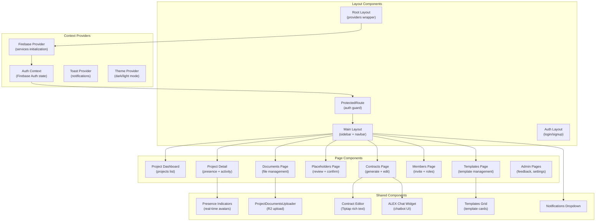
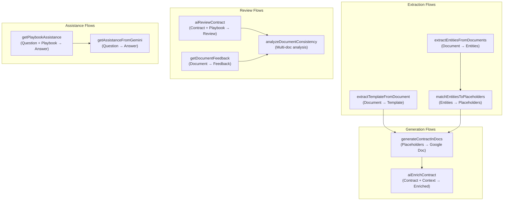

# C4 Components — V-Lab Assistant

> Diagrama de componentes (C4 Level 3) para os containers mais relevantes.
> Gerado pelo Architect em 2026-05-03 | Nível: Completo

---

## Container: Next.js SPA

---

## Container: Genkit AI Flows

---

## Container: Server Actions

```mermaid
graph TB
    subgraph Auth["Auth Actions"]
        SignInAction["signInWithEmail<br/>signUpWithEmail<br/>signInWithGoogle<br/>logout"]
    end

    subgraph Storage["Storage Actions"]
        UploadToR2["uploadToR2<br/>(presigned PUT)"]
        GetDownloadUrl["getDownloadUrl<br/>(presigned GET)"]
        MigrateToR2["migrateToR2<br/>(Firebase → R2)"]
    end

    subgraph Sync["Sync Actions"]
        SyncFileSearch["syncFileSearchToProject<br/>(documents → index)"]
        SyncTemplates["syncOfficialTemplates<br/>(scrape → update)"]
        SyncFAQ["syncFaqContent<br/>(scrape → store)"]
        ValidateLinks["validateTemplateLinks<br/>(audit URLs)"]
    end

    subgraph AI["AI Actions"]
        AiAssistance["getAiAssistance<br/>(chat streaming)"]
        AiReview["submitAiReview<br/>(contract review)"]
        AiEnrich["submitAiEnrich<br/>(contract enrich)"]
    end

    subgraph Google["Google Actions"]
        CreateGoogleDoc["createGoogleDoc<br/>(new document)"]
        UpdateGoogleDoc["updateGoogleDoc<br/>(sync content)"]
        GetDocContent["getGoogleDocContent<br/>(read content)"]
    end

    subgraph Feedback["Feedback Actions"]
        SubmitFeedback["submitFeedback<br/>(user feedback)"]
        GetPlaybookFeedback["getPlaybookFeedback<br/>(admin dashboard)"]
    end

    SignInAction --> Auth
    UploadToR2 --> Storage
    SyncFileSearch --> Sync
    SyncTemplates --> Sync
    SyncFAQ --> Sync
    AiAssistance --> AI
    AiReview --> AI
    AiEnrich --> AI
    CreateGoogleDoc --> Google
    UpdateGoogleDoc --> Google
    SubmitFeedback --> Feedback
```

---

## Component Dependency Matrix

| Component | Depende de | Fornece para |
|---|---|---|
| `ProtectedRoute` | `AuthProvider`, `useUser` | Todas as páginas protegidas |
| `DocumentUploader` | `uploadToR2`, `useProjectDocuments` | `DocumentsPage` |
| `ContractEditor` | `useProjectContracts`, `Tiptap` | `ContractsPage` |
| `PlaybookWidget` | `getAiAssistance`, `FaqContent` | `ContractsPage`, `ProjectDetail` |
| `PresenceIndicators` | `usePresence`, `UserPresence` | `ProjectDetail` |
| `NotificationsDropdown` | `useNotifications`, `TemplateNotification` | `MainLayout` |
| `TemplatesGrid` | `useTemplates`, `OfficialTemplate` | `ModelsPage` |
| `aiEnrichContract` | `genkit`, `gemini-3-flash-preview` | Server Actions |
| `aiReviewContract` | `genkit`, `playbook rules` | Server Actions |
| `generateContractInDocs` | `genkit`, `Composio`, `Google Docs API` | Server Actions |
