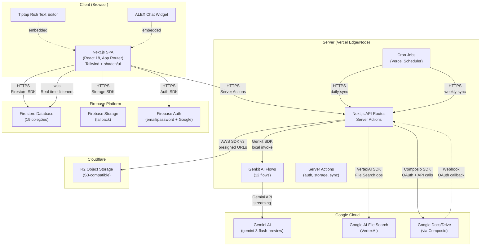

# C4 Containers — V-Lab Assistant

> Diagrama de containers do sistema (C4 Level 2).
> Gerado pelo Architect em 2026-05-03 | Nível: Completo

---

## Diagrama C4 — Containers

---

## Containers Detalhados

### 1. Next.js SPA (Browser Client)

| Propriedade | Valor |
|---|---|
| **Tipo** | Single Page Application |
| **Tecnologia** | Next.js 16 (App Router), React 18 |
| **Responsabilidade** | UI principal, roteamento, estado local, real-time listeners |
| **Comunicação** | Server Actions (escrita), Firestore SDK (leitura/real-time), Auth SDK |
| **Dependências** | Tailwind CSS 3.4, shadcn/ui, Radix UI, Framer Motion, Tiptap |

**Componentes principais:**
- Auth forms (email/password + Google sign-in)
- Project dashboard (list, create, invite)
- Document uploader (R2 presigned upload)
- Placeholder reviewer (edit, confirm, batch)
- Contract editor (Tiptap rich text)
- ALEX chat widget (streaming AI responses)
- Admin panels (templates, feedback, sync status)

---

### 2. Next.js API Routes + Server Actions (Server)

| Propriedade | Valor |
|---|---|
| **Tipo** | API + Server-Side Logic |
| **Tecnologia** | Next.js 16 API Routes, React Server Components |
| **Responsabilidade** | Orquestração de AI, storage operations, sync logic, OAuth callbacks |
| **Endpoints** | `/api/admin/test-faq-sync`, `/api/admin/test-sync`, `/api/cron/sync-templates`, `/api/cron/sync-faq-content`, `/api/feedback`, `/api/composio/callback` |
| **Server Actions** | Auth operations, document upload/download, AI assistance, sync operations |

---

### 3. Genkit AI Flows (Server)

| Propriedade | Valor |
|---|---|
| **Tipo** | AI Flow Engine |
| **Tecnologia** | Google Genkit 1.20, Gemini API |
| **Modelo** | `gemini-3-flash-preview` |
| **Flows** | 12 flows (extração, match, review, enrich, generate, assist, feedback, consistency, playbook, template extraction) |
| **Comunicação** | Invocado via Server Actions e API Routes |

---

### 4. Firestore Database

| Propriedade | Valor |
|---|---|
| **Tipo** | NoSQL Database (Document Store) |
| **Tecnologia** | Firebase Firestore |
| **Coleções** | 19 coleções (projects, projectMembers, projectDocuments, projectPlaceholders, projectContracts, activity, invites, presence, syncConfigs, syncEvents, templates, officialTemplateSyncs, notifications, faqContent, faqContentSyncs, contractModels, developer_feedback, playbook_feedback, emailQueue) |
| **Segurança** | 558 linhas de Firestore Security Rules |
| **Offline** | IndexedDB persistence (Firebase SDK) |

---

### 5. Firebase Auth

| Propriedade | Valor |
|---|---|
| **Tipo** | Authentication Service |
| **Tecnologia** | Firebase Authentication |
| **Providers** | Email/Password, Google OAuth |
| **Sessão** | JWT tokens, gerenciados pelo Firebase SDK |

---

### 6. Firebase Storage (Fallback)

| Propriedade | Valor |
|---|---|
| **Tipo** | Object Storage (Fallback) |
| **Tecnologia** | Firebase Cloud Storage |
| **Uso** | Fallback quando R2 não está configurado |
| **Migração** | `migrateToR2()` para transferência gradual |

---

### 7. Cloudflare R2

| Propriedade | Valor |
|---|---|
| **Tipo** | Object Storage (Primary) |
| **Tecnologia** | Cloudflare R2 (S3-compatible) |
| **Acesso** | Presigned URLs (PUT: 1h, GET: 15min) |
| **SDK** | AWS SDK v3 (`@aws-sdk/client-s3`) |
| **Hotfix** | CRC32 checksum disabled para compatibilidade |

---

### 8. Google AI File Search

| Propriedade | Valor |
|---|---|
| **Tipo** | Semantic Search Index |
| **Tecnologia** | Google AI (VertexAI SDK) |
| **Uso** | Index de documentos para contexto do ALEX chatbot |
| **Sync** | Triggered quando documentos são indexados |

---

### 9. Google Docs/Drive (via Composio)

| Propriedade | Valor |
|---|---|
| **Tipo** | Document Editor + Storage |
| **Tecnologia** | Google Workspace API (via Composio OAuth) |
| **Uso** | Criação, edição, export de contratos |
| **Sync** | Bidirecional com Firestore |

---

### 10. Cron Jobs (Vercel Scheduler)

| Propriedade | Valor |
|---|---|
| **Tipo** | Scheduled Jobs |
| **Tecnologia** | Vercel Cron |
| **Jobs** | `0 2 * * *` sync templates, `0 3 * * 0` sync FAQ |
| **Autenticação** | `CRON_SECRET` environment variable |
