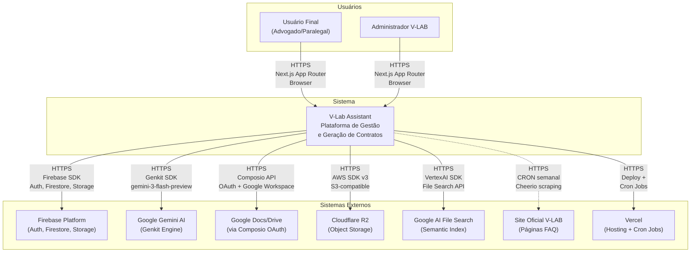

# C4 Context — V-Lab Assistant

> Diagrama de contexto do sistema (C4 Level 1).
> Gerado pelo Architect em 2026-05-03 | Nível: Completo

---

## Diagrama C4 — System Context

---

## Personas e Usuários

| Persona | Descrição | Interação Principal |
|---|---|---|
| **Advogado/Paralegal** | Usuário final que gerencia contratos | Criar projetos, enviar documentos, revisar placeholders, gerar contratos |
| **Administrador V-LAB** | Admin da plataforma | Gerenciar templates, monitorar syncs, revisar feedback |
| **Sistema CRON** | Job agendado no Vercel | Sync diário de templates, sync semanal de FAQ |

---

## Sistemas Externos

| Sistema | Propósito | Protocolo | Direção | Crítico? |
|---|---|---|---|---|
| **Firebase Auth** | Autenticação (email/senha + Google OAuth) | HTTPS (SDK) | Bidirecional | 🔴 Sim |
| **Firestore** | Banco de dados principal (19 coleções) | HTTPS (SDK) | Bidirecional | 🔴 Sim |
| **Firebase Storage** | Storage fallback para documentos | HTTPS (SDK) | Bidirecional | 🟡 Parcial |
| **Google Gemini AI** | 12 flows Genkit (extração, review, geração) | HTTPS (Genkit SDK) | Bidirecional | 🔴 Sim |
| **Composio** | OAuth e API wrapper para Google Workspace | HTTPS (REST) | Bidirecional | 🔴 Sim |
| **Google Docs/Drive** | Criação, edição, export de contratos | Via Composio | Bidirecional | 🔴 Sim |
| **Cloudflare R2** | Storage primário para documentos | HTTPS (AWS SDK v3) | Bidirecional | 🟡 Parcial |
| **Google AI File Search** | Index semântico de documentos para ALEX | HTTPS (VertexAI SDK) | Bidirecional | 🟡 Parcial |
| **Site Oficial V-LAB** | Fonte de templates e FAQ oficiais | HTTPS (scraping cheerio) | Inbound | 🟡 Parcial |
| **Vercel** | Hosting + Cron Jobs (sync templates/FAQ) | HTTPS | Inbound | 🔴 Sim |

---

## Fluxos Principais

1. **Autenticação**: Usuário → V-Lab → Firebase Auth → Sessão
2. **Gestão de Projetos**: Usuário → V-Lab → Firestore
3. **Upload de Documentos**: Usuário → V-Lab → R2 (presigned URL) → Firestore metadata
4. **Extração de Entidades**: Documento → Genkit → Gemini AI → Placeholders
5. **Geração de Contratos**: Placeholders + Template → Gemini → Google Docs (via Composio)
6. **Review de Contratos**: Contrato → Genkit → Gemini → Playbook Rules → Sugestões
7. **ALEX Chat**: Pergunta → ALEX → FAQ Content + File Search → Gemini → Resposta
8. **Template Sync**: CRON → Site V-LAB (scrape) → Templates → Notificações
9. **FAQ Sync**: CRON → Site V-LAB (scrape) → FAQ Content → ALEX Knowledge Base
