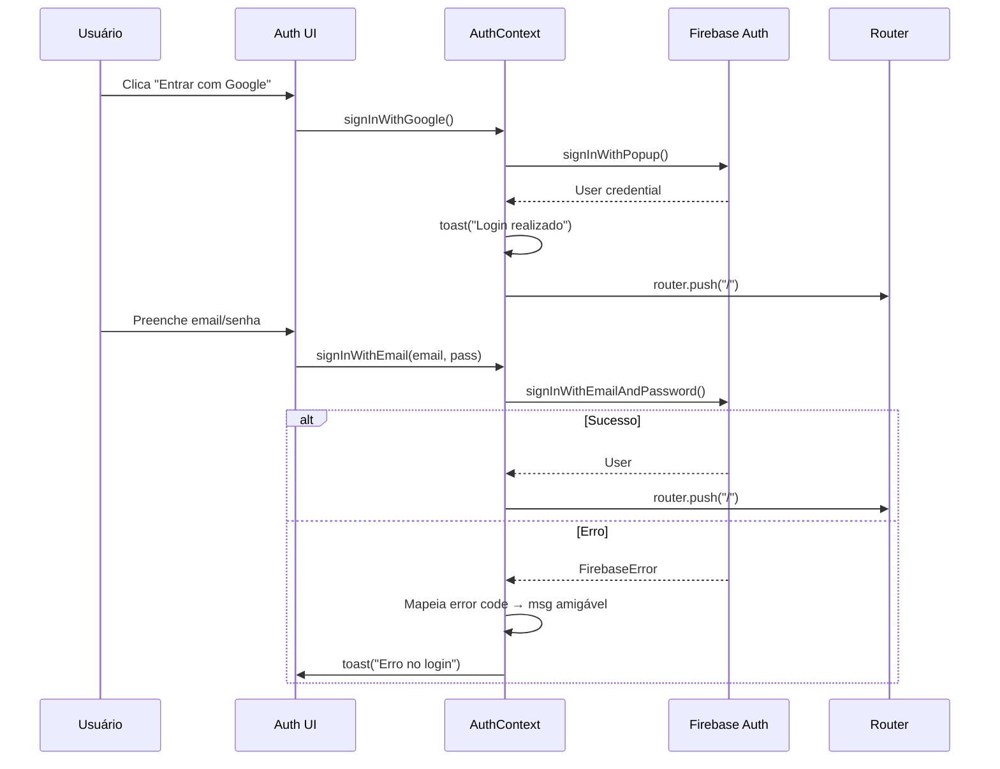

# Análise de Código — V-Lab Assistant

**Gerado em**: 2026-05-02  
**Nível**: Completo  
**Agente**: Archaeologist

---

## 1. Módulo `auth` 🟢 CONFIRMADO

### 1.1 Fluxo de Controle

**Arquivos**: `src/context/auth-context.tsx`, `src/components/auth/auth-forms.tsx`, `src/app/auth/page.tsx`, `src/app/auth/layout.tsx`, `src/components/auth/protected-route.tsx`

**Funções principais**:

| Função | Parâmetros | Retorno | Descrição |
|--------|-----------|---------|-----------|
| `signInWithGoogle` | — | `Promise<void>` | Popup OAuth Google → toast → redirect `/` |
| `signInWithEmail` | `email`, `pass` | `Promise<void>` | Login email/senha → toast → redirect `/` |
| `signUpWithEmail` | `name`, `email`, `pass` | `Promise<void>` | Cria conta + updateProfile → toast → redirect `/` |
| `logout` | — | `Promise<void>` | `firebaseSignOut` → redirect `/auth` |

**Algoritmo de mapeamento de erros (3 tabelas de erro)**:

```
auth/invalid-credential     → "Credenciais inválidas."
auth/user-not-found         → "Usuário não encontrado."
auth/wrong-password         → "Senha incorreta."
auth/network-request-failed → "Erro de conexão..."
auth/too-many-requests      → "Muitas tentativas..."
auth/email-already-in-use   → "Este e-mail já está em uso."
auth/weak-password          → "A senha é muito fraca."
auth/popup-blocked          → "Pop-up bloqueado..."
```

**Validação Zod nos formulários**:
- Login: `email` válido, `password` ≥ 6 chars
- SignUp: `name` ≥ 2 chars, `email` válido, `password` ≥ 6 chars, `confirmPassword` == `password`

### 1.2 Estruturas de Dados

- **`AuthContextType`**: interface com `user`, `loading`, 4 métodos de auth
- **Zod schemas**: `loginSchema`, `signUpSchema` (com refine para confirmação de senha)

### 1.3 Provider Firebase

**Arquivo**: `src/firebase/provider.tsx`

- `FirebaseProvider`: recebe instâncias `firebaseApp`, `firestore`, `auth`, `storage`
- `onAuthStateChanged`: subscribe para estado de autenticação em tempo real
- `useFirebase()`: hook que retorna todos os serviços + estado do usuário
- `useUser()`: hook específico para estado do usuário autenticado
- **Não bloqueante**: operações de Firestore podem ser iniciadas sem await (`non-blocking-updates.tsx`)

### 1.4 Sistema de Erros

**Arquivo**: `src/firebase/errors.ts`, `src/firebase/error-emitter.ts`

- `errorEmitter`: pub/sub tipado com 3 eventos: `permission-error`, `firestore-error`, `auth-error`
- `FirestorePermissionError`: erro customizado que simula `request.auth` das regras de segurança Firestore para debugging com LLM
- **Algoritmo**: `buildAuthObject()` → `buildRequestObject()` → `buildErrorMessage()` → constrói payload JSON com contexto completo da requisição negada

### 1.5 Fluxo (Mermaid)



---

## 2. Módulo `projects` 🟢 CONFIRMADO

### 2.1 Fluxo de Controle

**Arquivo principal**: `src/hooks/use-projects.ts` (1108 linhas), `src/app/(main)/projects/page.tsx`

**Hooks principais**:

| Hook | Responsabilidade |
|------|-----------------|
| `useProject(projectId)` | CRUD de um projeto individual |
| `useUserProjects()` | Lista projetos do usuário com roles |
| `useProjectMembers(projectId)` | Membros + convites |
| `useProjectRole(projectId)` | Role do usuário no projeto |
| `usePermission(projectId)` | Permissões calculadas (canEdit, canManageMembers, etc.) |
| `useProjectDocuments(projectId)` | Documentos do projeto |
| `useProjectPlaceholders(projectId)` | Placeholders extraídos |
| `useProjectContracts(projectId)` | Contratos gerados |
| `useActivity(projectId)` | Log de atividades com paginação |
| `useInvites()` | Convites pendentes do usuário |
| `usePresence(projectId)` | Presença em tempo real |

**Algoritmo: Auto-migração de memberships (useUserProjects)**:
```
Para cada membership:
  deterministicId = `${projectId}_${userId}`
  Se membership.id !== deterministicId:
    batch.set(novoRef, { ...membership })
    batch.delete(antigoRef)
```

**Algoritmo: Fetch de projetos em chunks**:
```
Para cada chunk de 10 projectIds:
  query: where('__name__', 'in', chunk) AND where('status', '==', 'active')
  getDocs → acumula resultados
```

### 2.2 Regras de Negócio

**Hierarquia de permissões**:
```
viewer (1) < editor (2) < owner (3)
```

| Ação | viewer | editor | owner |
|------|--------|--------|-------|
| Ver projeto | ✅ | ✅ | ✅ |
| Editar metadados | ❌ | ✅ (limitado) | ✅ |
| Convidar membros | ❌ | ✅ | ✅ |
| Alterar roles | ❌ | ❌ | ✅ |
| Deletar projeto | ❌ | ❌ | ✅ |
| Arquivar projeto | ❌ | ❌ | ✅ |
| Upload documentos | ❌ | ✅ | ✅ |

### 2.3 Presença em Tempo Real

**Algoritmo**: 
1. `setDoc(presence/${projectId}_${userId}, ...)` com merge
2. Heartbeat a cada 60s via `setInterval`
3. Query filtra por `lastSeenAt >= 5 minutos atrás`
4. Cleanup em `useEffect` cleanup

---

## 3. Módulo `documents` 🟢 CONFIRMADO

### 3.1 Fluxo de Controle

**Arquivos**: `src/app/(main)/projects/[projectId]/documents/page.tsx`, `src/app/(main)/projects/[projectId]/components/ProjectDocumentsUploader.tsx`

**Máquina de estados do documento**:
```
UPLOADED → PROCESSING → INDEXED
                  ↓
                ERROR
```

**Tipos de documento**:
- `planOfWork` → "Plano de Trabalho"
- `termOfExecution` → "Termo de Execução"
- `budgetSpreadsheet` → "Planilha Orçamentária"
- `other` → "Outro"

**Algoritmo de versionamento**: Documentos agrupados por `documentType`, ordenados por `version` descendente. Apenas a versão mais recente de cada tipo entra no contexto do ALEX.

### 3.2 Storage

- **Provedores**: Firebase Storage ou Cloudflare R2 (S3-compatible)
- **Download**: Se `storageProvider === 'r2'`, gera presigned URL via `getDownloadUrl()`
- **Formato**: `formatFileSize()` para display humano

---

## 4. Módulo `placeholders` 🟢 CONFIRMADO

### 4.1 Fluxo de Controle

**Arquivo**: `src/app/(main)/projects/[projectId]/placeholders/page.tsx`

**Máquina de estados**:
```
extracted → reviewed → confirmed
```

**Algoritmo de classificação de confiança**:
```
confidence >= 0.8 → Alta (high)
confidence >= 0.5 → Média (medium)
confidence <  0.5 → Baixa (low)
```

**Operações em batch**:
```
Para cada update:
  1. getDoc atual para pegar versão corrente
  2. writeBatch com: value, modifiedBy, modifiedAt, status='reviewed', version+1
  3. commit batch
```

### 4.2 Filtros e Ordenação

- Filtros: `all`, `low`, `medium`, `confirmed`, `pending`
- Busca por `key` ou `value` (case insensitive)
- Ordenação por confiança (menor primeiro) ou alfabética

---

## 5. Módulo `contracts` 🟢 CONFIRMADO

### 5.1 Fluxo de Controle

**Arquivo**: `src/app/(main)/projects/[projectId]/contracts/new/`, `src/app/(main)/projects/[projectId]/page.tsx` (ContractsTab)

**Fluxo**:
1. Verifica se `contractType` está configurado
2. Se não → redireciona para settings
3. Se sim → mostra `TemplatesGrid` filtrado por `contractType`
4. Usuário seleciona template → gera contrato via Genkit flow
5. Contrato salvo em `projectContracts` com `markdownContent` e `filledData` (JSON string)

### 5.2 Sync com Google Docs

- `googleDocId`, `googleDocLink`, `lastSyncedAt` rastreados no contract
- `syncConfigs` collection para configuração de sync bidirecional
- `syncEvents` collection para log imutável de eventos de sync

### 5.3 Entidades

- **ProjectContract**: `id`, `projectId`, `templateId`, `name`, `markdownContent`, `filledData` (JSON), `generatedBy`, `generatedAt`, `version`
- **Contract** (legado): versão anterior com campos adicionais como `lastReviewEdits`, `generationMethod`

---

## 6. Módulo `modelos` 🟢 CONFIRMADO

### 6.1 Fluxo de Controle

**Arquivo**: `src/app/(main)/modelos/page.tsx`

- Lista templates globais (`contractModels` collection - legado)
- Templates têm: `name`, `description`, `markdownContent`, `contractTypes[]`, `googleDocLink`, `projectDocLink`
- **Sync com modelos oficiais**: `officialSourceUrl`, `officialVersionHash`, `syncStatus`
- **Validação de links**: `TemplateLinkValidationState` com status para Google Docs e project docs

### 6.2 Algoritmo de Sync

- CRON job `/api/cron/sync-templates` (diário às 6h via Vercel)
- Compara `officialVersionHash` para detectar mudanças
- Log em `officialTemplateSyncs` collection

---

## 7. Módulo `ai-genkit` 🟢 CONFIRMADO

### 7.1 Flows Genkit (12 arquivos)

| Flow | Arquivo | Descrição |
|------|---------|-----------|
| `ai-enrich-contract` | `ai-enrich-contract.ts` | Enriquece contrato com IA |
| `ai-review-contract` | `ai-review-contract.ts` | Revisa contrato contra playbook |
| `analyze-document-consistency` | `analyze-document-consistency.ts` | Analisa consistência entre documentos |
| `extract-entities-from-documents` | `extract-entities-from-documents.ts` | Extrai entidades de documentos |
| `extract-template-from-document` | `extract-template-from-document.ts` | Extrai template de documento |
| `generate-contract-in-docs` | `generate-contract-in-docs.ts` | Gera contrato no Google Docs |
| `get-assistance-from-gemini` | `get-assistance-from-gemini.ts` | Chat geral com Gemini |
| `get-document-feedback` | `get-document-feedback.ts` | Feedback sobre documento |
| `get-playbook-assistance` | `get-playbook-assistance.ts` | Assistência via playbook institucional |
| `match-entities-to-placeholders` | `match-entities-to-placeholders.ts` | Mapeia entidades para placeholders |

### 7.2 Configuração

**Arquivo**: `src/ai/genkit.ts`, `src/ai/dev.ts`

- Provider: `@genkit-ai/google-genai`
- Integração Next.js via `@genkit-ai/next`
- Modelos: Gemini via Google GenAI

### 7.3 Integração Composio

**Arquivos**: `src/lib/composio-client.ts`, `src/lib/composio-gemini.ts`, `src/lib/composio-actions.ts`, `src/lib/composio-tools-mapping.ts`

- Composio conecta ferramentas Google (Docs, Drive) via OAuth redirect
- Callback: `/api/composio/callback/`
- Mapeamento de tools Composio → actions internas

---

## 8. Módulo `alex-chatbot` 🟢 CONFIRMADO

### 8.1 Componentes

- `playbook-chat-widget.tsx`: widget de chat integrado
- `ai-feedback.tsx`: feedback de IA

### 8.2 Base de Conhecimento

**Coleções Firestore**:
- `faqContent`: conteúdo FAQ extraído de páginas web
- `faqContentSyncs`: log de sync de FAQ
- CRON `/api/cron/sync-faq-content` (semanal, domingos às 3h)

### 8.3 Algoritmo de Parse

**Arquivo**: `src/lib/faq-content-parser.ts`

- Scrap de páginas FAQ com `cheerio`
- Extrai seções, títulos, conteúdo e links
- Salva em `faqContent` collection com `contentHash` para detecção de mudanças

---

## 9. Módulo `sync` 🟢 CONFIRMADO

### 9.1 Google Docs Sync

**Arquivos**: `src/lib/google-docs.ts`, `src/lib/actions/google-docs-actions.ts`, `src/lib/services/`

- Geração de contratos via Google Docs API
- Sync bidirecional configurável (`syncConfigs`)
- Direções: `bidirectional`, `firestore-to-docs`, `docs-to-firestore`
- Resolução de conflitos: `manual`, `firestore-wins`, `docs-wins`

### 9.2 Cloudflare R2

**Arquivos**: `src/lib/r2.ts`, `src/lib/actions/storage-actions.ts`, `r2-cors-rules.json`

- Storage alternativo ao Firebase Storage
- Presigned URLs para upload/download
- Migração via script `scripts/migrate-to-r2.ts`

### 9.3 Script de Migração

**Arquivo**: `scripts/migrate-to-r2.ts`

- Migra arquivos de Firebase Storage para Cloudflare R2

---

## 10. Módulo `activity` 🟢 CONFIRMADO

### 10.1 Tipos de Ação

13 tipos: `created`, `uploaded`, `extracted`, `edited`, `generated`, `shared`, `joined`, `left`, `role_changed`, `commented`, `exported`, `deleted`, `synced`

### 10.2 Algoritmo de Agrupamento Temporal

```
hoje:        activityDate >= hoje 00:00
ontem:       activityDate >= ontem 00:00
esta-semana: activityDate >= 7 dias atrás
este-mes:    activityDate >= 30 dias atrás
anteriores:  demais
```

### 10.3 Paginação

- `pageSize` padrão: 50
- Cursor-based via `startAfter(lastVisible)`
- `loadMore()` manual com fetch incremental

### 10.4 Imutabilidade

- Regras Firestore: `allow update, delete: if false` para `activity` collection
- Activity log é append-only

---

## 11. Módulo `admin` 🟢 CONFIRMADO

### 11.1 API Routes

| Endpoint | Método | Descrição |
|----------|--------|-----------|
| `/api/admin/test-faq-sync/` | POST | Testa sync de FAQ |
| `/api/admin/test-sync/` | POST | Testa sync de templates |
| `/api/cron/sync-templates` | GET (cron) | Sync diário de templates |
| `/api/cron/sync-faq-content` | GET (cron) | Sync semanal de FAQ |
| `/api/feedback` | POST | Endpoint de feedback |
| `/api/composio/callback/` | GET | OAuth callback Composio |

### 11.2 Painel Admin

- `src/app/(main)/admin/feedback/`: dashboard de feedback
- Proteção por role (inferido: owner-only)

---

## 12. Módulo `export` 🟢 CONFIRMADO

### 12.1 Bibliotecas

| Formato | Biblioteca |
|---------|-----------|
| DOCX | `docx` 8.5.0 |
| PDF | Via Google Docs export |
| XLSX | `xlsx` 0.18.5 |

### 12.2 Arquivos

- `src/lib/export.ts`: lógica de exportação
- `src/lib/document-converter.ts`: conversão entre formatos
- `src/lib/actions/google-docs-actions.ts`: export via Google Docs API

### 12.3 Algoritmo

```
1. markdownContent → converter para formato alvo
2. Se DOCX: usa biblioteca 'docx' para gerar documento
3. Se PDF: exporta via Google Docs API
4. Se XLSX: usa biblioteca 'xlsx'
5. Download via file-saver ou presigned URL
```

---

## Constantes e Enums Globais

| Enum | Valores |
|------|---------|
| `ProjectRole` | `owner`, `editor`, `viewer` |
| `ProjectStatus` | `active`, `archived`, `deleted` |
| `DocumentStatus` | `uploaded`, `processing`, `indexed`, `error` |
| `PlaceholderStatus` | `extracted`, `reviewed`, `confirmed` |
| `InviteStatus` | `pending`, `accepted`, `expired`, `revoked` |
| `ActivityAction` | 13 valores (see acima) |
| `ActivityTargetType` | `project`, `document`, `placeholder`, `contract`, `member` |
