# ERD Completo — V-Lab Assistant

> Entity-Relationship Diagram completo com todas as 19 coleções Firestore.
> Gerado pelo Architect em 2026-05-03 | Nível: Completo

---

## Diagrama ERD

```mermaid
erDiagram
    Project ||--o{ ProjectMember : "has"
    Project ||--o{ ProjectDocument : "contains"
    Project ||--o{ ProjectPlaceholder : "contains"
    Project ||--o{ ProjectContract : "contains"
    Project ||--o{ Activity : "logs"
    Project ||--o{ ProjectInvite : "has"
    Project ||--o{ UserPresence : "tracks"
    Project ||--o{ SyncConfig : "configures"
    Project ||--o{ SyncEvent : "records"
    Project ||--o{ ConflictResolution : "has"
    Project ||--o{ PendingAction : "queues"
    Project ||--o{ Notification : "sends"
    Project ||--o{ ProjectModelLink : "links"

    ProjectMember }o--|| User : "belongs to"
    ProjectInvite }o--|| User : "invites"
    Activity }o--|| User : "performed by"
    UserPresence }o--|| User : "tracks"
    Notification }o--|| User : "targets"

    ProjectDocument ||--o{ ExtractedEntity : "produces"
    ProjectPlaceholder }o--|| ProjectDocument : "sourced from"
    ProjectPlaceholder ||--o{ PlaceholderEditEvent : "tracks"

    ProjectContract ||--o{ SyncConfig : "syncs via"
    ProjectContract ||--o{ SyncEvent : "records"

    Template ||--o{ OfficialTemplateSync : "synced via"
    Template ||--o{ TemplateNotification : "generates"
    Template ||--o{ TemplateLinkValidation : "validated by"
    Template ||--o{ ProjectModelLink : "linked from"

    FaqContent ||--o{ FaqContentSync : "synced via"
    FaqContent ||--o{ FaqNotification : "generates"
    FaqContent }o--|| FaqPage : "scraped from"

    OfficialTemplate }o--|| Template : "sources"
    OfficialTemplateSync }o--|| OfficialTemplate : "tracks"

    DeveloperFeedback }o--|| User : "submitted by"
    PlaybookFeedback }o--|| User : "submitted by"
    EmailQueue ||--o{ EmailDelivery : "delivers"

    Project {
        string id PK
        string name
        string description
        string clientName
        string createdBy FK
        string createdAt
        string updatedAt
        string status "active | archived | deleted"
        int memberCount
        int documentCount
        int placeholderCount
        int contractCount
        string lastActivityAt
        string lastActivityBy
        string contractType
        string processType
        bool extraDocumentEnabled
        int extraDocumentCount
        bool isSyncedToFileSearch
        string fileSearchStoreId
        string lastSyncedAt
        string fileSearchSyncStatus
        string fileSearchSyncError
    }

    ProjectMember {
        string id PK "projectId_userId"
        string projectId FK
        string userId FK
        string role "owner | editor | viewer"
        string invitedBy
        string invitedAt
        string joinedAt
        string email
        string displayName
        string photoURL
    }

    ProjectDocument {
        string id PK
        string projectId FK
        string name
        string fileUrl
        string fileType
        int fileSize
        string uploadedBy FK
        string uploadedAt
        string status "uploaded | processing | indexed | error"
        json extractedEntities
        json extractedEntityDescriptions
        string processingError
        string mimeType
        string storagePath
        string storageProvider "firebase | r2"
        string documentType
        int version
        string originalFileName
        string fileSearchDocumentName
        string fileSearchIndexedAt
        string entityExtractionStatus
        string entityExtractionError
        int entityCount
    }

    ProjectPlaceholder {
        string id PK
        string projectId FK
        string key
        string value
        string defaultValue
        string source
        string sourceDocumentId FK
        float confidence
        json aiSuggestions
        string status "extracted | reviewed | confirmed"
        string modifiedBy FK
        string modifiedAt
        string modifiedByName
        int version
    }

    ProjectContract {
        string id PK
        string projectId FK
        string templateId FK
        string name
        string markdownContent
        string filledData
        string generatedBy FK
        string generatedAt
        string googleDocId
        string googleDocLink
        string lastSyncedAt
        string templateSource "googleDocLink | projectDocLink"
        bool fallbackUsed
        int version
        int wordCount
    }

    Activity {
        string id PK
        string projectId FK
        string userId FK
        string userName
        string userPhotoURL
        string action "13 types"
        string targetType "5 types"
        string targetId
        string targetName
        json metadata
        string timestamp
    }

    ProjectInvite {
        string id PK
        string projectId FK
        string projectName
        string email
        string role "owner | editor | viewer"
        string invitedBy FK
        string invitedByName
        string invitedAt
        string expiresAt
        string status "pending | accepted | expired | revoked"
        string acceptedAt
        string acceptedByUserId FK
    }

    UserPresence {
        string id PK
        string userId FK
        string userName
        string userPhotoURL
        string projectId FK
        string currentView
        string currentEditing
        string lastSeenAt
        string joinedAt
    }

    SyncConfig {
        string id PK
        string projectId FK
        string contractId FK
        string googleDocId
        string syncDirection "bidirectional | firestore-to-docs | docs-to-firestore"
        string conflictResolution "manual | firestore-wins | docs-wins"
        bool enabled
        string lastSyncAt
        string lastSyncStatus "success | error | conflict"
        string webhookUrl
        string webhookSecret
    }

    SyncEvent {
        string id PK
        string configId FK
        string projectId FK
        string contractId FK
        string direction "firestore-to-docs | docs-to-firestore"
        string status "pending | in-progress | success | error | conflict"
        string startedAt
        string completedAt
        string errorMessage
        json changesSummary
    }

    Template {
        string id PK
        string name
        string description
        string markdownContent
        string googleDocLink
        string projectDocLink
        bool isNew
        json contractTypes
        string officialSourceUrl
        string lastOfficialSync
        string officialVersionHash
        string syncStatus "synced | outdated | unknown | error"
        string syncError
        json linkValidation
    }

    OfficialTemplateSync {
        string id PK
        string timestamp
        string status "success | error | partial"
        int templatesChecked
        int templatesUpdated
        json errors
        json changes
    }

    TemplateNotification {
        string id PK
        string type "template_updated | template_sync_error | template_sync_success"
        string title
        string message
        json data
        bool read
        string createdAt
        string userId FK
    }

    FaqContent {
        string id PK
        string url
        string title
        string content
        json sections
        string contentHash
        string lastSyncedAt
        string syncStatus "synced | error | pending"
    }

    FaqContentSync {
        string id PK
        string timestamp
        string status "success | error | partial"
        int pagesChecked
        int pagesUpdated
        json errors
        json changes
    }

    FaqNotification {
        string id PK
        string type "faq_updated | faq_sync_error"
        string title
        string message
        json data
        bool read
        string createdAt
        string userId FK
    }

    DeveloperFeedback {
        string id PK
        string userId FK
        string feedback
        string timestamp
    }

    PlaybookFeedback {
        string id PK
        string userId FK
        string feedback
        string timestamp
    }

    EmailQueue {
        string id PK
        string to
        string subject
        string body
        string status
        string createdAt
    }

    ConflictResolution {
        string id PK
        string projectId FK
        string targetType
        string targetId
        string localValue
        string serverValue
        string lastSyncedValue
        string localTimestamp
        string serverTimestamp
        string resolvedAt
        string resolvedBy FK
        string resolution "local | server | merged"
    }

    PendingAction {
        string id PK
        string action "create | update | delete"
        string collection
        string documentId
        json data
        string timestamp
        int retryCount
        string lastError
        string projectId FK
    }
```

---

## Relacionamentos Detalhados

| Parent | Child | Cardinalidade | Tipo | Descrição |
|---|---|---|---|---|
| Project | ProjectMember | 1:N | Composition | Membros pertencem a um projeto |
| Project | ProjectDocument | 1:N | Composition | Documentos dentro de um projeto |
| Project | ProjectPlaceholder | 1:N | Composition | Placeholders extraídos do projeto |
| Project | ProjectContract | 1:N | Composition | Contratos gerados pelo projeto |
| Project | Activity | 1:N | Aggregation | Atividades logadas do projeto |
| Project | ProjectInvite | 1:N | Composition | Convites pendentes do projeto |
| Project | UserPresence | 1:N | Association | Presença em tempo real no projeto |
| Project | SyncConfig | 1:N | Composition | Configurações de sync do projeto |
| Project | SyncEvent | 1:N | Composition | Eventos de sync do projeto |
| Project | ConflictResolution | 1:N | Composition | Conflitos de sync do projeto |
| Project | PendingAction | 1:N | Composition | Ações offline pendentes do projeto |
| Project | Notification | 1:N | Composition | Notificações do projeto |
| ProjectMember | User | N:1 | Reference | Membro referencia um usuário |
| ProjectDocument | ExtractedEntity | 1:N | Composition | Entidades extraídas do documento |
| ProjectPlaceholder | ProjectDocument | N:1 | Reference | Placeholder vem de um documento |
| ProjectPlaceholder | PlaceholderEditEvent | 1:N | Composition | Eventos de edição do placeholder |
| ProjectContract | SyncConfig | 1:N | Composition | Configurações de sync do contrato |
| ProjectContract | SyncEvent | 1:N | Composition | Eventos de sync do contrato |
| Template | OfficialTemplateSync | 1:N | Composition | Logs de sync do template |
| Template | TemplateNotification | 1:N | Composition | Notificações de mudança do template |
| Template | TemplateLinkValidation | 1:N | Composition | Validação de links do template |
| FaqContent | FaqContentSync | 1:N | Composition | Logs de sync do FAQ |
| FaqContent | FaqNotification | 1:N | Composition | Notificações de mudança do FAQ |
| OfficialTemplate | Template | N:1 | Reference | Template usa fonte oficial |
| DeveloperFeedback | User | N:1 | Reference | Feedback de um usuário |
| PlaybookFeedback | User | N:1 | Reference | Feedback de playbook de um usuário |

---

## Chaves e Índices

### Chaves Primárias
- Todas as coleções usam `id` como chave primária (Firestore auto-generated ou deterministic)
- `ProjectMember`: ID determinístico `{projectId}_{userId}`

### Índices Compostos
- `projectDocuments`: `projectId` + `uploadedAt` (desc)
- `projectPlaceholders`: `projectId` + `status` + `confidence` (desc)
- `projectContracts`: `projectId` + `generatedAt` (desc)
- `activity`: `projectId` + `timestamp` (desc)
- `invites`: `projectId` + `status` + `expiresAt`
- `presence`: `projectId` + `lastSeenAt` (desc)
- `notifications`: `userId` + `read` + `createdAt` (desc)
- `officialTemplateSyncs`: `timestamp` (desc)
- `faqContentSyncs`: `timestamp` (desc)
