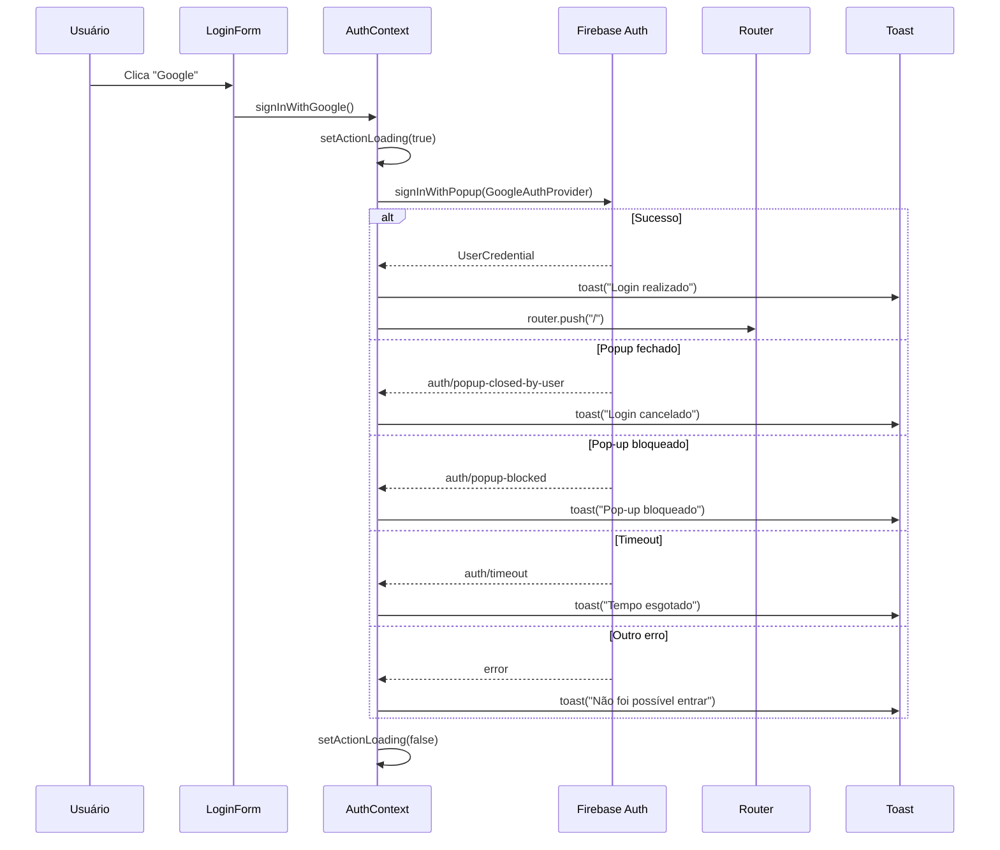
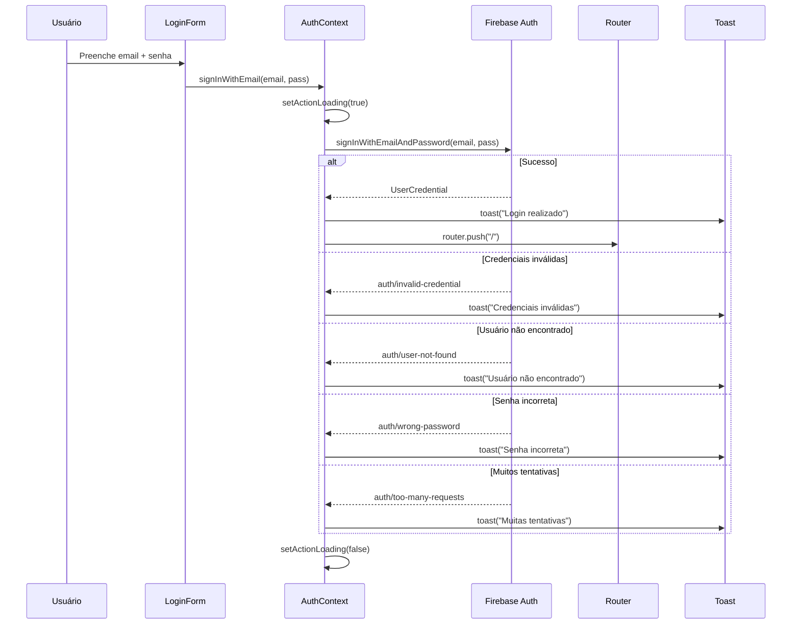
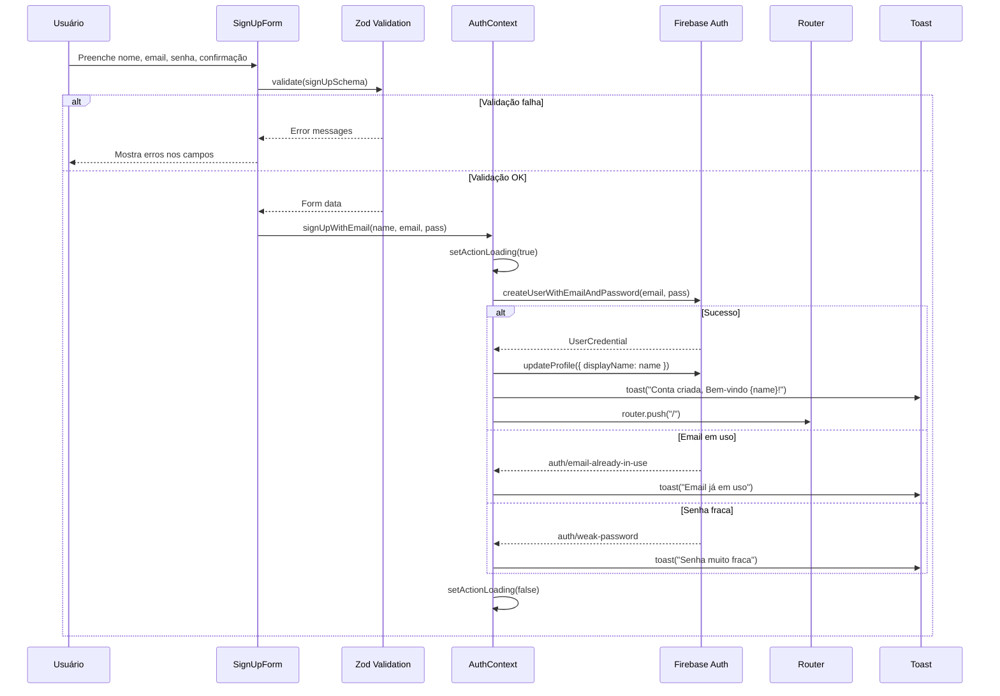
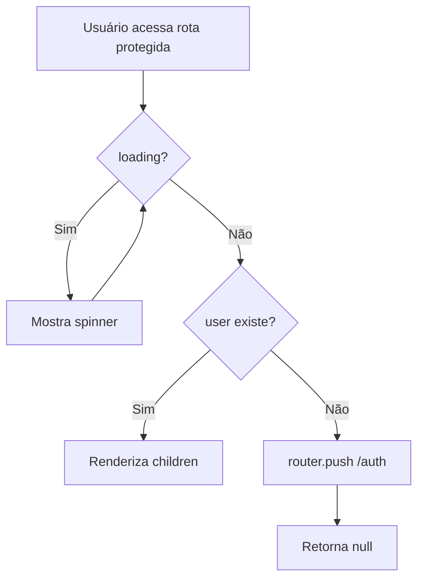

# Fluxo: Autenticação

## Login com Google

```mermaid
sequenceDiagram
    participant U as Usuário
    participant UI as LoginForm
    participant C as AuthContext
    participant FB as Firebase Auth
    participant R as Router
    participant T as Toast

    U->>UI: Clica "Google"
    UI->>C: signInWithGoogle()
    C->>C: setActionLoading(true)
    C->>FB: signInWithPopup(GoogleAuthProvider)
    alt Sucesso
        FB-->>C: UserCredential
        C->>T: toast("Login realizado")
        C->>R: router.push("/")
    else Popup fechado
        FB-->>C: auth/popup-closed-by-user
        C->>T: toast("Login cancelado")
    else Pop-up bloqueado
        FB-->>C: auth/popup-blocked
        C->>T: toast("Pop-up bloqueado")
    else Timeout
        FB-->>C: auth/timeout
        C->>T: toast("Tempo esgotado")
    else Outro erro
        FB-->>C: error
        C->>T: toast("Não foi possível entrar")
    end
    C->>C: setActionLoading(false)
```

## Login com Email/Senha

```mermaid
sequenceDiagram
    participant U as Usuário
    participant UI as LoginForm
    participant C as AuthContext
    participant FB as Firebase Auth
    participant R as Router
    participant T as Toast

    U->>UI: Preenche email + senha
    UI->>C: signInWithEmail(email, pass)
    C->>C: setActionLoading(true)
    C->>FB: signInWithEmailAndPassword(email, pass)
    alt Sucesso
        FB-->>C: UserCredential
        C->>T: toast("Login realizado")
        C->>R: router.push("/")
    else Credenciais inválidas
        FB-->>C: auth/invalid-credential
        C->>T: toast("Credenciais inválidas")
    else Usuário não encontrado
        FB-->>C: auth/user-not-found
        C->>T: toast("Usuário não encontrado")
    else Senha incorreta
        FB-->>C: auth/wrong-password
        C->>T: toast("Senha incorreta")
    else Muitos tentativas
        FB-->>C: auth/too-many-requests
        C->>T: toast("Muitas tentativas")
    end
    C->>C: setActionLoading(false)
```

## Cadastro com Email/Senha

```mermaid
sequenceDiagram
    participant U as Usuário
    participant UI as SignUpForm
    participant V as Zod Validation
    participant C as AuthContext
    participant FB as Firebase Auth
    participant R as Router
    participant T as Toast

    U->>UI: Preenche nome, email, senha, confirmação
    UI->>V: validate(signUpSchema)
    alt Validação falha
        V-->>UI: Error messages
        UI-->>U: Mostra erros nos campos
    else Validação OK
        V-->>UI: Form data
        UI->>C: signUpWithEmail(name, email, pass)
        C->>C: setActionLoading(true)
        C->>FB: createUserWithEmailAndPassword(email, pass)
        alt Sucesso
            FB-->>C: UserCredential
            C->>FB: updateProfile({ displayName: name })
            C->>T: toast("Conta criada, Bem-vindo {name}!")
            C->>R: router.push("/")
        else Email em uso
            FB-->>C: auth/email-already-in-use
            C->>T: toast("Email já em uso")
        else Senha fraca
            FB-->>C: auth/weak-password
            C->>T: toast("Senha muito fraca")
        end
        C->>C: setActionLoading(false)
    end
```

## Protected Route

```mermaid
flowchart TD
    A[Usuário acessa rota protegida] --> B{loading?}
    B -->|Sim| C[Mostra spinner]
    B -->|Não| D{user existe?}
    D -->|Sim| E[Renderiza children]
    D -->|Não| F[router.push /auth]
    F --> G[Retorna null]
    C --> B
```
