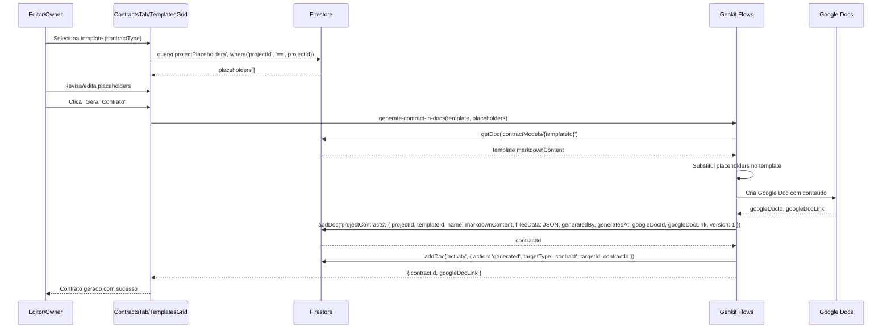
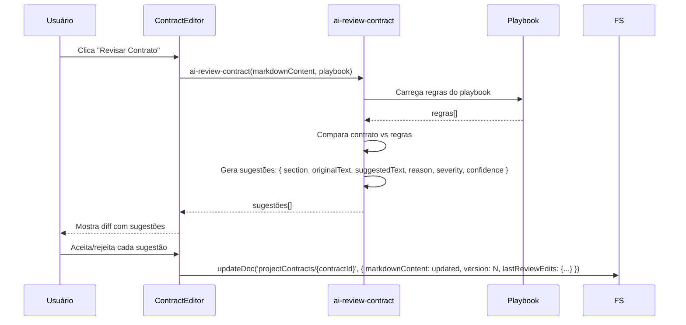
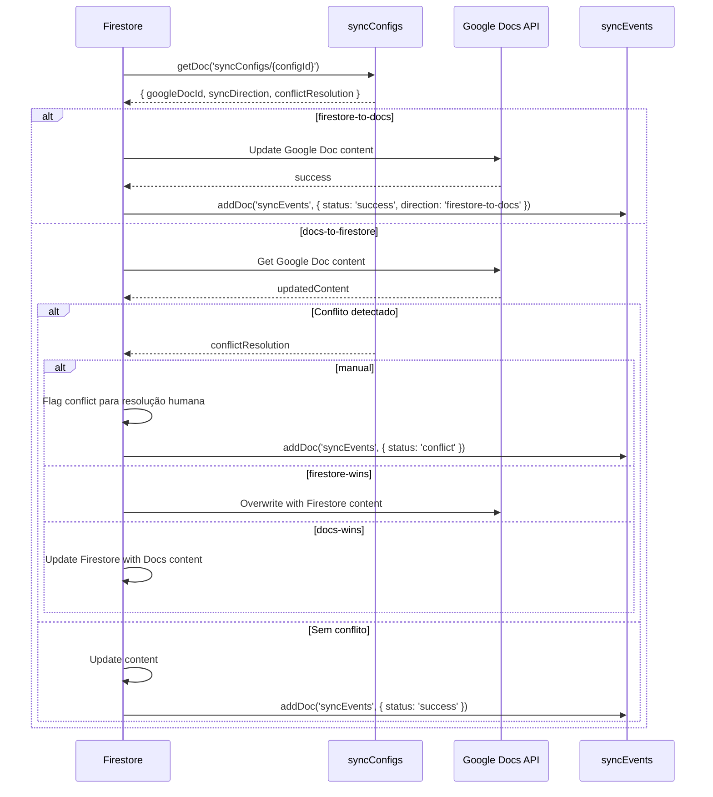
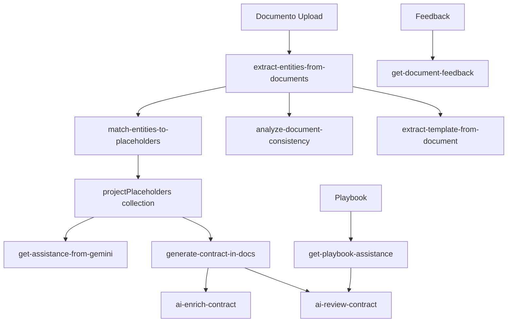

# Fluxo: Contratos e IA

## Geração de Contrato

```mermaid
sequenceDiagram
    participant U as Editor/Owner
    participant UI as ContractsTab/TemplatesGrid
    participant FS as Firestore
    participant AI as Genkit Flows
    participant GD as Google Docs

    U->>UI: Seleciona template (contractType)
    UI->>FS: query('projectPlaceholders', where('projectId', '==', projectId))
    FS-->>UI: placeholders[]
    U->>UI: Revisa/edita placeholders
    U->>UI: Clica "Gerar Contrato"
    UI->>AI: generate-contract-in-docs(template, placeholders)
    AI->>FS: getDoc('contractModels/{templateId}')
    FS-->>AI: template markdownContent
    AI->>AI: Substitui placeholders no template
    AI->>GD: Cria Google Doc com conteúdo
    GD-->>AI: googleDocId, googleDocLink
    AI->>FS: addDoc('projectContracts', { projectId, templateId, name, markdownContent, filledData: JSON, generatedBy, generatedAt, googleDocId, googleDocLink, version: 1 })
    FS-->>AI: contractId
    AI->>FS: addDoc('activity', { action: 'generated', targetType: 'contract', targetId: contractId })
    AI-->>UI: { contractId, googleDocLink }
    UI-->>U: Contrato gerado com sucesso
```

## Revisão de Contrato com IA

```mermaid
sequenceDiagram
    participant U as Usuário
    participant UI as ContractEditor
    participant AI as ai-review-contract
    participant PB as Playbook

    U->>UI: Clica "Revisar Contrato"
    UI->>AI: ai-review-contract(markdownContent, playbook)
    AI->>PB: Carrega regras do playbook
    PB-->>AI: regras[]
    AI->>AI: Compara contrato vs regras
    AI->>AI: Gera sugestões: { section, originalText, suggestedText, reason, severity, confidence }
    AI-->>UI: sugestões[]
    UI-->>U: Mostra diff com sugestões
    U->>UI: Aceita/rejeita cada sugestão
    UI->>FS: updateDoc('projectContracts/{contractId}', { markdownContent: updated, version: N, lastReviewEdits: {...} })
```

## Sync com Google Docs

```mermaid
sequenceDiagram
    participant FS as Firestore
    participant SC as syncConfigs
    participant GD as Google Docs API
    participant SE as syncEvents

    FS->>SC: getDoc('syncConfigs/{configId}')
    SC-->>FS: { googleDocId, syncDirection, conflictResolution }
    
    alt firestore-to-docs
        FS->>GD: Update Google Doc content
        GD-->>FS: success
        FS->>SE: addDoc('syncEvents', { status: 'success', direction: 'firestore-to-docs' })
    else docs-to-firestore
        FS->>GD: Get Google Doc content
        GD-->>FS: updatedContent
        alt Conflito detectado
            SC-->>FS: conflictResolution
            alt manual
                FS->>FS: Flag conflict para resolução humana
                FS->>SE: addDoc('syncEvents', { status: 'conflict' })
            else firestore-wins
                FS->>GD: Overwrite with Firestore content
            else docs-wins
                FS->>FS: Update Firestore with Docs content
            end
        else Sem conflito
            FS->>FS: Update content
            FS->>SE: addDoc('syncEvents', { status: 'success' })
        end
    end
```

## Flows Genkit (12 módulos)

```mermaid
flowchart TD
    A[Documento Upload] --> B[extract-entities-from-documents]
    B --> C[match-entities-to-placeholders]
    C --> D[projectPlaceholders collection]
    
    D --> E[get-assistance-from-gemini]
    D --> F[generate-contract-in-docs]
    
    F --> G[ai-enrich-contract]
    F --> H[ai-review-contract]
    
    I[Playbook] --> J[get-playbook-assistance]
    J --> H
    
    B --> K[analyze-document-consistency]
    B --> L[extract-template-from-document]
    
    M[Feedback] --> N[get-document-feedback]
```
