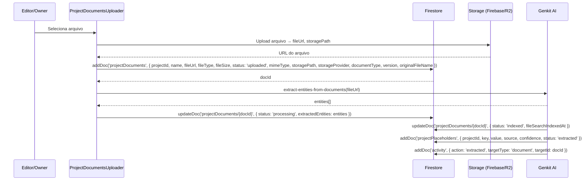
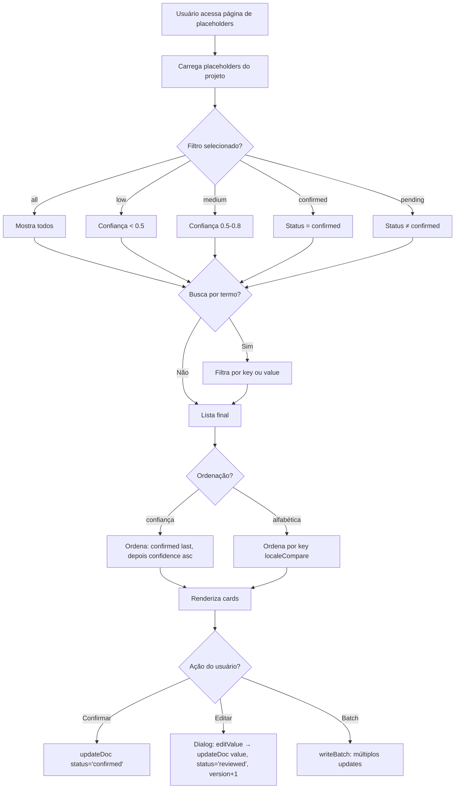
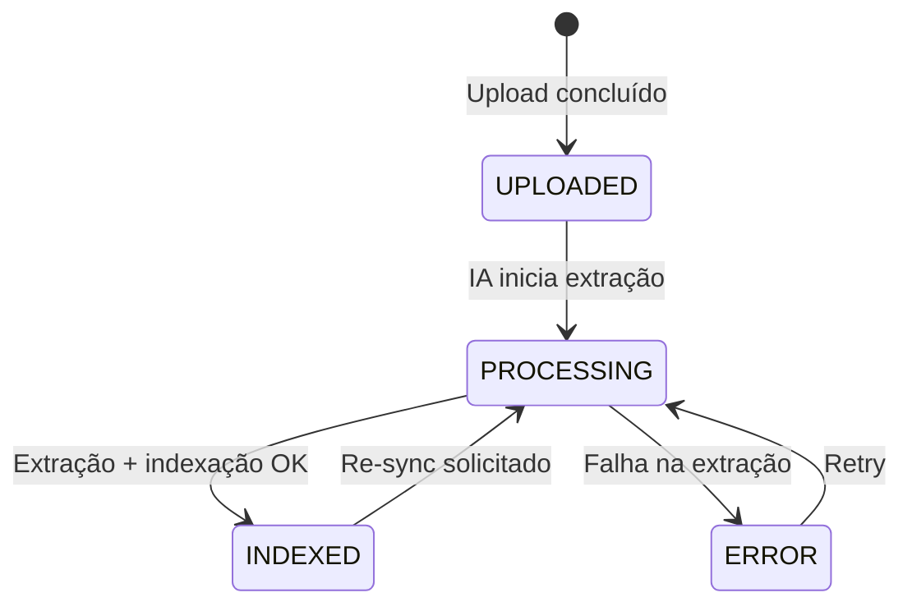
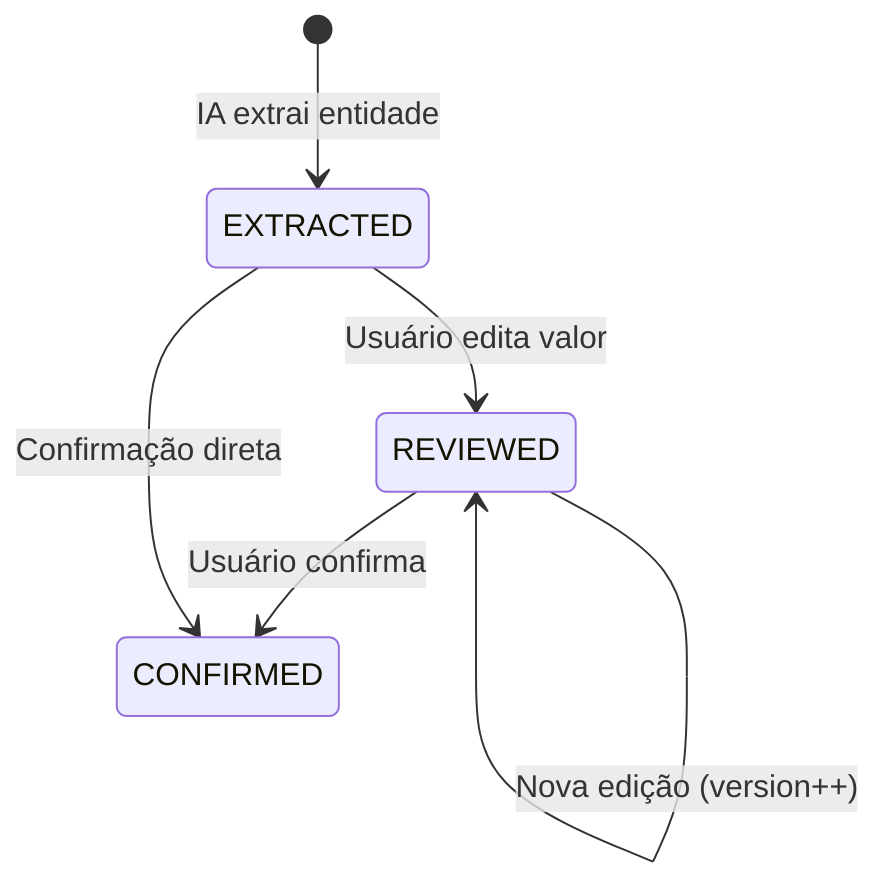

# Fluxo: Documentos e Placeholders

## Upload e Processamento de Documento

```mermaid
sequenceDiagram
    participant U as Editor/Owner
    participant UI as ProjectDocumentsUploader
    participant FS as Firestore
    participant ST as Storage (Firebase/R2)
    participant AI as Genkit AI

    U->>UI: Seleciona arquivo
    UI->>ST: Upload arquivo → fileUrl, storagePath
    ST-->>UI: URL do arquivo
    UI->>FS: addDoc('projectDocuments', { projectId, name, fileUrl, fileType, fileSize, status: 'uploaded', mimeType, storagePath, storageProvider, documentType, version, originalFileName })
    FS-->>UI: docId
    UI->>AI: extract-entities-from-documents(fileUrl)
    AI-->>UI: entities[]
    UI->>FS: updateDoc('projectDocuments/{docId}', { status: 'processing', extractedEntities: entities })
    AI->>FS: updateDoc('projectDocuments/{docId}', { status: 'indexed', fileSearchIndexedAt })
    AI->>FS: addDoc('projectPlaceholders', { projectId, key, value, source, confidence, status: 'extracted' })
    AI->>FS: addDoc('activity', { action: 'extracted', targetType: 'document', targetId: docId })
```

## Revisão de Placeholders

```mermaid
flowchart TD
    A[Usuário acessa página de placeholders] --> B[Carrega placeholders do projeto]
    B --> C{Filtro selecionado?}
    C -->|all| D[Mostra todos]
    C -->|low| E[Confiança < 0.5]
    C -->|medium| F[Confiança 0.5-0.8]
    C -->|confirmed| G[Status = confirmed]
    C -->|pending| H[Status ≠ confirmed]
    D --> I{Busca por termo?}
    E --> I
    F --> I
    G --> I
    H --> I
    I -->|Sim| J[Filtra por key ou value]
    I -->|Não| K[Lista final]
    J --> K
    K --> L{Ordenação?}
    L -->|confiança| M[Ordena: confirmed last, depois confidence asc]
    L -->|alfabética| N[Ordena por key localeCompare]
    M --> O[Renderiza cards]
    N --> O
    O --> P{Ação do usuário?}
    P -->|Confirmar| Q[updateDoc status='confirmed']
    P -->|Editar| R[Dialog: editValue → updateDoc value, status='reviewed', version+1]
    P -->|Batch| S[writeBatch: múltiplos updates]
```

## Máquina de Estados - Documento

```mermaid
stateDiagram-v2
    [*] --> UPLOADED: Upload concluído
    UPLOADED --> PROCESSING: IA inicia extração
    PROCESSING --> INDEXED: Extração + indexação OK
    PROCESSING --> ERROR: Falha na extração
    INDEXED --> PROCESSING: Re-sync solicitado
    ERROR --> PROCESSING: Retry
```

## Máquina de Estados - Placeholder

```mermaid
stateDiagram-v2
    [*] --> EXTRACTED: IA extrai entidade
    EXTRACTED --> REVIEWED: Usuário edita valor
    REVIEWED --> CONFIRMED: Usuário confirma
    EXTRACTED --> CONFIRMED: Confirmação direta
    REVIEWED --> REVIEWED: Nova edição (version++)
```
