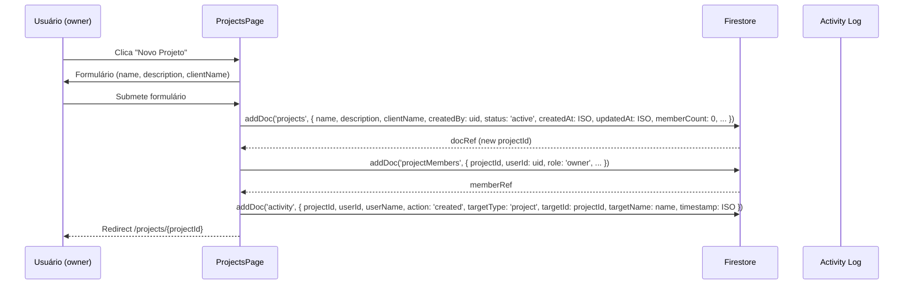
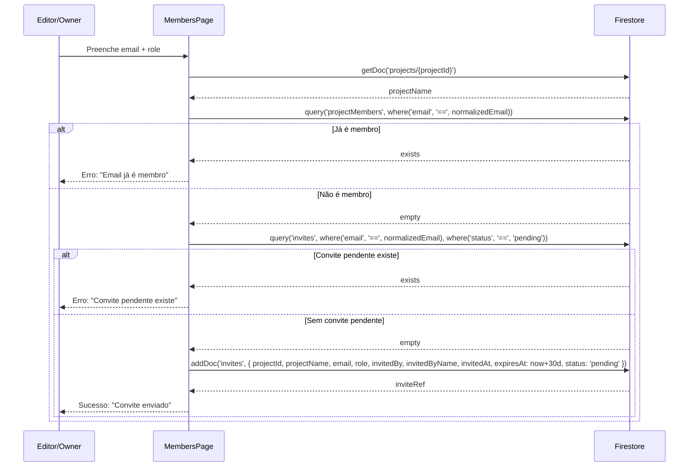
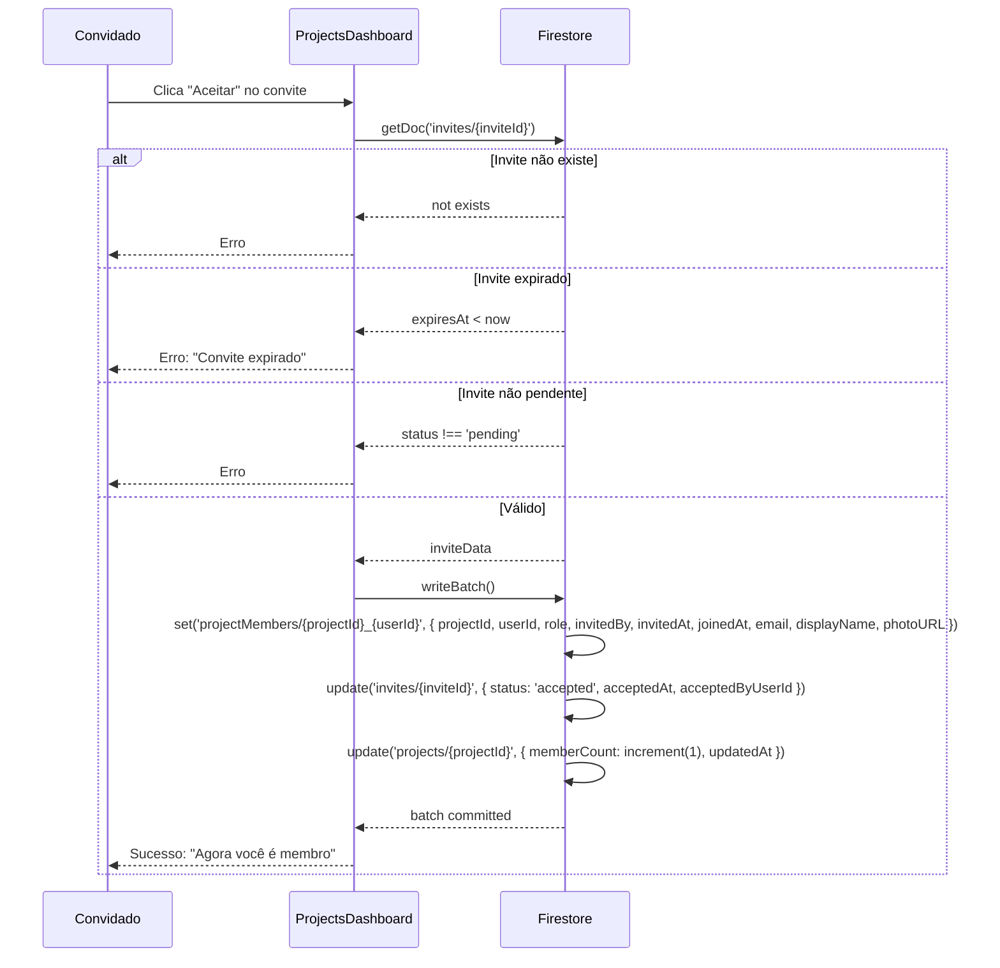
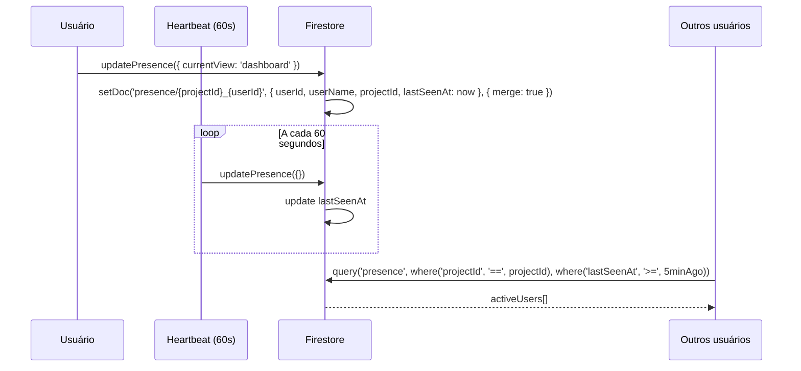

# Fluxo: Projetos

## Criação de Projeto



## Convite de Membro



## Aceite de Convite



## Hierarquia de Permissões

```mermaid
flowchart LR
    A[usePermission] --> B[useProjectRole]
    B --> C[useDoc projectMembers/{projectId}_{userId}]
    C --> D{role?}
    D -->|owner| E[canView, canEdit, canManageMembers, canDeleteProject, canChangeRoles]
    D -->|editor| F[canView, canEdit, canManageMembers]
    D -->|viewer| G[canView]
    D -->|null| H[canView=false, canEdit=false, ...]
```

## Presença em Tempo Real


