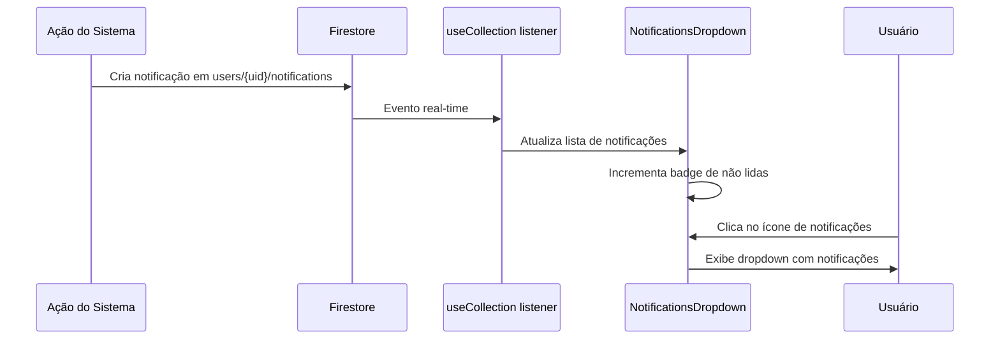
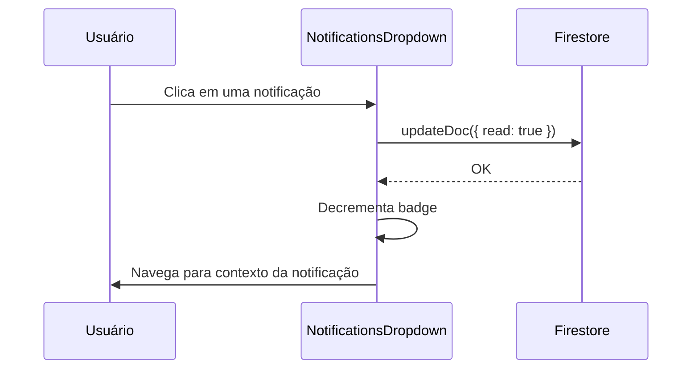

# Activity — Notificações e Atividade do Sistema

## Visão Geral

Sistema de notificações em tempo real que mantém os usuários informados sobre atividades relevantes nos projetos: uploads de documentos, extrações de entidades, geração de contratos, alterações de membros, e comentários. Implementado via componente `NotificationsDropdown` no header, com dados provenientes do Firestore em tempo real. Notificações são marcadas como lidas e podem ser limpas. Integra com email service para notificações por email em eventos críticos.

## Responsabilidades

- Listagem de notificações do usuário em tempo real
- Marcação de notificações como lidas
- Limpeza de notificações antigas
- Badge de contador de notificações não lidas
- Dropdown de notificações no header
- Email notifications para eventos críticos
- Filtro de notificações por tipo

## Interface

### Component: `NotificationsDropdown`

```typescript
// src/components/app/notifications-dropdown.tsx
interface Notification {
  id: string;
  userId: string;
  projectId?: string;
  type: 'document_upload' | 'entity_extraction' | 'contract_generation' | 'member_added' | 'comment' | 'sync_complete';
  title: string;
  message: string;
  read: boolean;
  createdAt: string;
  metadata?: Record<string, unknown>;
}

interface NotificationsDropdownProps {
  className?: string;
}
```

### Tipos no Firestore

Coleção inferida: `users/{userId}/notifications`

```typescript
interface NotificationDoc {
  id: string;
  type: string;
  title: string;
  message: string;
  read: boolean;
  projectId?: string;
  createdAt: Timestamp;
  metadata?: Map<string, unknown>;
}
```

## Regras de Negócio

- **RB-At-001:** Notificações são armazenadas por usuário (`users/{uid}/notifications`) 🟡
- **RB-At-002:** Badge exibe contador de notificações não lidas 🟢
- **RB-At-003:** Notificações são marcadas como lidas ao clicar 🟢
- **RB-At-004:** Tipos de notificação: document_upload, entity_extraction, contract_generation, member_added, comment, sync_complete 🟢
- **RB-At-005:** Notificações com projectId permitem navegação para o projeto 🟢
- **RB-At-006:** Email notifications para eventos críticos via email-service.ts 🟡
- **RB-At-007:** Notificações antigas podem ser limpas 🟡
- **RB-At-008:** Sem paginação visível para notificações 🟡
- **RB-At-009:** Sem preferências de notificação por usuário 🟡

## Fluxo Principal

### Recebimento de Notificação



### Marcação como Lida



## Fluxos Alternativos

- **[Sem notificações]:** Dropdown exibe "Nenhuma notificação"
- **[Notificação sem projectId]:** Não há link de navegação
- **[Email notification]:** Evento crítico dispara email via email-service.ts

## Dependências

| Dependência | Tipo | Motivo |
|---|---|---|
| `firebase/firestore` | Externa | CRUD de notificações |
| `useCollection` | Interno | Real-time listener |
| `email-service.ts` | Interno | Notificações por email |
| Header component | Interno | Localização do dropdown |

## Requisitos Não Funcionais

| Tipo | Requisito inferido | Evidência no código | Confiança |
|------|--------------------|---------------------|-----------|
| Real-time | Notificações atualizadas em tempo real | `useCollection` hook | 🟢 |
| Usabilidade | Badge de contador visível | Header integration | 🟢 |

## Critérios de Aceitação

```gherkin
Cenário: Receber notificação em tempo real
Dado que o usuário está logado
Quando uma ação relevante ocorre no projeto
Então uma nova notificação aparece no dropdown
E o badge de não lidas é incrementado

Cenário: Marcar notificação como lida
Dado que existe uma notificação não lida
Quando o usuário clica na notificação
Então o status muda para read: true
E o badge de não lidas é decrementado
```

## Rastreabilidade de Código

| Arquivo | Função / Classe | Cobertura |
|---------|-----------------|-----------|
| `src/components/app/notifications-dropdown.tsx` | `NotificationsDropdown` | 🟢 |
| `src/components/app/header.tsx` | Header integration | 🟢 |
| `src/lib/email-service.ts` | Email notifications | 🟢 |
| `src/lib/types.ts` | Notification types | 🟡 |
