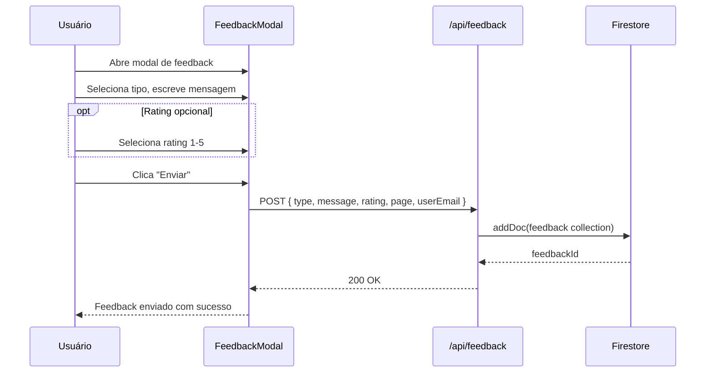
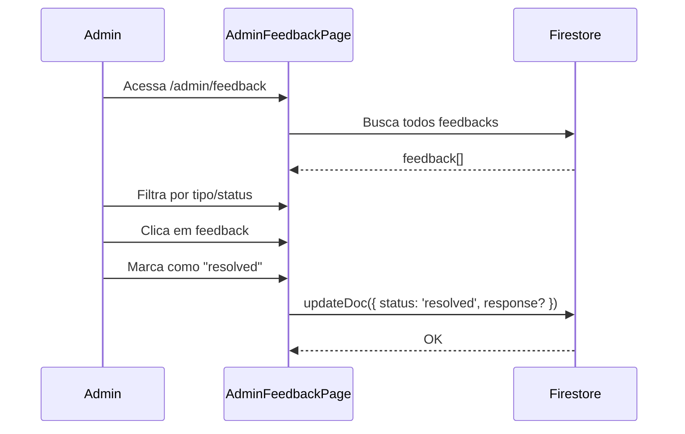
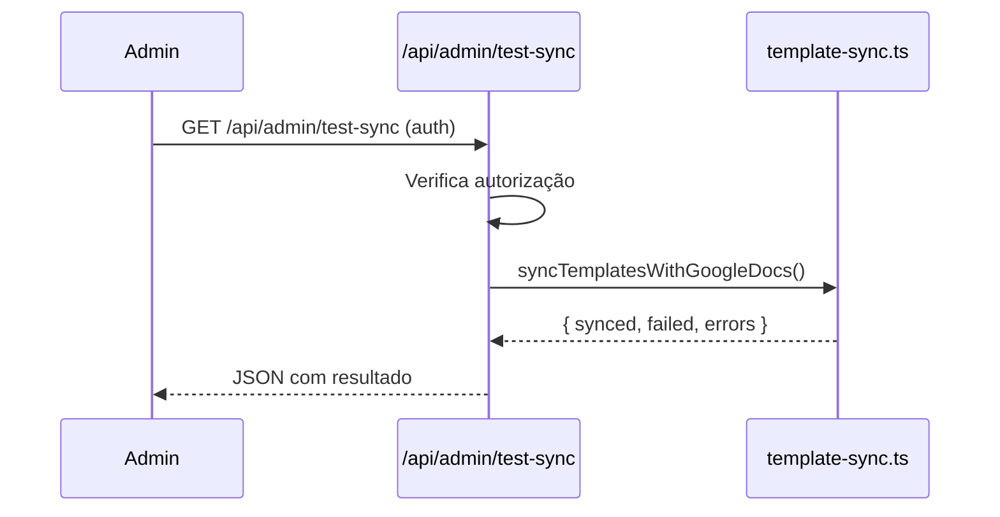

# Admin — Gestão de Feedback e Endpoints Administrativos

## Visão Geral

Módulo administrativo que centraliza o gerenciamento de feedback dos usuários e endpoints de teste para operações administrativas. Inclui página de gestão de feedback (`/admin/feedback`) com listagem, filtros e ações sobre feedback recebido. Endpoints administrativos protegidos (`/api/admin/test-sync`, `/api/admin/test-faq-sync`) permitem validação manual de operações de sincronização. Sem painel admin completo — funcionalidade limitada ao escopo de feedback e testes.

## Responsabilidades

- Listagem e gestão de feedback dos usuários
- Filtros por tipo e status de feedback
- Ações sobre feedback (visualizar, marcar como resolvido)
- Endpoints de teste para sync (protegidos)
- Visualização de métricas de feedback

## Interface

### Página: `AdminFeedbackPage` (`src/app/(main)/admin/feedback/page.tsx`)

```typescript
interface FeedbackEntry {
  id: string;
  userId: string;
  userEmail: string;
  type: 'bug' | 'feature' | 'improvement' | 'other';
  message: string;
  rating?: number;           // 1-5
  page?: string;             // Página onde feedback foi dado
  createdAt: string;
  status: 'pending' | 'reviewed' | 'resolved';
  response?: string;
}
```

### Endpoints Administrativos

| Endpoint | Método | Proteção | Função |
|---|---|---|---|
| `/api/admin/test-sync` | GET | CRON_SECRET ou admin | Testa sync de templates |
| `/api/admin/test-faq-sync` | GET | CRON_SECRET ou admin | Testa sync de FAQ |
| `/api/feedback` | POST | Auth | Recebe feedback do usuário |

### Componentes Relacionados

| Componente | Arquivo | Descrição |
|---|---|---|
| `FeedbackModal` | `src/components/app/feedback-modal.tsx` | Modal para submeter feedback |
| `FeedbackPage` | `src/app/(main)/feedback/page.tsx` | Página pública de feedback |

## Regras de Negócio

- **RB-Ad-001:** Feedback é submetido via modal ou página dedicada 🟢
- **RB-Ad-002:** Feedback inclui tipo, mensagem, rating opcional e página de origem 🟢
- **RB-Ad-003:** Status de feedback: `pending` → `reviewed` → `resolved` 🟢
- **RB-Ad-004:** `userEmail` é capturado automaticamente do contexto auth 🟢
- **RB-Ad-005:** Admin endpoints são protegidos por CRON_SECRET ou auth admin 🟢
- **RB-Ad-006:** Feedback pode ter resposta do admin (`response`) 🟡
- **RB-007:** Sem paginação de feedback na listagem 🟡
- **RB-008:** Sem export de feedback para CSV/Excel 🟡
- **RB-009:** Sem dashboard de métricas de feedback 🟡

## Fluxo Principal

### Submissão de Feedback



### Gestão de Feedback (Admin)



### Teste de Sync (Admin)



## Fluxos Alternativos

- **[Feedback sem auth]:** Não é possível submeter sem estar logado
- **[Endpoint sem auth]:** Retorna 401 Unauthorized
- **[Feedback duplicado]:** Sem validação de duplicatas

## Dependências

| Dependência | Tipo | Motivo |
|---|---|---|
| `firebase/firestore` | Externa | CRUD de feedback |
| `useUser` | Interno | Auth para submissão |
| `email-service.ts` | Interno | Notificações de feedback |

## Requisitos Não Funcionais

| Tipo | Requisito inferido | Evidência no código | Confiança |
|------|--------------------|---------------------|-----------|
| Segurança | Endpoints admin protegidos | Auth check | 🟢 |
| Usabilidade | Modal acessível de qualquer página | FeedbackModal | 🟢 |

## Critérios de Aceitação

```gherkin
Cenário: Submeter feedback
Dado que o usuário está logado
Quando abre o modal de feedback e envia
Então o feedback é salvo no Firestore
E uma confirmação é exibida

Cenário: Gerenciar feedback como admin
Dado que existem feedbacks pendentes
Quando o admin acessa /admin/feedback
Então todos os feedbacks são listados
E o admin pode mudar o status para "resolved"
```

## Rastreabilidade de Código

| Arquivo | Função / Classe | Cobertura |
|---------|-----------------|-----------|
| `src/app/(main)/admin/feedback/page.tsx` | `AdminFeedbackPage` | 🟢 |
| `src/app/(main)/feedback/page.tsx` | `FeedbackPage` | 🟢 |
| `src/components/app/feedback-modal.tsx` | `FeedbackModal` | 🟢 |
| `src/app/api/feedback/route.ts` | Feedback endpoint | 🟢 |
| `src/app/api/admin/test-sync/route.ts` | Test endpoint | 🟢 |
| `src/app/api/admin/test-faq-sync/route.ts` | Test endpoint | 🟢 |
