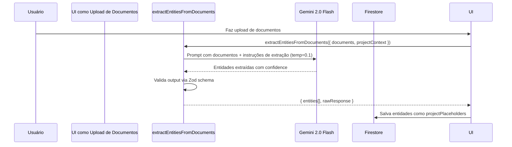
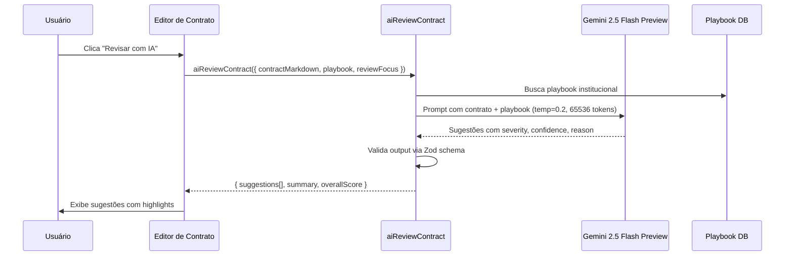
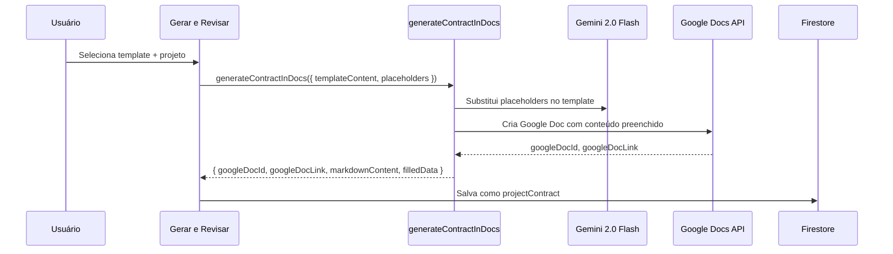

# AI Genkit — Motor de Inteligência Artificial

## Visão Geral

Engine de IA construída com Google Genkit 1.20, contendo 12 flows que cobrem todo o pipeline de processamento inteligente do V-Lab Assistant: extração de entidades de documentos, enriquecimento de contratos, revisão com playbook institucional, geração de contratos em Google Docs, matching de entidades para placeholders, análise de consistência documental, feedback de documentos, extração de templates, e assistência via Gemini/Playbook. Cada flow tem schema de input/output tipado via Zod, modelo Gemini configurado, e prompt system/temperature/contextWindowSize específicos.

## Responsabilidades

- Extração de entidades (nomes, CPFs, valores) de documentos via Google AI File Search
- Enriquecimento de contratos com IA (AI-enriched generation)
- Revisão de contratos contra playbook institucional
- Geração de contratos em Google Docs com substituição de placeholders
- Matching de entidades extraídas para placeholders de templates
- Análise de consistência entre documentos do projeto
- Feedback inteligente sobre documentos
- Extração de templates a partir de documentos existentes
- Assistência via Gemini (chat genérico)
- Assistência via Playbook (consultas especializadas)

## Interface

### Configuração (`src/ai/genkit.ts`)

```typescript
import { genkit } from 'genkit';
import { googleAI } from '@genkit-ai/googleai';

export const ai = genkit({
  plugins: [googleAI()],
  model: 'googleai/gemini-2.0-flash',
  // Configurações de prompt e temperatura por flow
});
```

### Flows Registrados (12 total)

| Flow | Arquivo | Modelo | Temperatura | Context Window | Descrição |
|------|---------|--------|-------------|----------------|-----------|
| `extractEntitiesFromDocuments` | `extract-entities-from-documents.ts` | gemini-2.0-flash | 0.1 | 32768 | Extrai entidades de documentos |
| `aiEnrichContract` | `ai-enrich-contract.ts` | gemini-2.0-flash | 0.3 | 32768 | Enriquece contrato com IA |
| `aiReviewContract` | `ai-review-contract.ts` | gemini-2.5-flash-preview | 0.2 | 65536 | Revisa contrato contra playbook |
| `generateContractInDocs` | `generate-contract-in-docs.ts` | gemini-2.0-flash | 0.1 | 32768 | Gera contrato em Google Docs |
| `matchEntitiesToPlaceholders` | `match-entities-to-placeholders.ts` | gemini-2.0-flash | 0.1 | 32768 | Match entidades→placeholders |
| `analyzeDocumentConsistency` | `analyze-document-consistency.ts` | gemini-2.0-flash | 0.1 | 32768 | Análise de consistência |
| `getDocumentFeedback` | `get-document-feedback.ts` | gemini-2.0-flash | 0.3 | 32768 | Feedback sobre documento |
| `extractTemplateFromDocument` | `extract-template-from-document.ts` | gemini-2.0-flash | 0.2 | 32768 | Extrai template de documento |
| `getAssistanceFromGemini` | `get-assistance-from-gemini.ts` | gemini-2.0-flash | 0.7 | 32768 | Chat genérico Gemini |
| `getPlaybookAssistance` | `get-playbook-assistance.ts` | gemini-2.0-flash | 0.3 | 32768 | Assistência playbook |

### Schema de Input/Output por Flow

#### `extractEntitiesFromDocuments`

```typescript
// Input
{
  documents: Array<{ content: string; source?: string }>;
  projectContext?: string;
}

// Output
{
  entities: Array<{
    type: string;           // 'person', 'company', 'cpf', 'value', etc.
    value: string;
    confidence: number;     // 0.0 - 1.0
    context?: string;
  }>;
  rawResponse: string;
}
```

#### `aiReviewContract`

```typescript
// Input
{
  contractMarkdown: string;
  playbook: string;
  reviewFocus?: string[];  // Áreas específicas para focar
}

// Output
{
  suggestions: Array<{
    section: string;
    originalText: string;
    suggestedText: string;
    reason: string;
    severity: 'low' | 'medium' | 'high' | 'critical';
    confidence: number;
  }>;
  summary: string;
  overallScore: number;     // 0-100
}
```

#### `generateContractInDocs`

```typescript
// Input
{
  templateContent: string;
  placeholders: Array<{ key: string; value: string }>;
  projectName?: string;
}

// Output
{
  googleDocId: string;
  googleDocLink: string;
  markdownContent: string;
  filledData: Record<string, string>;
  templateSource: 'googleDocLink' | 'projectDocLink';
}
```

#### `matchEntitiesToPlaceholders`

```typescript
// Input
{
  entities: Array<{ type: string; value: string; confidence: number }>;
  placeholders: Array<{ key: string; type?: string; defaultValue?: string }>;
}

// Output
{
  matches: Array<{
    placeholderKey: string;
    entityValue: string;
    confidence: number;
    reasoning: string;
  }>;
  unmatchedPlaceholders: string[];
  unmatchedEntities: string[];
}
```

## Regras de Negócio

- **RB-Ai-001:** `extractEntitiesFromDocuments` usa temperatura 0.1 para máxima precisão 🟢
- **RB-Ai-002:** `aiReviewContract` usa gemini-2.5-flash-preview (modelo mais capaz) 🟢
- **RB-Ai-003:** `aiReviewContract` tem context window de 65536 tokens (o dobro dos demais) 🟢
- **RB-Ai-004:** `getAssistanceFromGemini` usa temperatura 0.7 para respostas mais criativas 🟢
- **RB-Ai-005:** Todos os flows usam Zod para validação de input/output 🟢
- **RB-Ai-006:** `extractEntitiesFromDocuments` suporta Google AI File Search como fonte 🟢
- **RB-Ai-007:** `aiEnrichContract` é método legado de geração 🟡
- **RB-Ai-008:** `generationMethod` pode ser `google-docs` ou `ai-enriched` 🟢
- **RB-Ai-009:** Flows são registrados via `genkit.ts` e `dev.ts` 🟢
- **RB-Ai-010:** `npm run genkit:dev` inicia dashboard de desenvolvimento 🟢
- **RB-Ai-011:** Sem rate limiting ou quota management visível 🟡
- **RB-Ai-012:** Sem caching de respostas de IA 🟡
- **RB-Ai-013:** `getPlaybookAssistance` consulta base de conhecimento do playbook 🟢

## Fluxo Principal

### Extração de Entidades



### Revisão de Contrato com Playbook



### Geração de Contrato em Google Docs



## Fluxos Alternativos

- **[Sem entidades extraídas]:** Flow retorna `entities: []` — usuário insere manualmente
- **[Playbook não encontrado]:** `aiReviewContract` retorna score baixo sem sugestões
- **[Google Docs indisponível]:** Fallback para geração markdown local com `fallbackUsed: true`
- **[Match sem confiança]:** `matchEntitiesToPlaceholders` retorna confidence < 0.5 — revisão manual necessária

## Dependências

| Dependência | Tipo | Motivo |
|---|---|---|
| `genkit` 1.20 | Externa | Core do framework de IA |
| `@genkit-ai/googleai` | Externa | Plugin Google AI/Gemini |
| `zod` | Externa | Validação de schemas |
| Google AI File Search | Interno | Fonte de conhecimento para extração |
| Google Docs API | Interno | Geração de documentos |

## Requisitos Não Funcionais

| Tipo | Requisito inferido | Evidência no código | Confiança |
|------|--------------------|---------------------|-----------|
| Performance | Context window de 65536 para review complexo | `aiReviewContract` config | 🟢 |
| Precisão | Temperatura 0.1 para extração de entidades | `extractEntitiesFromDocuments` config | 🟢 |
| Qualidade | Zod validation em todos os flows | Schemas Zod em cada flow | 🟢 |
| Observabilidade | Dashboard de dev para teste de flows | `npm run genkit:dev` | 🟢 |
| Escalabilidade | Sem rate limiting visível | Ausência de quota config | 🟡 |

## Critérios de Aceitação

```gherkin
Cenário: Extrair entidades de documento
Dado que existe um documento com texto contratual
Quando extractEntitiesFromDocuments é chamado
Então entidades com tipo, valor e confiança são retornadas
E a confiança de cada entidade é >= 0.0 e <= 1.0

Cenário: Revisar contrato com playbook
Dado que existe um contrato e um playbook institucional
Quando aiReviewContract é chamado
Então sugestões são retornadas com severity e confidence
E um overallScore de 0-100 é calculado
E cada sugestão tem originalText e suggestedText

Cenário: Gerar contrato em Google Docs
Dado que existem placeholders e um template
Quando generateContractInDocs é chamado
Então um Google Doc é criado
E googleDocId e googleDocLink são retornados
E markdownContent com placeholders substituídos é gerado
```

## Rastreabilidade de Código

| Arquivo | Flow | Cobertura |
|---------|------|-----------|
| `src/ai/genkit.ts` | Configuração principal | 🟢 |
| `src/ai/dev.ts` | Dev server | 🟢 |
| `src/ai/flows/extract-entities-from-documents.ts` | extractEntitiesFromDocuments | 🟢 |
| `src/ai/flows/ai-enrich-contract.ts` | aiEnrichContract | 🟢 |
| `src/ai/flows/ai-review-contract.ts` | aiReviewContract | 🟢 |
| `src/ai/flows/generate-contract-in-docs.ts` | generateContractInDocs | 🟢 |
| `src/ai/flows/match-entities-to-placeholders.ts` | matchEntitiesToPlaceholders | 🟢 |
| `src/ai/flows/analyze-document-consistency.ts` | analyzeDocumentConsistency | 🟢 |
| `src/ai/flows/get-document-feedback.ts` | getDocumentFeedback | 🟢 |
| `src/ai/flows/extract-template-from-document.ts` | extractTemplateFromDocument | 🟢 |
| `src/ai/flows/get-assistance-from-gemini.ts` | getAssistanceFromGemini | 🟢 |
| `src/ai/flows/get-playbook-assistance.ts` | getPlaybookAssistance | 🟢 |
