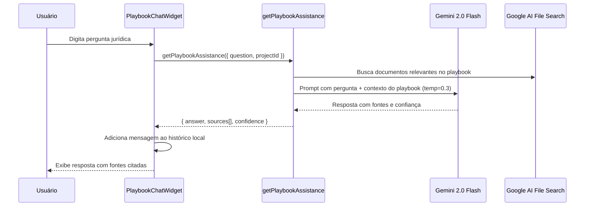
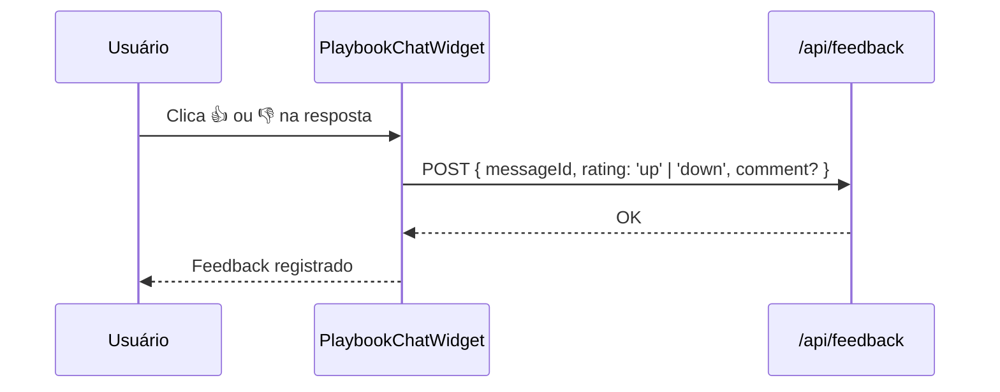

# ALEX Chatbot — Assistente Virtual com Conhecimento Institucional

## Visão Geral

ALEX é o assistente virtual do V-Lab, implementado como um chat widget que responde dúvidas jurídicas com base no playbook institucional e documentos do projeto. Usa o Genkit flow `getPlaybookAssistance` (Gemini 2.0 Flash, temp=0.3) para respostas contextualizadas e `getAssistanceFromGemini` (temp=0.7) para chat genérico. O widget é renderizado como componente flutuante (`playbook-chat-widget.tsx`) acessível em todas as páginas protegidas. Suporta contexto de projeto atual para respostas mais precisas e feedback do usuário sobre qualidade das respostas.

## Responsabilidades

- Chat widget flutuante para assistência jurídica
- Respostas baseadas no playbook institucional
- Respostas genéricas via Gemini (sem contexto de playbook)
- Contexto de projeto para respostas mais precisas
- Feedback do usuário sobre qualidade das respostas
- Histórico de conversas (session-based)
- Integração com Google AI File Search para base de conhecimento

## Interface

### Component: `PlaybookChatWidget`

```typescript
// src/components/app/playbook-chat-widget.tsx
interface ChatMessage {
  id: string;
  role: 'user' | 'assistant';
  content: string;
  timestamp: string;
  sources?: Array<{ title: string; snippet: string }>;
}

interface PlaybookChatWidgetProps {
  projectId?: string;              // Contexto do projeto atual
  initialOpen?: boolean;
}
```

### Hook: `usePlaybookAssistance()`

```typescript
interface UsePlaybookAssistanceReturn {
  isLoading: boolean;
  error: Error | null;
  sendMessage: (question: string, context?: { projectId?: string }) => Promise<{
    answer: string;
    sources: Array<{ title: string; snippet: string }>;
    confidence: number;
  }>;
}
```

### Genkit Flows Relacionados

| Flow | Modelo | Temperatura | Uso |
|------|--------|-------------|-----|
| `getPlaybookAssistance` | gemini-2.0-flash | 0.3 | Respostas com contexto de playbook |
| `getAssistanceFromGemini` | gemini-2.0-flash | 0.7 | Chat genérico sem playbook |

## Regras de Negócio

- **RB-Al-001:** ALEX usa `getPlaybookAssistance` para queries com contexto institucional 🟢
- **RB-Al-002:** `getAssistanceFromGemini` é usado para chat genérico (temp=0.7) 🟢
- **RB-Al-003:** `projectId` opcional enriquece contexto da resposta 🟢
- **RB-Al-004:** Fontes (sources) são incluídas nas respostas quando disponíveis 🟢
- **RB-Al-005:** Widget é flutuante e acessível em todas as páginas 🟡
- **RB-Al-006:** Feedback do usuário é coletado via endpoint `/api/feedback` 🟢
- **RB-Al-007:** Google AI File Search é a fonte de conhecimento do playbook 🟢
- **RB-Al-008:** Sem persistência de histórico de conversas em Firestore 🟡
- **RB-Al-009:** Sem limite de mensagens por sessão 🟡
- **RB-Al-010:** Sem indicação de "digitando..." durante resposta 🟡

## Fluxo Principal

### Pergunta com Contexto de Playbook



### Feedback sobre Resposta



## Fluxos Alternativos

- **[Sem contexto de projeto]:** `projectId` não fornecido — resposta genérica baseada apenas no playbook
- **[Sem fontes encontradas]:** `sources: []` — resposta sem citações
- **[Baixa confiança]:** `confidence < 0.5` — indica possível falta de dados no playbook
- **[Playbook vazio]:** Nenhuma resposta útil — sugere ao usuário adicionar conteúdo ao playbook

## Dependências

| Dependência | Tipo | Motivo |
|---|---|---|
| `getPlaybookAssistance` | Interno | Genkit flow principal |
| `getAssistanceFromGemini` | Interno | Fallback para chat genérico |
| Google AI File Search | Interno | Base de conhecimento |
| `/api/feedback` | Interno | Coleta de feedback |

## Requisitos Não Funcionais

| Tipo | Requisito inferido | Evidência no código | Confiança |
|------|--------------------|---------------------|-----------|
| UX | Widget flutuante acessível globalmente | `playbook-chat-widget.tsx` | 🟢 |
| Qualidade | Fontes citadas para rastreabilidade | Schema output com sources | 🟢 |
| Performance | Temperature 0.3 para respostas consistentes | Flow config | 🟢 |

## Critérios de Aceitação

```gherkin
Cenário: Pergunta sobre cláusula contratual
Dado que existe conteúdo no playbook
Quando o usuário pergunta sobre uma cláusula específica
Então ALEX responde com base no playbook
E cita as fontes utilizadas
E exibe o nível de confiança

Cenário: Feedback sobre resposta
Dado que ALEX forneceu uma resposta
Quando o usuário clica em 👎
Então o feedback é registrado via API
E opcionalmente o usuário pode adicionar um comentário
```

## Rastreabilidade de Código

| Arquivo | Função / Classe | Cobertura |
|---------|-----------------|-----------|
| `src/components/app/playbook-chat-widget.tsx` | `PlaybookChatWidget` | 🟢 |
| `src/ai/flows/get-playbook-assistance.ts` | `getPlaybookAssistance` | 🟢 |
| `src/ai/flows/get-assistance-from-gemini.ts` | `getAssistanceFromGemini` | 🟢 |
| `src/app/api/feedback/route.ts` | Feedback endpoint | 🟢 |
| `src/lib/actions.ts` | Actions relacionadas | 🟢 |
