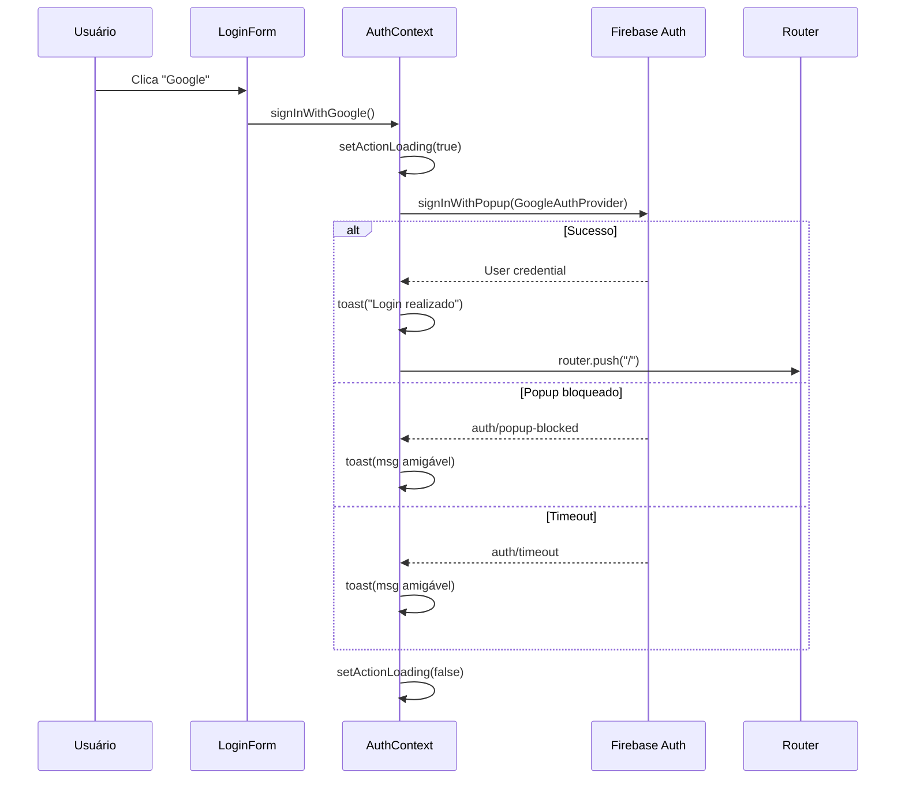
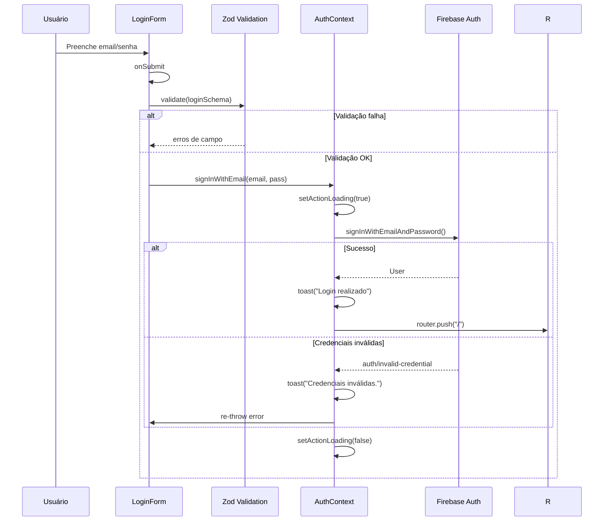
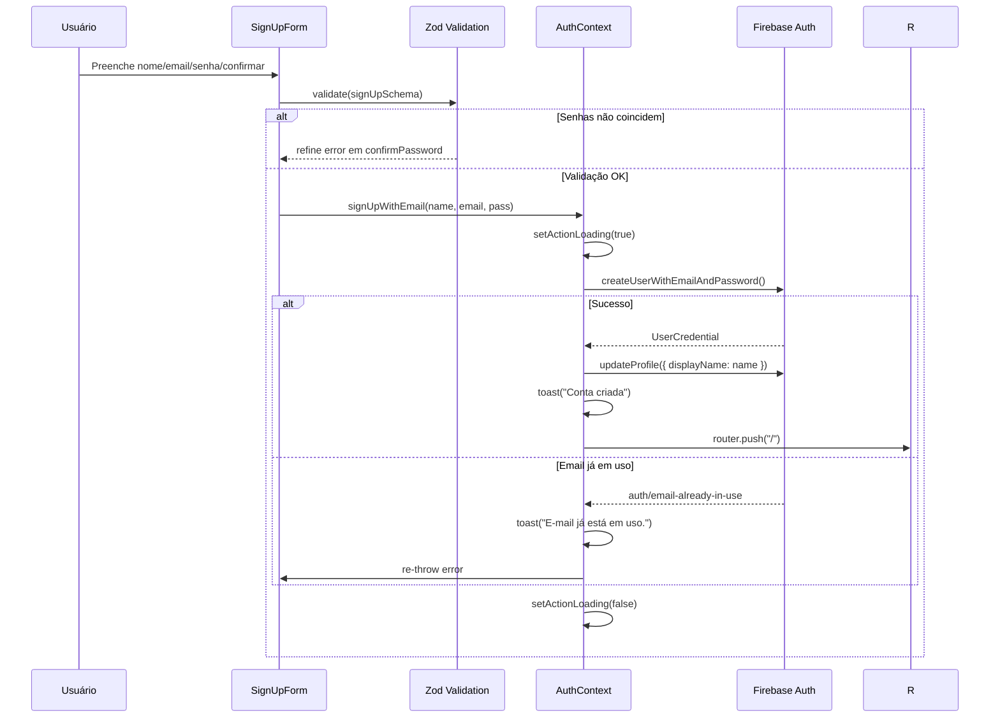
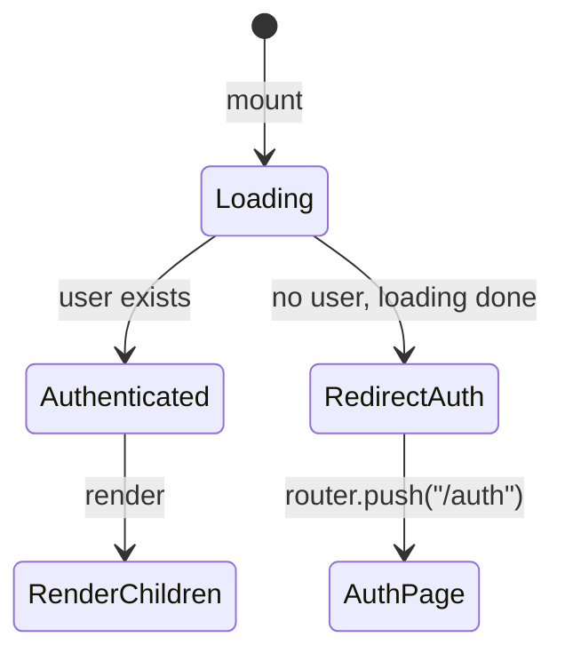

# Auth — Sistema de Autenticação

## Visão Geral

Componente responsável por gerenciar a identidade do usuário no V-Lab Assistant. Fornece login via Google OAuth e email/senha, proteção de rotas client-side, e um sistema pub/sub de erros para debugging de regras Firestore. Toda autenticação é delegada ao **Firebase Auth** — nenhum servidor de auth próprio existe.

## Responsabilidades

- Autenticação via Google OAuth (popup)
- Autenticação via email e senha (login + signup)
- Logout e redirecionamento
- Proteção de rotas client-side (`ProtectedRoute`)
- Gerenciamento de estado de autenticação (`onAuthStateChanged`)
- Emissão de eventos de erro para debugging (`errorEmitter`)
- Construção de objetos de erro simulando `request.auth` do Firestore para LLMs
- Validação de formulários com Zod

## Interface

### AuthContextType

```typescript
interface AuthContextType {
    user: User | null;           // Firebase User ou null
    loading: boolean;            // Combina isUserLoading + actionLoading
    signInWithGoogle: () => Promise<void>;
    signInWithEmail: (email: string, pass: string) => Promise<void>;
    signUpWithEmail: (name: string, email: string, pass: string) => Promise<void>;
    logout: () => Promise<void>;
}
```

### FirebaseContextState

```typescript
interface FirebaseContextState {
    areServicesAvailable: boolean;
    firebaseApp: FirebaseApp | null;
    firestore: Firestore | null;
    auth: Auth | null;
    storage: FirebaseStorage | null;
    user: User | null;
    isUserLoading: boolean;      // Apenas check inicial de auth
    userError: Error | null;
}
```

### Zod Schemas

**Login:**
- `email`: string válida (Zod `.email()`)
- `password`: mínimo 6 caracteres

**Signup:**
- `name`: mínimo 2 caracteres
- `email`: string válida
- `password`: mínimo 6 caracteres
- `confirmPassword`: deve ser igual a `password` (`.refine()`)

### Error Emitter Events

```typescript
interface AppEvents {
    'permission-error': FirestorePermissionError;
    'firestore-error': { path, operation, code, message, originalError };
    'auth-error': { code, message, originalError };
}
```

### Componentes UI

| Componente | Arquivo | Descrição |
|---|---|---|
| `AuthProvider` | `src/context/auth-context.tsx` | Provider do contexto de auth |
| `LoginForm` | `src/components/auth/auth-forms.tsx` | Formulário de login (email + Google) |
| `SignUpForm` | `src/components/auth/auth-forms.tsx` | Formulário de cadastro |
| `ProtectedRoute` | `src/components/auth/protected-route.tsx` | Guard de rota client-side |
| `FirebaseProvider` | `src/firebase/provider.tsx` | Provider de serviços Firebase |
| `FirebaseClientProvider` | `src/firebase/client-provider.tsx` | Inicialização client-side |
| `FirebaseErrorListener` | `src/components/FirebaseErrorListener` | Listener de erros emitidos |

## Regras de Negócio

### Auth Nucleares

- **RB-Auth-001:** Usuário autenticado é redirecionado de `/auth` para `/projects` 🟢
- **RB-Auth-002:** Usuário não autenticado é redirecionado de rotas protegidas para `/auth` 🟢
- **RB-Auth-003:** Senha mínima é 6 caracteres (exigência do Firebase Auth) 🟢
- **RB-Auth-004:** Google Auth provê apenas identidade — acesso a Google Docs/Drive é feito via Composio OAuth separado 🟢
- **RB-Auth-005:** Não há verificação de email obrigatória — usuário pode usar o sistema sem email verified 🔴
- **RB-Auth-006:** Não há funcionalidade de password reset implementada 🔴
- **RB-Auth-007:** Não há middleware server-side — toda proteção de rotas é client-side 🟡
- **RB-Auth-008:** Todos os usuários autenticados têm acesso às mesmas rotas — não há role-based routing 🟡

### Validação de Formulários

- **RB-Auth-009:** Email deve ser válido (formato RFC) 🟢
- **RB-Auth-010:** Nome deve ter pelo menos 2 caracteres 🟢
- **RB-Auth-011:** Senha e confirmação devem coincidir 🟢

### Tratamento de Erros

- **RB-Auth-012:** Erros do Firebase Auth são mapeados para mensagens em português 🟢
- **RB-Auth-013:** `signInWithEmail` re-throws o erro após toast (permite form handling adicional) 🟢
- **RB-Auth-014:** `signInWithGoogle` não re-throws erros (apenas toast) 🟢
- **RB-Auth-015:** `logout` não re-throws erros (apenas console.error) 🟢

## Fluxo Principal

### Login com Google



### Login com Email/Senha



### SignUp com Email/Senha



### Proteção de Rotas



## Fluxos Alternativos

- **[Popup fechado pelo usuário]:** Exibe toast "Login cancelado" sem redirecionar
- **[Network failure]:** Exibe toast "Erro de conexão. Verifique sua internet"
- **[Too many requests]:** Exibe toast "Muitas tentativas. Aguarde alguns minutos"
- **[Conta desativada]:** Exibe toast "Esta conta foi desativada" (apenas email login)
- **[Firebase não inicializado]:** `auth` é null — funções retornam early sem efeito

## Dependências

| Dependência | Tipo | Motivo |
|---|---|---|
| `firebase/auth` | Externa | SDK de autenticação (Google, email/senha) |
| `firebase/app` | Externa | Inicialização do Firebase App |
| `@hookform/resolvers/zod` | Externa | Integração Zod + react-hook-form |
| `zod` | Externa | Validação de schemas de formulário |
| `react-hook-form` | Externa | Gerenciamento de estado de formulários |
| `next/navigation` | Externa | `useRouter` para redirecionamentos |
| `FirebaseProvider` | Interno | Fornece instâncias `auth`, `user`, `isUserLoading` |
| `useToast` | Interno | Notificações de sucesso/erro |
| `errorEmitter` | Interno | Pub/sub para erros de auth/Firestore |
| `FirestorePermissionError` | Interno | Erro customizado para debugging LLM |

## Requisitos Não Funcionais

| Tipo | Requisito inferido | Evidência no código | Confiança |
|------|--------------------|---------------------|-----------|
| Performance | Loading state previne submissão dupla | `disabled={loading}` em todos os botões de form | 🟢 |
| Performance | Initial auth check é assíncrono não-bloqueante | `onAuthStateChanged` subscribe, `isUserLoading` state | 🟢 |
| Segurança | Sem server-side auth middleware | Nenhum arquivo `src/middleware.ts` encontrado | 🟢 |
| Segurança | Rotas protegidas apenas via JS client-side | `ProtectedRoute` verifica `user` no useEffect | 🟢 |
| Disponibilidade | Error emitter permite tratamento global de falhas | `errorEmitter.on('auth-error', ...)` | 🟡 |

> Inferido a partir do código. Validar com equipe de operações.

## Critérios de Aceitação

```gherkin
Cenário: Login com Google bem-sucedido
Dado que o usuário está na página /auth
Quando clica em "Entrar com Google" e autoriza no popup
Então vê toast "Login realizado com sucesso" e é redirecionado para /

Cenário: Login com email/senha com credenciais inválidas
Dado que o usuário está na página /auth com aba "Entrar" selecionada
Quando insere email/senha incorretos e submete o formulário
Então vê toast "Credenciais inválidas." e permanece na página

Cenário: Cadastro com senhas não coincidentes
Dado que o usuário está na aba "Cadastrar"
Quando insere senha e confirmação diferentes
Então o Zod exibe erro "As senhas não coincidem" no campo confirmPassword

Cenário: Acesso a rota protegida sem autenticação
Dado que o usuário NÃO está autenticado
Quando tenta acessar uma rota envolvida por ProtectedRoute
Então é redirecionado para /auth automaticamente

Cenário: Usuário autenticado acessa /auth
Dado que o usuário JÁ está autenticado
Quando navega para /auth
Então é redirecionado automaticamente para /projects

Cenário: Cadastro com email já existente
Dado que um email já está registrado no Firebase
Quando tenta criar conta com o mesmo email
Então vê toast "Este e-mail já está em uso."

Cenário: Senha muito fraca no cadastro
Dado que o usuário está na aba "Cadastrar"
Quando insere senha com menos de 6 caracteres
Então o Zod exibe erro "A senha deve ter pelo menos 6 caracteres"
```

## Prioridade

| Requisito | MoSCoW | Justificativa |
|-----------|--------|---------------|
| Google OAuth login | Must | Método primário de autenticação |
| Email/senha login | Must | Método alternativo essencial |
| Email/senha signup | Must | Onboarding de novos usuários |
| ProtectedRoute guard | Must | Sem isso, dados expostos |
| FirebaseProvider state | Must | Base de todo o sistema |
| Error emitter pub/sub | Should | Debugging LLM — útil mas não crítico |
| Zod form validation | Should | Poderia ser validação manual |
| FirestorePermissionError | Could | Apenas para debugging avançado |
| Toast notifications | Could | UX polish — funcional sem toasts |

> Prioridade inferida por frequência de chamada e posição na cadeia de dependências.

## Rastreabilidade de Código

| Arquivo | Função / Classe | Cobertura |
|---------|-----------------|-----------|
| `src/context/auth-context.tsx` | `AuthProvider`, `useAuthContext` | 🟢 |
| `src/components/auth/auth-forms.tsx` | `LoginForm`, `SignUpForm` | 🟢 |
| `src/components/auth/protected-route.tsx` | `ProtectedRoute` | 🟢 |
| `src/firebase/provider.tsx` | `FirebaseProvider`, `useFirebase`, `useUser` | 🟢 |
| `src/firebase/client-provider.tsx` | `FirebaseClientProvider` | 🟢 |
| `src/firebase/error-emitter.ts` | `createEventEmitter`, `errorEmitter` | 🟢 |
| `src/firebase/errors.ts` | `FirestorePermissionError`, `buildAuthObject` | 🟢 |
| `src/app/auth/page.tsx` | `AuthenticationPage` | 🟢 |
| `src/app/auth/layout.tsx` | `AuthLayout`, metadata | 🟢 |
| `src/app/layout.tsx` | `RootLayout` (provider tree) | 🟢 |
| `firestore.rules` | Regras `request.auth != null` (linhas 30-558) | 🟢 |
