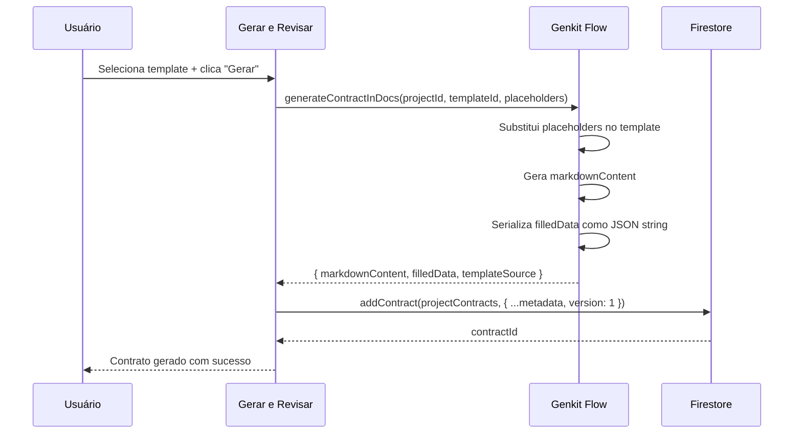
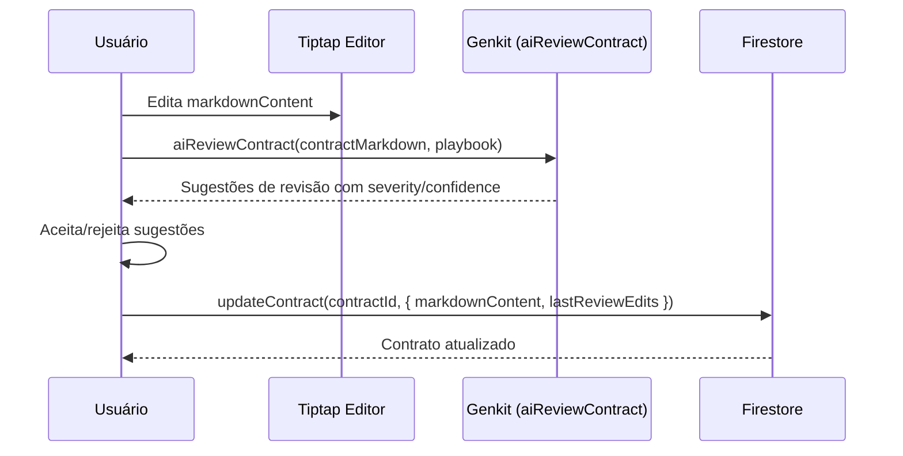
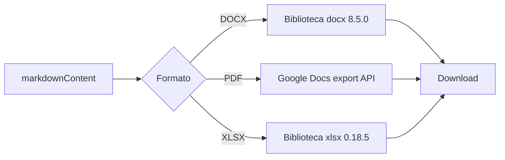

# Contracts — Geração, Edição e Exportação de Contratos

## Visão Geral

Módulo que gerencia contratos gerados a partir de templates + valores de placeholders. O fluxo de geração foi centralizado na página `/gerar-exportar` — a rota `/projects/[projectId]/contracts/new/` agora apenas redireciona. Contratos são salvos em `projectContracts` com `markdownContent` e `filledData` (JSON string). Suporta geração via Google Docs API, export para DOCX/PDF/XLSX, e revisão com IA via Genkit flow `aiReviewContract`. Integra com sync bidirecional Firestore ↔ Google Docs.

## Responsabilidades

- Listagem de contratos gerados por projeto
- Geração de contratos a partir de templates selecionados
- Salvamento de contrato com markdownContent e filledData (JSON)
- Edição de contratos via Tiptap rich text editor
- Revisão de contratos com IA (Genkit: aiReviewContract)
- Export para DOCX, PDF, XLSX
- Integração com Google Docs (googleDocId, googleDocLink, lastSyncedAt)
- Versionamento de contratos
- Tracking de template source (googleDocLink vs projectDocLink)
- Contador de palavras (wordCount)
- Undo de review edits (lastReviewEdits)

## Interface

### Hook: `useProjectContracts(projectId)`

```typescript
interface UseProjectContractsReturn {
  contracts: (ProjectContract & { id: string })[] | null;
  isLoading: boolean;
  error: Error | null;
  addContract: (contract: Omit<ProjectContract, 'id'>) => Promise<string>;
  updateContract: (contractId: string, updates: Partial<ProjectContract>) => Promise<void>;
  deleteContract: (contractId: string) => Promise<void>;
}
```

### Tipo: `ProjectContract` (`src/lib/types.ts:166-186`)

```typescript
interface ProjectContract {
  id: string;
  projectId: string;
  templateId: string;
  name: string;
  markdownContent: string;
  filledData: string;                    // JSON string de valores de placeholders
  generatedBy: string;
  generatedAt: string;
  googleDocId?: string;
  googleDocLink?: string;
  lastSyncedAt?: string;
  templateSource?: 'googleDocLink' | 'projectDocLink';
  fallbackUsed?: boolean;
  version: number;
  wordCount?: number;
}
```

### Tipo: `Contract` (legado, `src/lib/types.ts:445-477`)

```typescript
interface Contract {
  id: string;
  contractModelId?: string;
  projectContractId?: string;
  projectId?: string;
  clientName: string;
  filledData: string;
  name: string;
  markdownContent: string;
  googleDocLink?: string;
  createdAt: string;
  sourceDocumentIds?: string[];
  entityCount?: number;
  generationMethod?: 'google-docs' | 'ai-enriched';
  templateName?: string;
  extractionDate?: string;
  templateSource?: 'googleDocLink' | 'projectDocLink';
  fallbackUsed?: boolean;
  lastReviewEdits?: {                    // Para undo de review
    appliedAt: string;
    edits: Array<{ section, originalText, suggestedText, reason?, severity?, confidence? }>;
  };
}
```

### Componentes UI

| Componente | Arquivo | Descrição |
|---|---|---|
| `NewProjectContractPage` | `src/app/.../contracts/new/page.tsx` | Redireciona para /gerar-exportar |
| `ContractsTab` | `src/app/.../page.tsx` (ContractsTab) | Tab de contratos no dashboard do projeto |
| `TemplatesGrid` | `src/app/.../components/TemplatesGrid.tsx` | Grid de templates selecionáveis |

## Regras de Negócio

- **RB-Ct-001:** Contratos são gerados a partir de placeholders confirmados e templates 🟢
- **RB-Ct-002:** `filledData` é armazenado como JSON string (não objeto) 🟢
- **RB-Ct-003:** Contratos são ordenados por `generatedAt` descendente 🟢
- **RB-Ct-004:** Template source pode ser `googleDocLink` ou `projectDocLink` 🟢
- **RB-Ct-005:** `fallbackUsed` indica quando template alternativo foi utilizado 🟢
- **RB-Ct-006:** `lastReviewEdits` armazena edições de IA para permitir undo 🟢
- **RB-Ct-007:** Geração pode ser via `google-docs` ou `ai-enriched` (legado) 🟢
- **RB-Ct-008:** `/contracts/new/` redireciona para `/gerar-exportar` — geração centralizada 🟢
- **RB-Ct-009:** `useLegacyContracts()` hook é deprecated — lê `users/{uid}/filledContracts` 🔴
- **RB-Ct-010:** Sem validação de `contractType` antes de gerar contrato 🟡
- **RB-Ct-011:** `wordCount` é opcional — nem sempre populado 🟡

## Fluxo Principal

### Geração de Contrato



### Edição e Revisão com IA



### Export



## Fluxos Alternativos

- **[Template sem conteúdo]:** Fallback para template alternativo com `fallbackUsed: true`
- **[Google Docs indisponível]:** Geração fallback para markdown local
- **[Undo review]:** `lastReviewEdits` permite reverter para versão pré-review
- **[Projeto sem contractType]:** Redireciona para settings antes de gerar

## Dependências

| Dependência | Tipo | Motivo |
|---|---|---|
| `firebase/firestore` | Externa | CRUD de contratos |
| `docx` 8.5.0 | Externa | Geração de arquivos DOCX |
| `xlsx` 0.18.5 | Externa | Geração de planilhas XLSX |
| `tiptap` | Externa | Rich text editor para contratos |
| Genkit flows | Interno | `generateContractInDocs`, `aiReviewContract` |
| Google Docs API | Interno | Geração e export via Google Docs |

## Requisitos Não Funcionais

| Tipo | Requisito inferido | Evidência no código | Confiança |
|------|--------------------|---------------------|-----------|
| Performance | filledData como JSON string evita parsing desnecessário | `filledData: string` no tipo | 🟡 |
| Disponibilidade | Fallback para markdown quando Google Docs falha | `fallbackUsed` flag | 🟢 |

## Critérios de Aceitação

```gherkin
Cenário: Gerar contrato a partir de template
Dado que existem placeholders confirmados e um template selecionado
Quando clica em "Gerar Contrato"
Então o contrato é criado com markdownContent preenchido
E filledData contém os valores dos placeholders como JSON
E version = 1

Cenário: Exportar contrato para DOCX
Dado que existe um contrato gerado
Quando clica em "Exportar DOCX"
Então o markdownContent é convertido via biblioteca docx
E o download do arquivo .docx é iniciado

Cenário: Revisão de contrato com IA
Dado que existe um contrato gerado
Quando clica em "Revisar com IA"
Então o Genkit flow aiReviewContract é chamado
E sugestões com severity e confidence são exibidas
E o usuário pode aceitar ou rejeitar cada sugestão
```

## Rastreabilidade de Código

| Arquivo | Função / Classe | Cobertura |
|---------|-----------------|-----------|
| `src/hooks/use-projects.ts` | `useProjectContracts` | 🟢 |
| `src/app/(main)/projects/[projectId]/contracts/new/page.tsx` | `NewProjectContractPage` | 🟢 |
| `src/app/(main)/projects/[projectId]/components/TemplatesGrid.tsx` | `TemplatesGrid` | 🟢 |
| `src/lib/types.ts` | `ProjectContract`, `Contract` | 🟢 |
| `src/lib/export.ts` | Export logic | 🟢 |
| `src/lib/document-converter.ts` | Document converter | 🟢 |
| `src/ai/flows/generate-contract-in-docs.ts` | Genkit flow | 🟢 |
| `src/ai/flows/ai-review-contract.ts` | Genkit flow | 🟢 |
