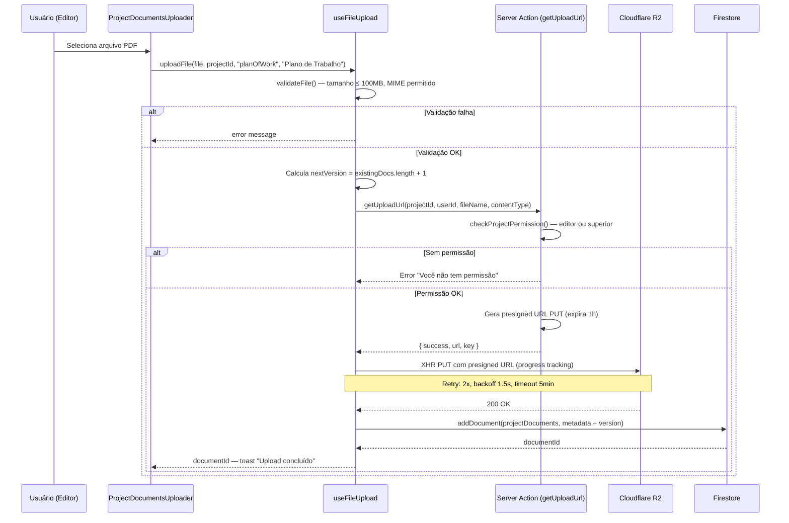
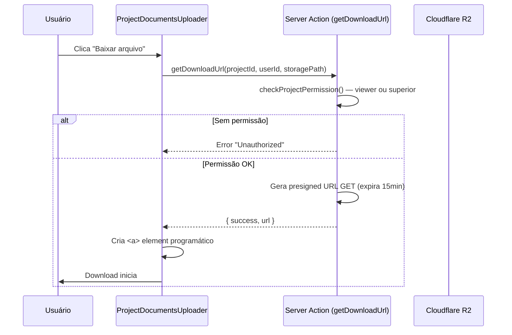
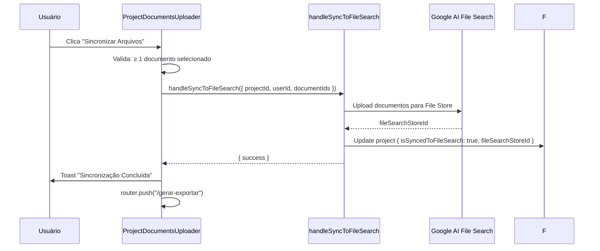

# Documents — Upload, Processamento e Versionamento de Documentos

## Visão Geral

Módulo responsável pelo upload de documentos iniciais (planos de trabalho, termos de execução, planilhas orçamentárias, documentos extras) para projetos. Usa **Cloudflare R2** como provedor de storage com presigned URLs geradas via server action. Cada documento é versionado por `documentType`, com validação de MIME type, tamanho máximo de 100MB, retry com exponential backoff, e progresso de upload via XHR. Documentos são sincronizados com o **Google AI File Search** para servir como contexto do chatbot ALEX.

## Responsabilidades

- Upload de arquivos para Cloudflare R2 via presigned URLs (PUT)
- Geração de presigned URLs com validação de permissão server-side
- Validação de arquivo: tamanho (100MB max), MIME types permitidos, imagens bloqueadas
- Versionamento automático por `documentType` (`v1`, `v2`, ...)
- Download via presigned URL (GET, expira em 15min)
- Grouping de documentos por tipo com ordenação por `uploadedAt`
- Seleção de documentos para sincronização com Google AI File Search
- Análise de consistência entre documentos via IA (Genkit flow)
- Feedback por documento (via FeedbackModal)
- Configuração de tipo de contrato e tipo de processo por projeto
- Gerenciamento de documentos extras (0 a 6 por projeto)

## Interface

### Hook: `useFileUpload(projectId)`

```typescript
interface FileUploadState {
  isUploading: boolean;
  progress: number;          // 0-100
  error: string | null;
  documentId: string | null;
}

interface UseFileUploadReturn {
  uploadState: FileUploadState;
  uploadFile: (file: File, projectId: string, documentType: string, documentName: string) => Promise<string | null>;
  resetUpload: () => void;
}
```

### Hook: `useDocumentsByType(projectId)`

```typescript
interface UseDocumentsByTypeReturn {
  documentsByType: Record<string, (ProjectDocument & { id: string })[]>;
  // keys: 'planOfWork', 'termOfExecution', 'budgetSpreadsheet', 'extraDocument1', 'extraDocument2', ...
  // valores ordenados por uploadedAt desc, depois version desc
}
```

### Server Actions (`src/lib/actions/storage-actions.ts`)

| Action | Parâmetros | Retorno | Descrição |
|---|---|---|---|
| `getUploadUrl` | `projectId`, `userId`, `fileName`, `contentType` | `{ success, url, key, bucket }` | Gera presigned URL PUT (expira em 1h) |
| `getDownloadUrl` | `projectId`, `userId`, `key` | `{ success, url }` | Gera presigned URL GET (expira em 15min) |

### Componentes UI

| Componente | Arquivo | Descrição |
|---|---|---|
| `ProjectDocumentsUploader` | `src/app/.../components/ProjectDocumentsUploader.tsx` | Página principal de gestão de documentos |
| `FileUploader` | `src/components/app/file-uploader` | Drop zone de upload por tipo de documento |
| `FeedbackModal` | `src/components/app/feedback-modal` | Modal de feedback sobre documento |
| `ConsistencyAnalysisModal` | `src/components/app/consistency-analysis-modal` | Modal de análise de consistência entre documentos |

### Tipos Principais

**ProjectDocument** (`src/lib/types.ts:113-142`):
- `documentType`: string — `planOfWork`, `termOfExecution`, `budgetSpreadsheet`, `extraDocument1..6`, `other`
- `status`: `uploaded` → `processing` → `indexed` ou `error`
- `storageProvider`: `'firebase'` | `'r2'`
- `version`: number — incrementado automaticamente
- `fileSearchDocumentName`, `fileSearchIndexedAt`: tracking do Google AI File Search
- `entityExtractionStatus`: `'pending'` | `'processing'` | `'completed'` | `'failed'`

## Regras de Negócio

### Upload

- **RB-Doc-001:** Apenas membros com role `editor` ou superior podem fazer upload 🟢
- **RB-Doc-002:** Tamanho máximo de arquivo: 100MB (`100 * 1024 * 1024` bytes) 🟢
- **RB-Doc-003:** Tipos permitidos: PDF, DOC, DOCX, XLS, XLSX, TXT 🟢
- **RB-Doc-004:** Imagens (PNG, JPG, GIF, WebP, BMP, SVG) são explicitamente bloqueadas 🟢
- **RB-Doc-005:** Presigned URL PUT expira em 1 hora (3600s) 🟢
- **RB-Doc-006:** Presigned URL GET expira em 15 minutos (900s) 🟢
- **RB-Doc-007:** Upload usa XHR (não fetch) para suporte a progresso nativo 🟢
- **RB-Doc-008:** Timeout do XHR é 5 minutos para arquivos grandes 🟢
- **RB-Doc-009:** Retry com exponential backoff: 2 retries, base delay 1s (presigned URL) e 1.5s (upload R2) 🟢
- **RB-Doc-010:** MIME type é validado via `getValidMimeType(file.name, file.type)` 🟢
- **RB-Doc-011:** CRC32 checksum algorithm é explicitamente desabilitado no PutObjectCommand para evitar CORS preflight falho no R2 🟢
- **RB-Doc-012:** HEAD preflight check foi removido — presigned URLs PUT não autorizam OPTIONS 🟢

### Versionamento

- **RB-Doc-013:** Version é calculado como `existingDocs.length + 1` para o mesmo `documentType` 🟢
- **RB-Doc-014:** Documentos são agrupados por `documentType` e ordenados por `uploadedAt` desc 🟢
- **RB-Doc-015:** Apenas o documento mais recente de cada tipo é usado no contexto ALEX 🟢
- **RB-Doc-016:** `extraDocument` genérico é mapeado para `extraDocument1` no `useDocumentsByType` 🟡

### Configuração de Projeto

- **RB-Doc-017:** Tipo de contrato é obrigatório antes de qualquer upload 🟢
- **RB-Doc-018:** Títulos dos cards mudam dinamicamente baseado no `contractType` (ted, acordo-parceria-inovacao, acordo-parceria-embrapii, contrato-extensao) 🟢
- **RB-Doc-019:** Tipo de processo só aparece para TED (ufpe-parceiro, fade-ufpe) 🟢
- **RB-Doc-020:** Documentos extras: 0 a 6, persistido em `project.extraDocumentCount` 🟢
- **RB-Doc-021:** "Limpar Dados Antigos" reseta apenas estado local — não apaga dados do Firestore 🟢

### Sincronização

- **RB-Doc-022:** Sincronização com File Search requer ao menos 1 documento selecionado 🟢
- **RB-Doc-023:** Análise de consistência requer ao menos 2 documentos selecionados 🟢
- **RB-Doc-024:** Sem documentos selecionados, usa todos os tipos visíveis por padrão 🟢
- **RB-Doc-025:** Após sync bem-sucedido, redireciona para `/gerar-exportar?projectId=...` 🟢

### Download

- **RB-Doc-026:** Documentos R2 usam presigned URL gerada via server action 🟢
- **RB-Doc-027:** Documentos Firebase usam URL direta do `projectDocument.fileUrl` 🟢
- **RB-Doc-028:** Download via `<a>` element programático com `download` attribute 🟢

## Fluxo Principal

### Upload de Documento



### Download de Documento



### Sincronização com File Search



## Fluxos Alternativos

- **[R2 não configurado]:** `getUploadUrl` retorna `{ success: false, error: 'R2 credentials missing' }` — upload é bloqueado
- **[CORS error no R2]:** XHR status 0 — mensagem específica: "problema de configuração CORS no Cloudflare R2"
- **[Presigned URL expirada]:** R2 retorna 403 — mensagem: "URL de upload pode ter expirado"
- **[Network timeout]:** XHR timeout após 5min — mensagem: "Arquivos grandes podem levar mais tempo"
- **[Contrato type não selecionado]:** FileUploader desabilitado — toast: "Tipo de contrato obrigatório"
- **[Status 403 no upload]:** R2 rejeita — "Acesso negado ao armazenamento (erro 403)"

## Dependências

| Dependência | Tipo | Motivo |
|---|---|---|
| `@aws-sdk/client-s3` | Externa | Cliente S3-compatible para Cloudflare R2 |
| `@aws-sdk/s3-request-presigner` | Externa | Geração de presigned URLs |
| `firebase/storage` | Externa | Upload para Firebase Storage (legado) |
| `src/lib/r2.ts` | Interno | Configuração do cliente R2 (S3) |
| `src/lib/storage.ts` | Interno | `validateFile`, `uploadFileToR2`, `withRetry`, `formatFileSize` |
| `src/lib/actions/storage-actions.ts` | Interno | Server actions para presigned URLs |
| `src/lib/mime-type-utils.ts` | Interno | `getValidMimeType` |
| `src/lib/firebase-server.ts` | Interno | Firebase Admin SDK (`db`) para verificação server-side |
| `useProjectDocuments` | Interno | CRUD de documentos no Firestore |
| `handleSyncToFileSearch` | Interno | Server action para sync com Google AI File Search |

## Requisitos Não Funcionais

| Tipo | Requisito inferido | Evidência no código | Confiança |
|------|--------------------|---------------------|-----------|
| Performance | XHR para tracking de progresso nativo | `xhr.upload.addEventListener('progress', ...)` | 🟢 |
| Performance | Retry com exponential backoff (2 retries) | `withRetry(fn, 2, 1000/1500)` | 🟢 |
| Performance | Timeout de 5min para uploads grandes | `xhr.timeout = 5 * 60 * 1000` | 🟢 |
| Segurança | Presigned URLs com expiração curta | PUT: 3600s, GET: 900s | 🟢 |
| Segurança | Validação server-side de permissões | `checkProjectPermission` via Admin SDK | 🟢 |
| Segurança | CRC32 checksum desabilitado para compatibilidade R2 | Comentário no PutObjectCommand | 🟢 |
| Disponibilidade | CORS preflight HEAD removido para evitar falhas | Comentário sobre `unhoistableHeaders` | 🟢 |

> Inferido a partir do código. Validar com equipe de operações.

## Critérios de Aceitação

```gherkin
Cenário: Upload bem-sucedido de PDF
Dado que o usuário é editor do projeto e selecionou o tipo de contrato
Quando faz upload de um arquivo PDF de 5MB
Então vê progresso de 0 a 100%
E o documento aparece no card com versão v1
E toast "Upload concluído" é exibido

Cenário: Upload bloqueado por tamanho
Dado que o usuário tenta enviar um arquivo de 150MB
Quando seleciona o arquivo
Então vê erro "Arquivo muito grande. Tamanho máximo permitido: 100MB"
E o upload não é iniciado

Cenário: Upload bloqueado por tipo de arquivo
Dado que o usuário tenta enviar uma imagem PNG
Quando seleciona o arquivo
Então vê erro "Formato de arquivo não suportado"
E imagens são explicitamente listadas como não aceitas

Cenário: Upload sem tipo de contrato selecionado
Dado que o usuário não selecionou nenhum tipo de contrato
Quando tenta fazer upload de um documento
Então vê toast "Tipo de contrato obrigatório"
E o FileUploader está desabilitado

Cenário: Download de documento R2
Dado que existe um documento armazenado no R2
Quando clica em "Baixar arquivo"
Então uma presigned URL GET é gerada com expiração de 15 minutos
E o download do arquivo original é iniciado

Cenário: Presigned URL expirada
Dado que uma presigned URL foi gerada há mais de 1 hora
Quando o XHR tenta fazer PUT
Então recebe status 403
E vê mensagem "Acesso negado ao armazenamento (erro 403). A URL de upload pode ter expirado"

Cenário: Versionamento de documentos
Dado que já existe 1 documento do tipo "planOfWork"
Quando faz upload de outro documento do mesmo tipo
Então o novo documento recebe version = 2
E o documento mais recente aparece primeiro na listagem

Cenário: Sincronização com File Search
Dado que há pelo menos 1 documento selecionado
Quando clica em "Sincronizar Arquivos"
Então os documentos são enviados ao Google AI File Search
E o projeto é atualizado com isSyncedToFileSearch = true
E o usuário é redirecionado para /gerar-exportar

Cenário: Análise de consistência com documentos insuficientes
Dado que há apenas 1 documento selecionado
Quando tenta abrir a análise de consistência
Então o botão está desabilitado
E tooltip indica "Selecione pelo menos 2 documentos"

Cenário: R2 não configurado
Dado que as variáveis de ambiente R2 não estão definidas
Quando tenta fazer upload
Então recebe erro "Armazenamento em nuvem não configurado"
E a mensagem menciona "R2 credentials missing"
```

## Prioridade

| Requisito | MoSCoW | Justificativa |
|-----------|--------|---------------|
| Upload para R2 com presigned URL | Must | Mecanismo primário de storage |
| Validação de arquivo (tamanho, tipo) | Must | Segurança e integridade |
| Permissão server-side para upload | Must | Sem isso, qualquer um pode upload |
| Versionamento por documentType | Must | Core do fluxo de documentos |
| Download via presigned URL | Must | Acesso aos documentos |
| Agrupamento por tipo | Must | UI depende disso |
| Sync com File Search | Must | Contexto para ALEX |
| Retry com backoff | Should | Resiliência de rede |
| Documentos extras (0-6) | Should | Flexibilidade do projeto |
| Progresso de upload via XHR | Should | UX — pode ser simplificado |
| Análise de consistência | Could | Feature avançada de IA |
| Feedback por documento | Could | Melhoria de qualidade |
| Firebase Storage (legado) | Won't | R2 é o provedor primário agora |

> Prioridade inferida por frequência de chamada e posição na cadeia de dependências.

## Rastreabilidade de Código

| Arquivo | Função / Classe | Cobertura |
|---------|-----------------|-----------|
| `src/app/(main)/projects/[projectId]/documents/page.tsx` | `ProjectDocumentsPage` | 🟢 |
| `src/app/(main)/projects/[projectId]/components/ProjectDocumentsUploader.tsx` | `ProjectDocumentsUploader` | 🟢 |
| `src/hooks/use-file-upload.ts` | `useFileUpload`, `useDocumentsByType` | 🟢 |
| `src/lib/storage.ts` | `validateFile`, `uploadFileToR2`, `withRetry`, `formatFileSize` | 🟢 |
| `src/lib/actions/storage-actions.ts` | `getUploadUrl`, `getDownloadUrl`, `checkProjectPermission` | 🟢 |
| `src/lib/r2.ts` | `getR2Client`, `isR2Configured`, `R2_BUCKET_NAME` | 🟢 |
| `src/lib/mime-type-utils.ts` | `getValidMimeType` | 🟢 |
| `src/hooks/use-projects.ts` | `useProjectDocuments` | 🟢 |
| `src/lib/types.ts` | `ProjectDocument`, `DocumentStatus` | 🟢 |
| `firestore.rules` | Regras de projectDocuments (linhas 160-220) | 🟢 |
