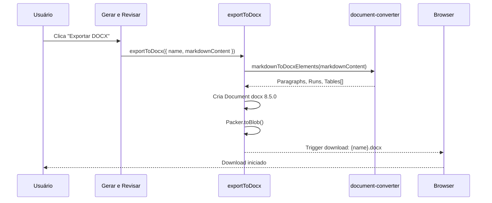
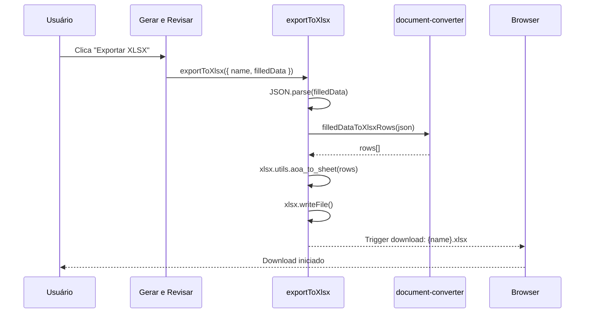

# Export — Exportação de Contratos em Múltiplos Formatos

## Visão Geral

Módulo de exportação que converte contratos em markdown para formatos DOCX, PDF e XLSX. Utiliza bibliotecas especializadas (`docx` 8.5.0, `xlsx` 0.18.5) para geração client-side de documentos e planilhas, e Google Docs API para export PDF. A página `/gerar-exportar` centraliza tanto a geração quanto a exportação. O document converter (`document-converter.ts`) transforma markdown em estruturas nativas de cada formato (Paragraphs/Runs para DOCX, Worksheets para XLSX).

## Responsabilidades

- Export de contrato para DOCX via biblioteca `docx`
- Export de contrato para PDF via Google Docs API
- Export de contrato para XLSX via biblioteca `xlsx`
- Conversão de markdown para estrutura DOCX (Paragraphs, Runs, Tables)
- Conversão de dados de placeholders para planilha XLSX
- Download de arquivos gerados no browser
- Integração com Google Docs para PDF

## Interface

### `export.ts` (`src/lib/export.ts`)

```typescript
// Export para DOCX
export async function exportToDocx(
  contract: { name: string; markdownContent: string; filledData?: string }
): Promise<void>;

// Export para XLSX
export async function exportToXlsx(
  contract: { name: string; filledData?: string }
): Promise<void>;

// Export para PDF (via Google Docs)
export async function exportToPdfViaGoogleDocs(
  googleDocId: string,
  fileName: string
): Promise<void>;
```

### `document-converter.ts` (`src/lib/document-converter.ts`)

```typescript
// Converte markdown para estrutura DOCX
export function markdownToDocxElements(markdown: string): Array<{
  type: 'paragraph' | 'heading' | 'table' | 'list';
  children: unknown[];
}>;

// Converte filledData JSON para dados XLSX
export function filledDataToXlsxRows(filledDataJson: string): Array<Record<string, string>>;
```

### Dependências de Bibliotecas

| Biblioteca | Versão | Uso |
|---|---|---|
| `docx` | 8.5.0 | Geração de arquivos .docx |
| `xlsx` | 0.18.5 | Geração de arquivos .xlsx |
| `googleapis` | - | Export PDF via Google Docs |

## Regras de Negócio

- **RB-Ex-001:** DOCX é gerado client-side via biblioteca `docx` 🟢
- **RB-Ex-002:** XLSX contém dados dos placeholders em formato tabular 🟢
- **RB-Ex-003:** PDF requer Google Doc (não é gerado client-side) 🟢
- **RB-Ex-004:** Export dispara download automático no browser 🟢
- **RB-Ex-005:** Nome do arquivo é baseado no `name` do contrato 🟢
- **RB-Ex-006:** Markdown é parseado para elementos DOCX (headings, paragraphs, tables) 🟢
- **RB-Ex-007:** `filledData` é parseado de JSON string para objeto antes de export 🟢
- **RB-Ex-008:** Sem suporte a export de múltiplos contratos em batch 🟡
- **RB-Ex-009:** Sem opções de customização de formato (font, margins) 🟡
- **RB-Ex-010:** Sem preview antes do download 🟡

## Fluxo Principal

### Export para DOCX



### Export para XLSX



## Fluxos Alternativos

- **[Sem filledData]:** XLSX export com dados mínimos (apenas nome do contrato)
- **[Google Docs indisponível]:** PDF export falha — fallback não implementado
- **[Markdown complexo]:** Elementos não suportados são ignorados na conversão DOCX

## Dependências

| Dependência | Tipo | Motivo |
|---|---|---|
| `docx` 8.5.0 | Externa | Geração DOCX |
| `xlsx` 0.18.5 | Externa | Geração XLSX |
| `googleapis` | Externa | Export PDF |
| `document-converter.ts` | Interno | Conversão de markdown |

## Requisitos Não Funcionais

| Tipo | Requisito inferido | Evidência no código | Confiança |
|------|--------------------|---------------------|-----------|
| Performance | Export client-side evita round-trip ao servidor | Bibliotecas no client | 🟢 |
| Compatibilidade | DOCX compatível com Word e Google Docs | Biblioteca docx padrão | 🟢 |

## Critérios de Aceitação

```gherkin
Cenário: Exportar contrato para DOCX
Dado que existe um contrato com markdownContent
Quando clica em "Exportar DOCX"
Então o markdown é convertido para elementos DOCX
E um arquivo .docx é baixado com o nome do contrato

Cenário: Exportar dados para XLSX
Dado que existe um contrato com filledData
Quando clica em "Exportar XLSX"
Então os dados dos placeholders são convertidos para planilha
E um arquivo .xlsx é baixado
```

## Rastreabilidade de Código

| Arquivo | Função / Classe | Cobertura |
|---------|-----------------|-----------|
| `src/lib/export.ts` | exportToDocx, exportToXlsx, exportToPdfViaGoogleDocs | 🟢 |
| `src/lib/document-converter.ts` | markdownToDocxElements, filledDataToXlsxRows | 🟢 |
| `src/app/(main)/gerar-exportar/page.tsx` | UI de export | 🟢 |
| `package.json` | docx 8.5.0, xlsx 0.18.5 | 🟢 |
