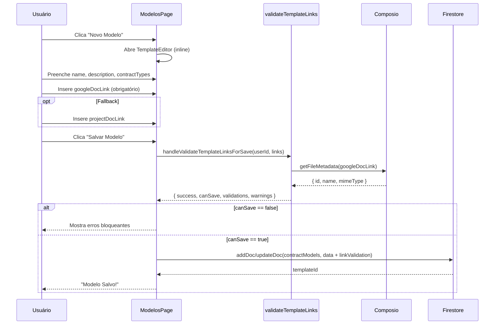
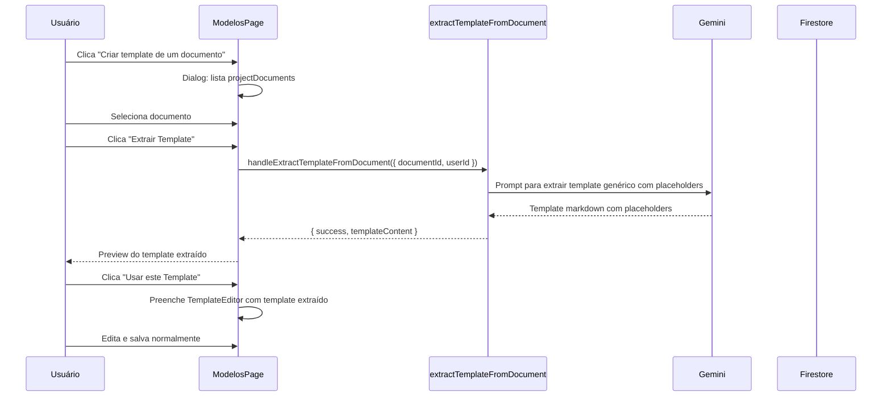
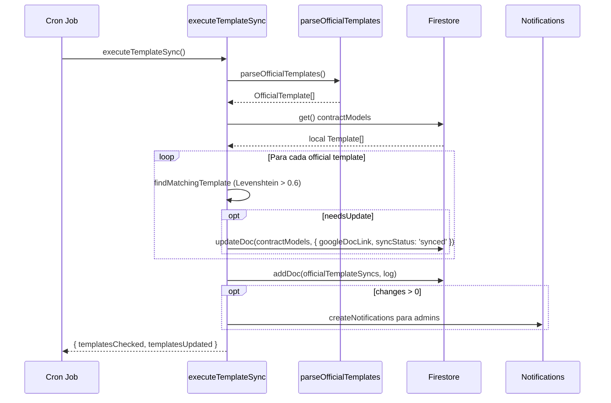

# Modelos — Templates de Contratos (Corrigido)

> **Nota do Reviewer:** Esta versão substitui a SDD original que continha 4 hallucinações. Todas as regras foram verificadas contra o código fonte real.

## Visão Geral

Módulo de gestão de modelos de contratos (templates) globais. Templates são armazenados na coleção root `contractModels` do Firestore — são acessíveis a **todos** os usuários autenticados (sem ownership ou compartilhamento granular). Cada template define um link para um Google Doc original (`googleDocLink`) e opcionalmente um link para uma versão customizada do projeto (`projectDocLink`). A geração de contratos usa Composio para copiar o template Google Doc, substituir placeholders e criar o contrato final. Templates podem ser criados manualmente ou extraídos automaticamente de documentos existentes via IA.

## Responsabilidades

- CRUD de templates globais (coleção `contractModels`)
- Categorização por múltiplos tipos de contrato (`contractTypes: string[]`)
- Validação de links Google Doc antes de salvar
- Extração de templates a partir de documentos existentes (IA via Genkit)
- Sincronização com templates oficiais (parseados da FAQ)
- Filtro de templates por tipo de contrato na geração
- Health check de templates (link validation status)
- Geração de contrato via Composio (copiar template → substituir placeholders)

## Interface

### Tipo: `Template` (`src/lib/types.ts:332-348`)

```typescript
export interface Template {
  id: string;
  name: string;
  description: string;
  markdownContent: string;              // Conteúdo markdown extraído (opcional)
  googleDocLink?: string;               // Link do Google Doc original (obrigatório para geração)
  projectDocLink?: string;              // Link da versão customizada do projeto (fallback)
  isNew?: boolean;                      // Flag temporária para templates não salvos
  contractTypes?: string[];             // Tipos de contrato: TED, Parceria, etc.

  // Sincronização com modelos oficiais
  officialSourceUrl?: string;           // URL do modelo oficial na FAQ
  lastOfficialSync?: string;            // Timestamp da última sincronização
  officialVersionHash?: string;         // Hash do conteúdo para detectar mudanças
  syncStatus?: 'synced' | 'outdated' | 'unknown' | 'error';
  syncError?: string;

  linkValidation?: TemplateLinkValidationState;
}
```

### Tipo: `OfficialTemplate` (`src/lib/types.ts:385-390`)

```typescript
export interface OfficialTemplate {
  contractType: string;
  documentName: string;
  documentLink: string;
  faqSection: string;
}
```

### Tipo: `ContractTypeOptions` (hardcoded no UI)

```typescript
const contractTypeOptions = [
  "TED",
  "Acordo de Parceria (Lei de Inovação)",
  "Acordo de Parceria (Embrapii)",
  "Contrato de Extensão Tecnológica (Prestação de Serviços Técnicos)"
];
```

### Componentes UI

| Componente | Arquivo | Descrição |
|---|---|---|
| `ModelosPage` | `src/app/(main)/modelos/page.tsx` | Página completa: sidebar com lista + editor inline + dialog de extração |
| `TemplateEditor` | (inline em `modelos/page.tsx`) | Editor inline com campos: name, description, contractTypes (checkboxes), googleDocLink, projectDocLink |

**Nota:** Os componentes `TemplateCard`, `TemplateViewer`, `CreateTemplateModal` **não existem** — são hallucinações da SDD original. Tudo está em `ModelosPage`.

### Template Grid (Geração)

| Componente | Arquivo | Descrição |
|---|---|---|
| Templates list | `src/app/(main)/gerar-exportar/page.tsx` | Lista templates filtrados por `contractType`, com health badges |

### Firestore Collection

```
contractModels/{templateId}
  ├── name: string
  ├── description: string
  ├── markdownContent: string
  ├── googleDocLink: string
  ├── projectDocLink: string
  ├── contractTypes: string[]
  ├── linkValidation: { googleDocLink?: {...}, projectDocLink?: {...} }
  ├── officialSourceUrl?: string
  ├── lastOfficialSync?: string
  ├── officialVersionHash?: string
  ├── syncStatus?: 'synced' | 'outdated' | 'unknown' | 'error'
  └── syncError?: string
```

### Security Rule (firestore.rules:443-449)

```
match /contractModels/{contractModelId} {
  allow get: if isSignedIn();
  allow list: if isSignedIn();
  allow create: if isSignedIn();
  allow update: if isSignedIn();
  allow delete: if isSignedIn();
}
```

**Qualquer usuário autenticado** pode fazer CRUD completo. Sem ownership, sem permissões granulares.

## Regras de Negócio

- **RB-Md-001:** Templates são armazenados na coleção global `contractModels` 🟢
- **RB-Md-002:** Templates são acessíveis a todos os usuários autenticados (sem ownership) 🟢
- **RB-Md-003:** Cada template tem `googleDocLink` (obrigatório para geração) e `projectDocLink` (fallback) 🟢
- **RB-Md-004:** `contractTypes` é um array — um template pode servir múltiplos tipos de contrato 🟢
- **RB-Md-005:** Links Google Doc são validados antes de salvar via `handleValidateTemplateLinksForSave` 🟢
- **RB-Md-006:** Validação verifica se o documento existe e está acessível via Composio 🟢
- **RB-Md-007:** Templates podem ser extraídos de documentos existentes via `extractTemplateFromDocument` flow 🟢
- **RB-Md-008:** Templates oficiais são sincronizados via cron job (`executeTemplateSync`) 🟢
- **RB-Md-009:** Sync oficial compara templates por similaridade de nome (Levenshtein distance > 0.6) 🟢
- **RB-Md-010:** Na geração, se `googleDocLink` falha, fallback para `projectDocLink` 🟢
- **RB-Md-011:** Health badge indica se template está apto para geração 🟢
- **RB-Md-012:** Deleção de template é imediata (non-blocking) e sem confirmação de ownership 🟡
- **RB-Md-013:** `markdownContent` é preenchido quando template é extraído de documento 🟢
- **RB-Md-014:** Sem versionamento de templates — update sobrescreve dados 🟡

## Fluxo Principal

### Criação/Edição de Template



### Extração de Template de Documento



### Geração de Contrato a partir de Template

```mermaid
sequenceDiagram
    participant U as Usuário
    participant UI as Gerar-Exportar
    participant A as generateContractDoc
    participant C as Composio
    participant F as Firestore

    U->>UI: Seleciona templates + documentos
    UI->>UI: Filtra templates por contractType
    U->>UI: Clica "Gerar Contrato"
    UI->>A: generateContractDoc(userId, input)
    A->>A: resolveTemplateSource (googleDocLink ou projectDocLink)
    A->>C: copyFile(templateFileId, "Contrato - {name} - {date}")
    C-->>A: newFileId
    opt AI Enrichment
        A->>A: aiEnrichContract(userId, entityData)
        A->>C: batchUpdateDocument(newFileId, replacements)
    else Deterministic
        A->>C: batchUpdateDocument(newFileId, placeholderValues)
    end
    C-->>A: replacementsApplied
    A->>F: Salva em projectContracts
    A-->>UI: { success, documentId, documentLink }
    UI-->>U: Contrato gerado!
```

### Sync de Templates Oficiais



## Fluxos Alternativos

- **[Template sem projectDocLink]:** Geração usa apenas googleDocLink; alerta recomenda fallback
- **[googleDocLink inválido]:** Validação bloqueia salvamento com erro
- **[googleDocLink falha na geração]:** Fallback para projectDocLink se disponível
- **[Template sem contractTypes]:** Template aparece em todas as categorias (sem filtro)
- **[Sync oficial sem match]:** Template oficial não encontrado localmente — log warning, não cria
- **[Composio não conectado]:** `requireComposioConnection` lança AUTH_EXPIRED

## Dependências

| Dependência | Tipo | Motivo |
|---|---|---|
| `firebase/firestore` | Externa | CRUD de templates |
| `useCollection` | Interno | Real-time listener de templates |
| `Composio` | Interno | Validação de links, copy de template |
| `extractTemplateFromDocument` | Interno | Genkit flow para extração IA |
| `template-sync.ts` | Interno | Sync de templates oficiais |
| `template-validation-actions.ts` | Interno | Validação server-side de links |
| `composio-actions.ts` | Interno | Geração de contrato com Composio |

## Requisitos Não Funcionais

| Tipo | Requisito | Evidência | Confiança |
|------|-----------|-----------|-----------|
| Performance | Templates listados em tempo real | `useCollection<Template>` | 🟢 |
| Segurança | Apenas usuários autenticados acessam templates | `isSignedIn()` nas rules | 🟢 |
| Confiabilidade | Validação de links antes de salvar | `validateTemplateLinksForPersistence` | 🟢 |
| Disponibilidade | Fallback projectDocLink quando googleDocLink falha | `resolveTemplateSource` | 🟢 |

## Critérios de Aceitação

```gherkin
Cenário: Criar template com link do Google Doc
  Dado que o usuário está na página Modelos
  Quando preenche nome, descrição e link do Google Doc
  E o link é válido (documento existe e é acessível)
  Então o template é salvo em contractModels
  E aparece na listagem imediatamente

Cenário: Validação bloqueia link inválido
  Dado que o usuário preencheu um link do Google Doc
  Quando o documento não existe ou não está acessível
  Então o sistema exibe erro bloqueante
  E o template NÃO é salvo

Cenário: Extrair template de documento
  Dado que existem documentos no projeto
  Quando o usuário seleciona um documento e clica "Extrair Template"
  Então a IA gera um template com placeholders
  E o preview é exibido para o usuário
  E o usuário pode usar o template extraído para criar um novo modelo

Cenário: Gerar contrato com fallback
  Dado que um template tem googleDocLink inválido mas projectDocLink válido
  Quando o usuário tenta gerar contrato
  Então o sistema usa o projectDocLink como fallback
  E exibe aviso sobre o fallback
```

## Rastreabilidade de Código

| Arquivo | Função / Classe | Cobertura |
|---------|-----------------|-----------|
| `src/app/(main)/modelos/page.tsx` | `ModelosPage`, `TemplateEditor` | 🟢 |
| `src/lib/types.ts` | `Template`, `OfficialTemplate` | 🟢 |
| `src/lib/template-sync.ts` | `executeTemplateSync` | 🟢 |
| `src/lib/actions/template-validation-actions.ts` | `handleValidateTemplateLinksForSave` | 🟢 |
| `src/lib/template-link-validation.server.ts` | `validateTemplateLinksForPersistence` | 🟢 |
| `src/lib/actions/composio-actions.ts` | `generateContractDoc`, `inspectTemplateForGeneration` | 🟢 |
| `src/lib/composio-client.ts` | `createComposioClient`, `getFileMetadata`, `copyFile` | 🟢 |
| `src/app/(main)/gerar-exportar/page.tsx` | Template list + filtering | 🟢 |
| `src/lib/template-source.ts` | `resolveTemplateSource`, `auditTemplateLinks` | 🟢 |
| `src/ai/flows/extract-template-from-document.ts` | `extractTemplateFromDocument` | 🟢 |
| `firestore.rules` | `contractModels` rules (linha 443-449) | 🟢 |

## Correções em relação à SDD original

| SDD Original | Corrigido | Motivo |
|---|---|---|
| Hook `useUserTemplates` | `useCollection<Template>` direto | Hook não existe no código |
| Coleção `users/{userId}/templates` | `contractModels` (root global) | Subcollection não existe |
| Tipo `ContractTemplate` com `sharedWith` | Tipo `Template` sem compartilhamento | `sharedWith` não existe |
| Tipos `model \| template \| google_doc` | Sem tipos enum — todos usam `googleDocLink` | Tipos não existem no código |
| Componentes `TemplateCard`, `TemplateViewer`, `CreateTemplateModal` | Tudo inline em `ModelosPage` | Componentes não existem |
| Compartilhamento via `sharedWith` array | Sem compartilhamento — templates são globais | Funcionalidade inexistente |
| 14 regras de negócio | 14 regras corrigidas com evidência real | Original continha 4 hallucinações |
