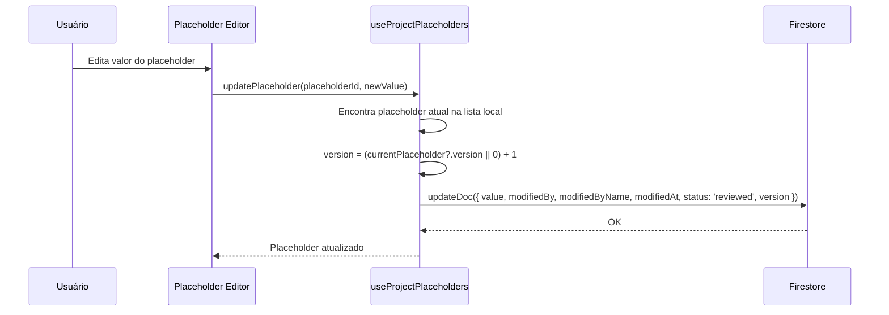
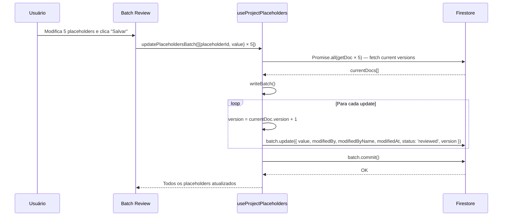
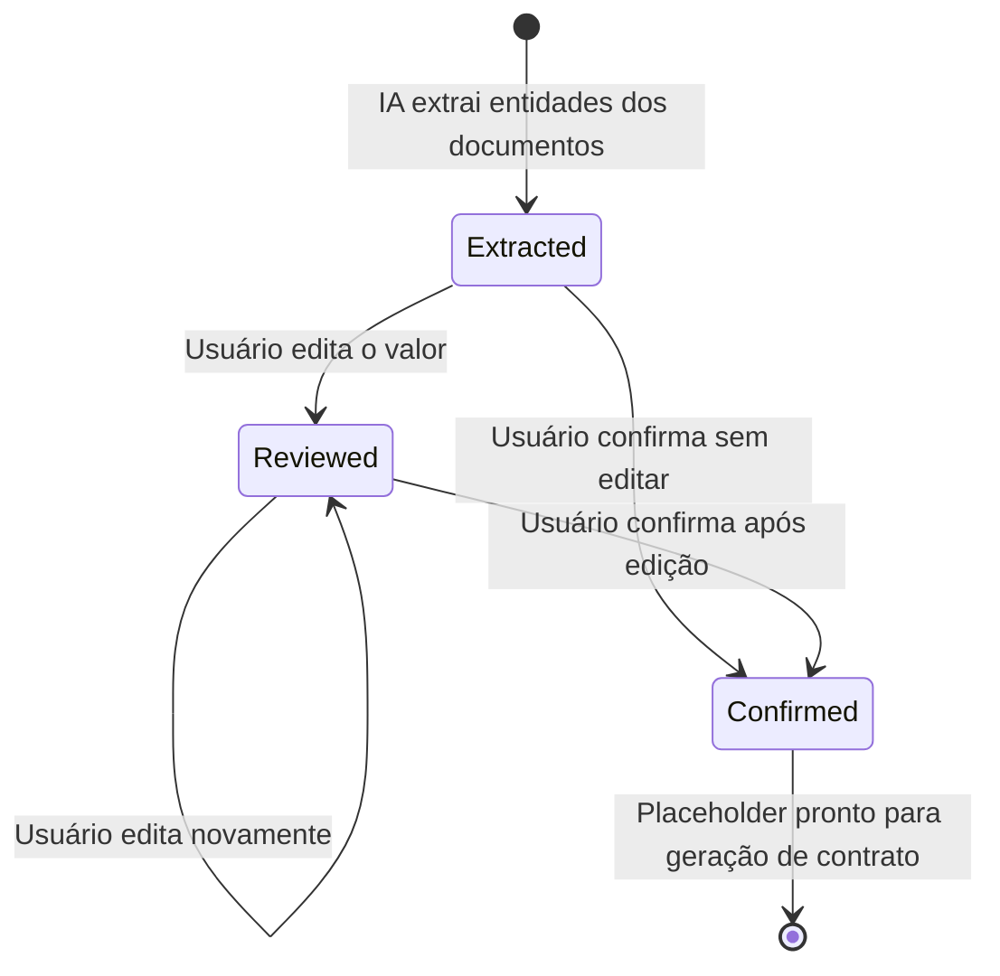

# Placeholders — Extração, Revisão e Confirmação de Variáveis de Contrato

## Visão Geral

Componente que gerencia variáveis extraídas por IA dos documentos do projeto (ex: nome da parte, CPF, valor do contrato). Cada placeholder tem um `key` (nome da variável), `value` (valor extraído), `confidence` (confiança da IA de 0 a 1), e `status` (extracted → reviewed → confirmed). Suporta edição individual e batch com controle de versão para evitar race conditions. UI permite filtrar por confiança, buscar por key/value, e ordenar por confiança ou alfabeticamente.

## Responsabilidades

- Exibição de placeholders extraídos por IA agrupados por projeto
- Edição individual de valores com tracking de modificação
- Batch update atômico de múltiplos placeholders com fetch de versões correntes
- Confirmação individual de placeholder (status → confirmed)
- Filtragem por nível de confiança (all, low, medium, confirmed, pending)
- Busca case-insensitive por key ou value
- Ordenação por confiança (menor primeiro) ou alfabética
- Versionamento de cada placeholder para resolução de conflitos

## Interface

### Hook: `useProjectPlaceholders(projectId)`

```typescript
interface PlaceholderUpdate {
  placeholderId: string;
  value: string;
}

interface UseProjectPlaceholdersReturn {
  placeholders: (ProjectPlaceholder & { id: string })[] | null;
  isLoading: boolean;
  error: Error | null;
  updatePlaceholder: (placeholderId: string, value: string) => Promise<void>;
  updatePlaceholdersBatch: (updates: PlaceholderUpdate[]) => Promise<void>;
  confirmPlaceholder: (placeholderId: string) => Promise<void>;
}
```

### Tipo: `ProjectPlaceholder` (`src/lib/types.ts:144-164`)

```typescript
interface ProjectPlaceholder {
  id: string;
  projectId: string;
  key: string;                    // Nome da variável
  value?: string;                 // Valor extraído/revisado
  defaultValue?: string;
  source: string;                 // Origem da extração
  sourceDocumentId?: string;
  confidence: number;             // 0.0 - 1.0
  aiSuggestions?: string[];       // Sugestões alternativas da IA
  status: PlaceholderStatus;      // 'extracted' | 'reviewed' | 'confirmed'
  modifiedBy?: string;
  modifiedAt?: string;
  modifiedByName?: string;
  version: number;                // Incrementado a cada edição
}
```

### Classificação de Confiança

```typescript
confidence >= 0.8 → Alta (high)
confidence >= 0.5 → Média (medium)
confidence <  0.5 → Baixa (low)
```

## Regras de Negócio

- **RB-Ph-001:** Placeholders são ordenados por `key` ascendente no Firestore 🟢
- **RB-Ph-002:** Status `extracted` indica valor recém-extraído pela IA 🟢
- **RB-Ph-003:** Status `reviewed` indica valor modificado pelo usuário 🟢
- **RB-Ph-004:** Status `confirmed` indica valor validado pelo usuário 🟢
- **RB-Ph-005:** Update individual incrementa `version` e seta `status: 'reviewed'` 🟢
- **RB-Ph-006:** Batch update faz fetch de TODOS os docs correntes antes do writeBatch 🟢
- **RB-Ph-007:** Batch usa `writeBatch` para atomicidade — todos ou nenhum 🟢
- **RB-Ph-008:** `modifiedByName` fallback para `user.email` ou `'Unknown'` 🟢
- **RB-Ph-009:** Confirmação apenas muda status para `confirmed` — não modifica valor 🟢
- **RB-Ph-010:** Placeholder sem value pode ser confirmado (valor vazio) 🟡
- **RB-Ph-011:** `aiSuggestions` pode conter múltiplas alternativas da IA 🟡
- **RB-Ph-012:** Filtros: `all`, `low` (conf < 0.5), `medium` (0.5 ≤ conf < 0.8), `confirmed`, `pending` 🟢
- **RB-Ph-013:** Busca é case-insensitive sobre `key` e `value` 🟢
- **RB-Ph-014:** Ordenação por confiança coloca valores mais baixos primeiro (prioriza revisão) 🟢

## Fluxo Principal

### Edição Individual de Placeholder



### Batch Update de Placeholders



### Fluxo de Revisão Completo



## Fluxos Alternativos

- **[Placeholder sem valor]:** `value` é undefined — usuário pode inserir do zero
- **[AI suggestions disponíveis]:** `aiSuggestions[]` oferece alternativas clicáveis
- **[Busca sem resultados]:** Lista filtrada retorna array vazio
- **[Batch update parcial falha]:** writeBatch é atômico — tudo falha ou tudo succeeds

## Dependências

| Dependência | Tipo | Motivo |
|---|---|---|
| `firebase/firestore` | Externa | CRUD, writeBatch, getDoc |
| `useFirebase` | Interno | Acesso a instância Firestore |
| `useUser` | Interno | Usuário autenticado para tracking |
| `useCollection` | Interno | Real-time listener para projectPlaceholders |

## Requisitos Não Funcionais

| Tipo | Requisito inferido | Evidência no código | Confiança |
|------|--------------------|---------------------|-----------|
| Concorrência | Fetch de versões correntes antes de batch update | `Promise.all(updates.map(getDoc))` | 🟢 |
| Concorrência | Version increment previne overwrites | `version: currentVersion + 1` | 🟢 |
| Usabilidade | Placeholders de baixa confiança aparecem primeiro | Ordenação por confidence asc | 🟢 |

> Inferido a partir do código. Validar com equipe de operações.

## Critérios de Aceitação

```gherkin
Cenário: Editar placeholder individual
Dado que existe um placeholder com status 'extracted'
Quando o usuário modifica o valor e salva
Então o status muda para 'reviewed'
E a versão é incrementada em 1
E modifiedBy é setado com o UID do usuário

Cenário: Batch update atômico
Dado que existem 5 placeholders para atualizar
Quando updatePlaceholdersBatch é chamado
Então TODOS os placeholders são lidos antes de escrever
E um único writeBatch é commitado
E se qualquer update falhar, nenhum é aplicado

Cenário: Filtrar por baixa confiança
Dado que existem placeholders com confiança variada
Quando aplica filtro 'low'
Então apenas placeholders com confidence < 0.5 são exibidos

Cenário: Confirmar placeholder sem edição
Dado que existe um placeholder com status 'extracted'
Quando o usuário clica em confirmar
Então o status muda para 'confirmed'
E o valor permanece inalterado

Cenário: Buscar placeholder por key
Dado que existem múltiplos placeholders
Quando digita "cpf" na busca
Então apenas placeholders com "cpf" no key ou value são exibidos
```

## Prioridade

| Requisito | MoSCoW | Justificativa |
|-----------|--------|---------------|
| Edição individual | Must | Core do fluxo de revisão |
| Batch update atômico | Must | Eficiência do usuário |
| Confirmação de placeholder | Must | Necessário para geração de contrato |
| Filtro por confiança | Should | UX de revisão |
| Busca por key/value | Should | Navegação em muitos placeholders |
| Versionamento | Should | Race condition prevention |
| AI suggestions | Could | Feature avançada |

> Prioridade inferida por frequência de chamada e posição na cadeia de dependências.

## Rastreabilidade de Código

| Arquivo | Função / Classe | Cobertura |
|---------|-----------------|-----------|
| `src/hooks/use-projects.ts` | `useProjectPlaceholders` | 🟢 |
| `src/app/(main)/projects/[projectId]/placeholders/page.tsx` | `ProjectPlaceholdersPage` | 🟢 |
| `src/lib/types.ts` | `ProjectPlaceholder`, `PlaceholderStatus` | 🟢 |
| `firestore.rules` | Regras de projectPlaceholders | 🟢 |
