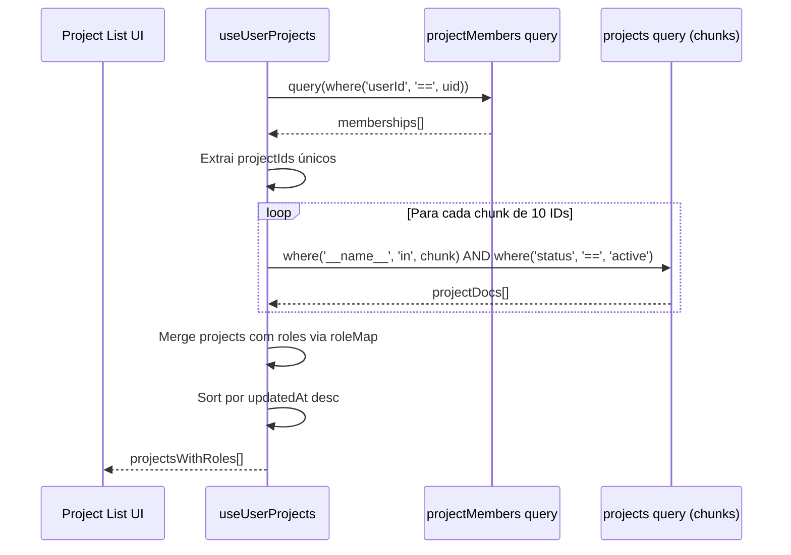
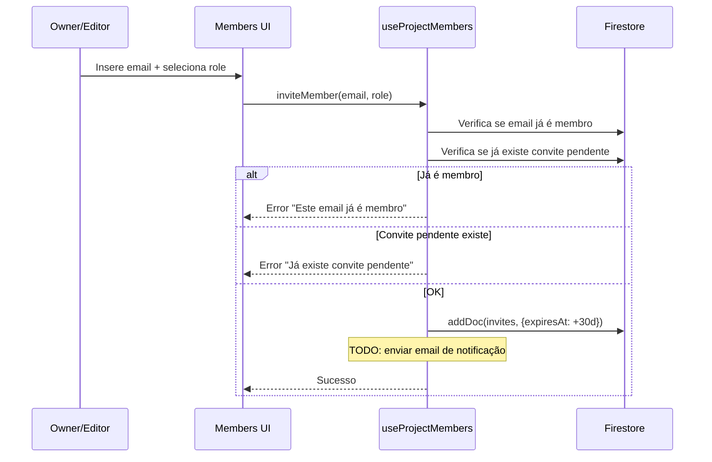
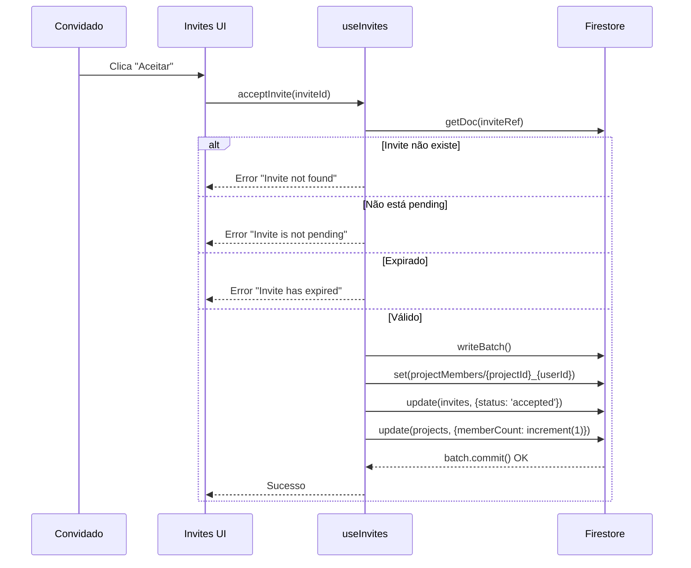
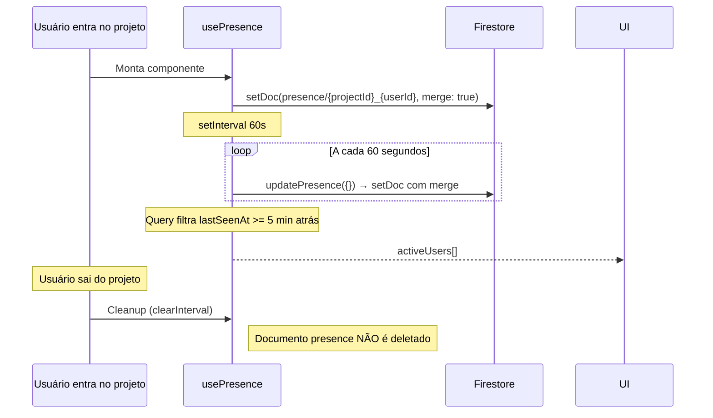

# Projects — Gestão de Projetos e Colaboração

## Visão Geral

Módulo central do sistema que gerencia projetos como unidades de trabalho colaborativo. Cada projeto encapsula documentos, placeholders, contratos, membros e atividade. Implementa RBAC com 3 papéis (owner/editor/viewer), convites com expiração, presença em tempo real via heartbeat, e paginação cursor-based para activity log. Toda a lógica é client-side via 11 hooks React que operam sobre Firestore.

## Responsabilidades

- CRUD de projetos (create via Firebase, update, archive soft-delete, delete soft-delete)
- Gestão de membros: convites, aceitação, recusa, alteração de role, remoção
- Controle de permissões baseado em hierarquia de roles
- Presença em tempo real com heartbeat de 60s e expiração de 5min
- Listagem de projetos do usuário com chunking (10 por vez)
- Auto-migração de memberships de IDs aleatórios para determinísticos
- Gerenciamento de documentos, placeholders e contratos por projeto
- Activity log com paginação cursor-based (50 itens por página)
- Gestão de convites pendentes por email do usuário

## Interface

### Hooks Exportados

| Hook | Arquivo | Retorno | Descrição |
|---|---|---|---|
| `useProject(projectId)` | `src/hooks/use-projects.ts` | `UseProjectReturn` | CRUD de um projeto individual |
| `useUserProjects()` | `src/hooks/use-projects.ts` | `UseUserProjectsReturn` | Lista projetos do usuário com roles |
| `useProjectMembers(projectId)` | `src/hooks/use-projects.ts` | `UseProjectMembersReturn` | Membros + convites do projeto |
| `useProjectRole(projectId)` | `src/hooks/use-projects.ts` | `UseProjectRoleReturn` | Role do usuário no projeto |
| `usePermission(projectId)` | `src/hooks/use-projects.ts` | `UsePermissionReturn` | Permissões calculadas |
| `useProjectDocuments(projectId)` | `src/hooks/use-projects.ts` | `UseProjectDocumentsReturn` | Documentos do projeto |
| `useProjectPlaceholders(projectId)` | `src/hooks/use-projects.ts` | `UseProjectPlaceholdersReturn` | Placeholders + batch update |
| `useProjectContracts(projectId)` | `src/hooks/use-projects.ts` | `UseProjectContractsReturn` | Contratos gerados |
| `useActivity(projectId, pageSize?)` | `src/hooks/use-projects.ts` | `UseActivityReturn` | Activity log paginado |
| `useInvites()` | `src/hooks/use-projects.ts` | `UseInvitesReturn` | Convites pendentes globais |
| `usePresence(projectId)` | `src/hooks/use-projects.ts` | `UsePresenceReturn` | Presença em tempo real |
| `useLegacyContracts()` | `src/hooks/use-projects.ts` | deprecated | Compatibilidade legada |

### Permission Helpers (`src/lib/types.ts`)

```typescript
export const ROLE_HIERARCHY: Record<ProjectRole, number> = {
  viewer: 1, editor: 2, owner: 3
};

function hasPermission(userRole, requiredRole): boolean;
function canEdit(userRole): boolean;           // editor ou owner
function canManageMembers(userRole): boolean;  // editor ou owner
function canDeleteProject(userRole): boolean;  // apenas owner
function canChangeRoles(userRole): boolean;    // apenas owner
```

### Principais Tipos

**Project** (`src/lib/types.ts:69-97`):
- Campos obrigatórios: `id`, `name`, `clientName`, `createdBy`, `createdAt`, `updatedAt`, `status`
- Contadores denormalizados: `memberCount`, `documentCount`, `placeholderCount`, `contractCount`
- Configuração de contrato: `contractType`, `processType`, `extraDocumentEnabled`
- File Search sync: `isSyncedToFileSearch`, `fileSearchStoreId`, `fileSearchSyncStatus`

**ProjectInvite** (`src/lib/types.ts:206-220`):
- Expira em 30 dias (`expiresAt`)
- Status: `pending`, `accepted`, `declined`, `expired`, `revoked`

**UserPresence** (`src/lib/types.ts:226-237`):
- `lastSeenAt`: atualizado a cada 60s
- `currentView`, `currentEditing`: contexto do usuário

## Regras de Negócio

### Projetos

- **RB-Prj-001:** Projetos são listados em chunks de 10 IDs via `where('__name__', 'in', chunk)` 🟢
- **RB-Prj-002:** Apenas projetos com `status === 'active'` são listados em `useUserProjects` 🟢
- **RB-Prj-003:** Projetos são ordenados por `updatedAt` descendente 🟢
- **RB-Prj-004:** Soft-delete via `status: 'deleted'` — não há delete físico 🟢
- **RB-Prj-005:** Archive via `status: 'archived'` — projeto oculto da listagem 🟢
- **RB-Prj-006:** `documentCount` é incrementado/decrementado automaticamente ao add/delete documents 🟢
- **RB-Prj-007:** `memberCount` é incrementado ao aceitar convite 🟢
- **RB-Prj-008:** Não há transferência de ownership implementada 🔴

### Membros e Permissões

- **RB-Prj-009:** Membership ID é determinístico: `${projectId}_${userId}` 🟢
- **RB-Prj-010:** IDs legados aleatórios são auto-migrados para formato determinístico 🟢
- **RB-Prj-011:** Viewer pode editar apenas `lastActivityAt`, `lastActivityBy`, `updatedAt` do projeto 🟢
- **RB-Prj-012:** Editor pode editar: `name`, `description`, `clientName`, `status`, `contractType`, `processType`, `updatedAt` 🟢
- **RB-Prj-013:** Owner pode editar todos os campos do projeto 🟢
- **RB-Prj-014:** Não há verificação de último owner — remoção pode deixar projeto sem owner 🔴

### Convites

- **RB-Prj-015:** Convites expiram em 30 dias (`Date.now() + 30 * 24 * 60 * 60 * 1000`) 🟢
- **RB-Prj-016:** Apenas um convite pendente por email por projeto 🟢
- **RB-Prj-017:** Email já membro bloqueia novo convite 🟢
- **RB-Prj-018:** Email é normalizado para lowercase + trim antes de criar convite 🟢
- **RB-Prj-019:** Aceitar convite é atômico via `writeBatch` (create membership + update invite + increment memberCount) 🟢
- **RB-Prj-020:** Convite expirado não pode ser aceito — validação de `expiresAt` 🟢
- **RB-Prj-021:** TODO: envio de email de notificação ao convidado não implementado 🔴

### Presença

- **RB-Prj-022:** Heartbeat a cada 60 segundos via `setInterval` 🟢
- **RB-Prj-023:** Presença expira após 5 minutos de inatividade 🟢
- **RB-Prj-024:** Presence ID é determinístico: `${projectId}_${userId}` 🟢
- **RB-Prj-025:** Cleanup do interval no useEffect cleanup — sem cleanup do documento Firestore 🔴

### Activity Log

- **RB-Prj-026:** Paginação cursor-based com `startAfter(lastVisible)` 🟢
- **RB-Prj-027:** PageSize padrão: 50 itens 🟢
- **RB-Prj-028:** `hasMore` é determinado por `activities.length === pageSize` 🟢
- **RB-Prj-029:** Activity é append-only (regra Firestore: `allow update, delete: if false`) 🟢

### Placeholders

- **RB-Prj-030:** Update individual incrementa `version` e seta `status: 'reviewed'` 🟢
- **RB-Prj-031:** Batch update fetchs current versions antes de escrever (evita race conditions) 🟢
- **RB-Prj-032:** Placeholders são ordenados por `key` ascendente 🟢

## Fluxo Principal

### Listar Projetos do Usuário



### Convidar Membro



### Aceitar Convite



### Presença em Tempo Real



## Fluxos Alternativos

- **[Projeto não encontrado]:** `useProject` retorna `project: null` sem erro
- **[Usuário sem projetos]:** `useUserProjects` retorna array vazio
- **[Network error em chunk]:** Error é capturado e setado em `projectsError`
- **[Migração de membership falha]:** Erro é logged mas não bloqueia a UI
- **[Heartbeat falha]:** Presença expira após 5min — usuário desaparece da lista
- **[LoadMore sem mais dados]:** `hasMore` é false — botão desabilitado

## Dependências

| Dependência | Tipo | Motivo |
|---|---|---|
| `firebase/firestore` | Externa | CRUD, queries, batch writes, paginação |
| `useFirebase` | Interno | Acesso a instância Firestore |
| `useUser` | Interno | Estado do usuário autenticado |
| `useCollection` | Interno | Real-time listener para coleções |
| `useDoc` | Interno | Real-time listener para documento único |
| `useMemoFirebase` | Interno | Memoização com null-check para Firebase |
| `src/lib/types.ts` | Interno | Tipos, enums, permission helpers |

## Requisitos Não Funcionais

| Tipo | Requisito inferido | Evidência no código | Confiança |
|------|--------------------|---------------------|-----------|
| Performance | Chunking de 10 projectIds contorna limite `in` do Firestore | `for (let index = 0; index < projectIds.length; index += 10)` | 🟢 |
| Performance | Contadores denormalizados evitam queries de count | `memberCount`, `documentCount` no Project | 🟢 |
| Performance | `useMemoFirebase` previne re-queries desnecessárias | `useMemoFirebase(() => query(...), [firestore, projectId])` | 🟢 |
| Performance | `cancelled` flag previne setState em component desmontado | `let cancelled = true; return () => { cancelled = true }` | 🟢 |
| Disponibilidade | Dynamic imports de `firebase/firestore` para code splitting | `const { increment } = await import('firebase/firestore')` | 🟡 |

> Inferido a partir do código. Validar com equipe de operações.

## Critérios de Aceitação

```gherkin
Cenário: Listar projetos do usuário com sucesso
Dado que o usuário está autenticado e é membro de 3 projetos
Quando a página de projetos carrega
Então vê 3 projetos ordenados por updatedAt mais recente
E cada projeto exibe o role do usuário (owner/editor/viewer)

Cenário: Convidar membro com email já existente
Dado que um usuário com role editor está na página de membros
Quando tenta convidar um email que já é membro do projeto
Então vê erro "Este email já é membro deste projeto."

Cenário: Aceitar convite expirado
Dado que um usuário recebe um convite com expiresAt no passado
Quando tenta aceitar o convite
Então vê erro "Invite has expired"

Cenário: Presença atualiza automaticamente
Dado que o usuário entra em um projeto
Quando aguarda 60 segundos
Então o documento presence é atualizado com novo lastSeenAt

Cenário: Presença expira após inatividade
Dado que um usuário estava ativo mas saiu do projeto
Quando passam 5 minutos sem heartbeat
Então o usuário não aparece mais na lista de activeUsers

Cenário: Auto-migração de membership legado
Dado que existe um membership com ID aleatório para o usuário
Quando useUserProjects é montado
Então o membership é migrado para formato {projectId}_{userId}
E o documento antigo é deletado

Cenário: Batch update de placeholders com race condition protection
Dado que há 5 placeholders para atualizar simultaneamente
Quando updatePlaceholdersBatch é chamado
Então cada placeholder é lido antes do write para pegar versão corrente
E todos os updates são commitados atomicamente via writeBatch

Cenário: Projeto soft-delete
Dado que o owner de um projeto clica em deletar
Quando a operação é confirmada
Então o status do projeto é setado para 'deleted'
E o projeto não aparece mais na lista de useUserProjects
```

## Prioridade

| Requisito | MoSCoW | Justificativa |
|-----------|--------|---------------|
| CRUD de projetos | Must | Unidade central do sistema |
| RBAC com 3 roles | Must | Controle de acesso fundamental |
| Convites com expiração | Must | Mecanismo de colaboração primário |
| Accept invite atômico | Must | Integridade de dados |
| Permission hooks | Must | UI depende de canEdit, canManageMembers, etc. |
| useUserProjects com chunking | Must | Performance para muitos projetos |
| Presença em tempo real | Should | UX de colaboração, mas não crítico |
| Activity log paginado | Should | Audit é importante mas pode ser simplificado |
| Auto-migração de memberships | Could | Apenas para dados legados |
| Placeholder batch update | Should | Otimização de UX |
| Heartbeat presence | Could | Poderia ser substituído por WebSocket |
| Legacy contracts hook | Won't | Deprecated — será removido |

> Prioridade inferida por frequência de chamada e posição na cadeia de dependências.

## Rastreabilidade de Código

| Arquivo | Função / Classe | Cobertura |
|---------|-----------------|-----------|
| `src/hooks/use-projects.ts` | `useProject` | 🟢 |
| `src/hooks/use-projects.ts` | `useUserProjects` | 🟢 |
| `src/hooks/use-projects.ts` | `useProjectMembers` | 🟢 |
| `src/hooks/use-projects.ts` | `useProjectRole` | 🟢 |
| `src/hooks/use-projects.ts` | `usePermission` | 🟢 |
| `src/hooks/use-projects.ts` | `useProjectDocuments` | 🟢 |
| `src/hooks/use-projects.ts` | `useProjectPlaceholders` | 🟢 |
| `src/hooks/use-projects.ts` | `useProjectContracts` | 🟢 |
| `src/hooks/use-projects.ts` | `useActivity` | 🟢 |
| `src/hooks/use-projects.ts` | `useInvites` | 🟢 |
| `src/hooks/use-projects.ts` | `usePresence` | 🟢 |
| `src/hooks/use-projects.ts` | `useLegacyContracts` | 🟢 |
| `src/lib/types.ts` | `ProjectRole`, `ProjectStatus`, enums | 🟢 |
| `src/lib/types.ts` | `Project`, `ProjectMember`, `ProjectInvite` | 🟢 |
| `src/lib/types.ts` | `ROLE_HIERARCHY`, `canEdit`, `canManageMembers` | 🟢 |
| `firestore.rules` | Regras de projeto (linhas 30-160) | 🟢 |
