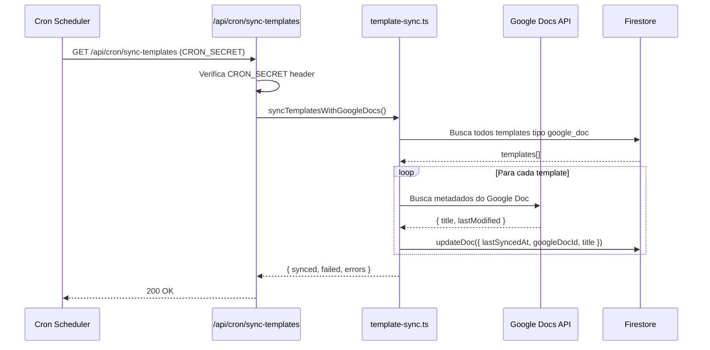
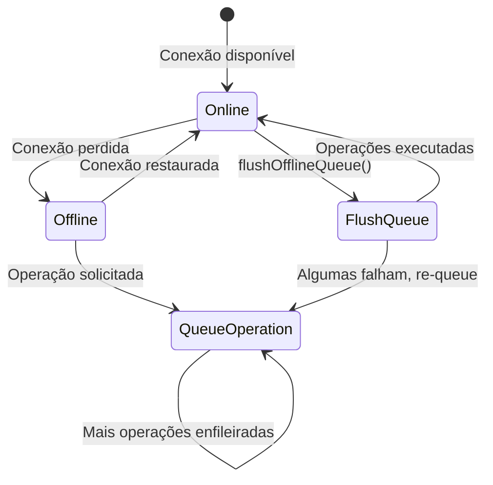

# Sync — Sincronização Bidirecional e Manutenção de Dados

## Visão Geral

Módulo que gerencia múltiplos mecanismos de sincronização do V-Lab: sincronização de templates com Google Docs via cron job, sincronização de conteúdo FAQ para o chatbot ALEX, sincronização offline para operações quando a conexão é perdida, e integração com Composio para automações Google Workspace. Os cron jobs são protegidos por `CRON_SECRET` e executam via Next.js API routes (`/api/cron/sync-templates`, `/api/cron/sync-faq-content`). A sincronização de templates valida links do Google Docs e atualiza metadados de templates no Firestore.

## Responsabilidades

- Sync de templates com Google Docs via cron job periódico
- Sync de conteúdo FAQ para base de conhecimento do ALEX
- Sync offline para operações sem conexão
- Validação de links de Google Docs para templates
- Atualização de metadados de templates (lastSyncedAt, googleDocId)
- Integração Composio para automações Google Workspace
- Test endpoints para validação de sync

## Interface

### `template-sync.ts` (`src/lib/template-sync.ts`)

```typescript
interface TemplateSyncResult {
  synced: number;
  failed: number;
  errors: string[];
}

// Sincroniza todos os templates com Google Docs
export async function syncTemplatesWithGoogleDocs(): Promise<TemplateSyncResult>;

// Valida e atualiza link de template
export async function validateAndUpdateTemplateLink(templateId: string, googleDocLink: string): Promise<void>;

// Busca metadados do Google Doc
export async function fetchGoogleDocMetadata(docUrl: string): Promise<{
  googleDocId: string;
  title: string;
  lastModified: string;
}>;
```

### `faq-sync.ts` (`src/lib/faq-sync.ts`)

```typescript
interface FaqSyncResult {
  synced: number;
  failed: number;
  errors: string[];
}

// Sincroniza conteúdo FAQ para base de conhecimento
export async function syncFaqContent(): Promise<FaqSyncResult>;

// Parse e indexa conteúdo FAQ
export async function parseAndIndexFaqContent(content: string): Promise<void>;
```

### `offline-sync.ts` (`src/lib/offline-sync.ts`)

```typescript
interface OfflineOperation {
  type: 'create' | 'update' | 'delete';
  collection: string;
  data: Record<string, unknown>;
  timestamp: string;
  retryCount: number;
}

// Enfileira operação para sync posterior
export async function queueOfflineOperation(operation: OfflineOperation): Promise<void>;

// Executa operações pendentes quando conexão retorna
export async function flushOfflineQueue(): Promise<{
  successful: number;
  failed: number;
  errors: string[];
}>;
```

### Cron Endpoints

| Endpoint | Função | Proteção |
|---|---|---|
| `/api/cron/sync-templates` | Sync templates com Google Docs | `CRON_SECRET` header |
| `/api/cron/sync-faq-content` | Sync FAQ para base de conhecimento | `CRON_SECRET` header |
| `/api/admin/test-sync` | Test endpoint para sync | Admin auth |
| `/api/admin/test-faq-sync` | Test endpoint para FAQ sync | Admin auth |

## Regras de Negócio

- **RB-Sy-001:** Cron jobs são protegidos por `CRON_SECRET` no header 🟢
- **RB-Sy-002:** `sync-templates` itera sobre todos os templates do tipo `google_doc` 🟢
- **RB-Sy-003:** `sync-faq-content` parseia e indexa FAQ para Google AI File Search 🟢
- **RB-Sy-004:** Offline operations são enfileiradas com retry count 🟢
- **RB-Sy-005:** `validateAndUpdateTemplateLink` verifica se Google Doc existe 🟢
- **RB-Sy-006:** `lastSyncedAt` é atualizado após sync bem-sucedido 🟢
- **RB-Sy-007:** Composio integração para automações Google Workspace 🟢
- **RB-Sy-008:** Test endpoints permitem validação manual de sync 🟢
- **RB-Sy-009:** Operações offline têm retry limitado 🟡
- **RB-Sy-010:** Sem notificação ao usuário quando sync falha 🟡

## Fluxo Principal

### Cron Sync de Templates



### Operações Offline



## Fluxos Alternativos

- **[Google Doc não encontrado]:** Template é marcado como failed no resultado
- **[CRON_SECRET inválido]:** Endpoint retorna 401 Unauthorized
- **[Offline queue cheia]:** Operações mais antigas são descartadas após limite
- **[Composio desconectado]:** Automações falham silenciosamente

## Dependências

| Dependência | Tipo | Motivo |
|---|---|---|
| `googleapis` | Externa | Google Docs API |
| `composio-core` | Externa | Automações Google Workspace |
| `CRON_SECRET` env | Config | Proteção de cron endpoints |
| `google-docs.ts` | Interno | Helper de Google Docs |
| `composio-actions.ts` | Interno | Actions Composio |

## Requisitos Não Funcionais

| Tipo | Requisito inferido | Evidência no código | Confiança |
|------|--------------------|---------------------|-----------|
| Confiabilidade | Retry count para operações offline | `retryCount` no tipo | 🟢 |
| Segurança | CRON_SECRET protege endpoints | Header check | 🟢 |
| Disponibilidade | Offline queue para operações sem conexão | `offline-sync.ts` | 🟢 |

## Critérios de Aceitação

```gherkin
Cenário: Cron job de sync de templates
Dado que CRON_SECRET está configurado
Quando o cron job é executado
Então todos os templates google_doc são verificados
E lastSyncedAt é atualizado para cada template válido
E erros são reportados no resultado

Cenário: Operação offline
Dado que a conexão foi perdida
Quando o usuário tenta salvar um documento
Então a operação é enfileirada com tipo e timestamp
E quando a conexão retorna, a operação é executada
```

## Rastreabilidade de Código

| Arquivo | Função / Classe | Cobertura |
|---------|-----------------|-----------|
| `src/lib/template-sync.ts` | syncTemplatesWithGoogleDocs | 🟢 |
| `src/lib/faq-sync.ts` | syncFaqContent | 🟢 |
| `src/lib/offline-sync.ts` | queueOfflineOperation, flushOfflineQueue | 🟢 |
| `src/app/api/cron/sync-templates/route.ts` | Cron endpoint | 🟢 |
| `src/app/api/cron/sync-faq-content/route.ts` | Cron endpoint | 🟢 |
| `src/app/api/admin/test-sync/route.ts` | Test endpoint | 🟢 |
| `src/app/api/admin/test-faq-sync/route.ts` | Test endpoint | 🟢 |
| `src/lib/actions/composio-actions.ts` | Composio integration | 🟢 |
