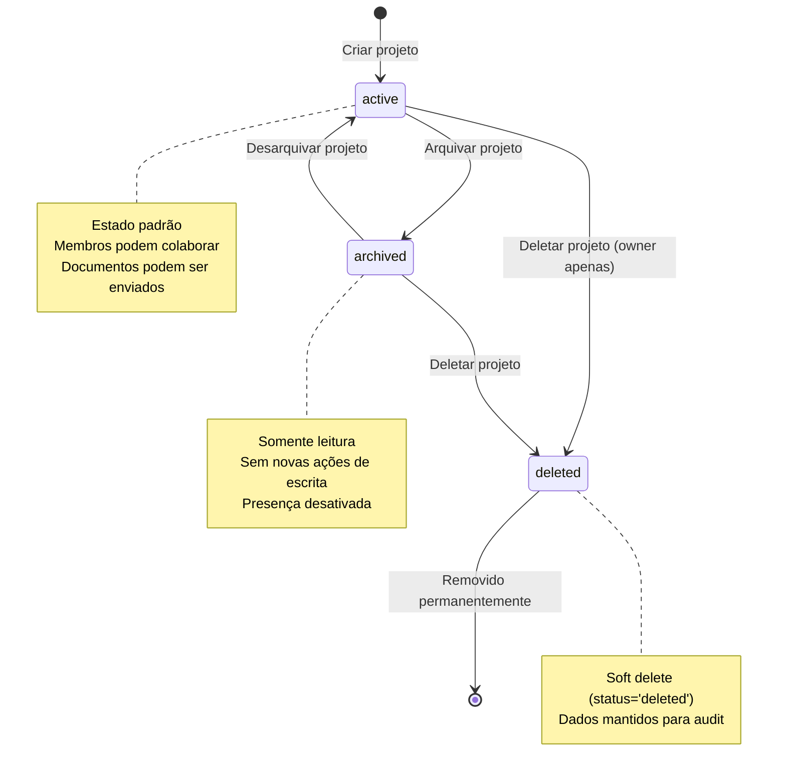
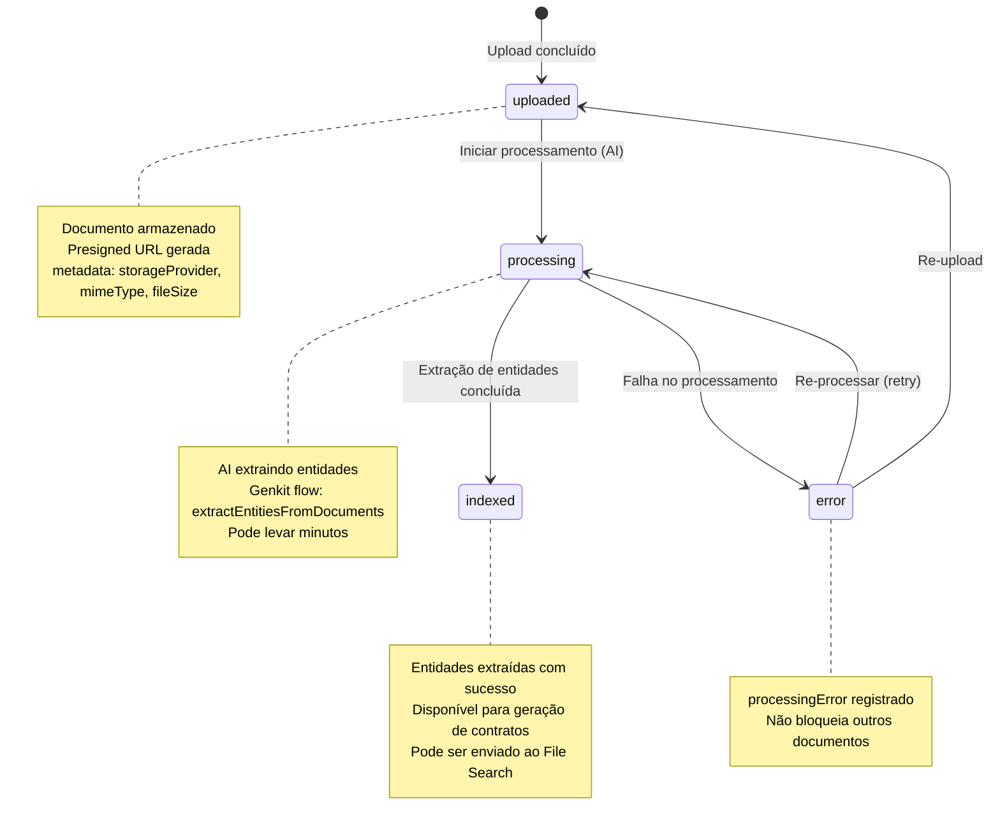
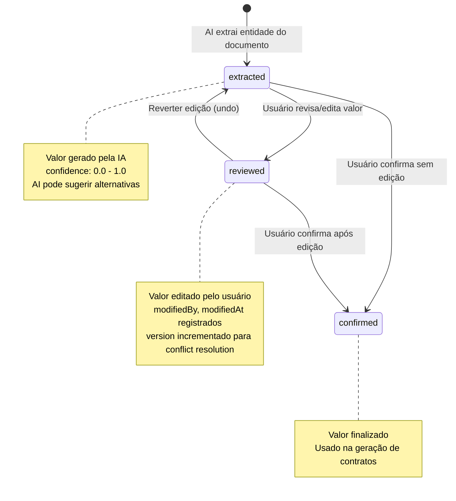
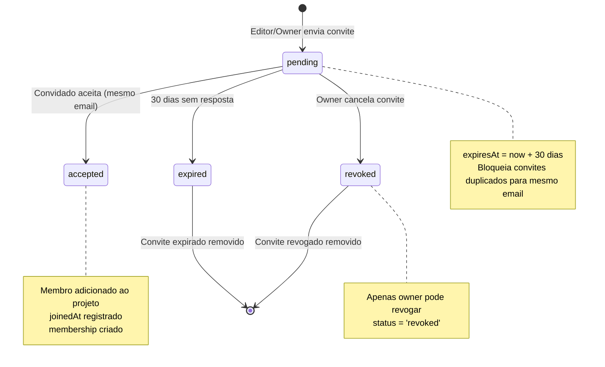
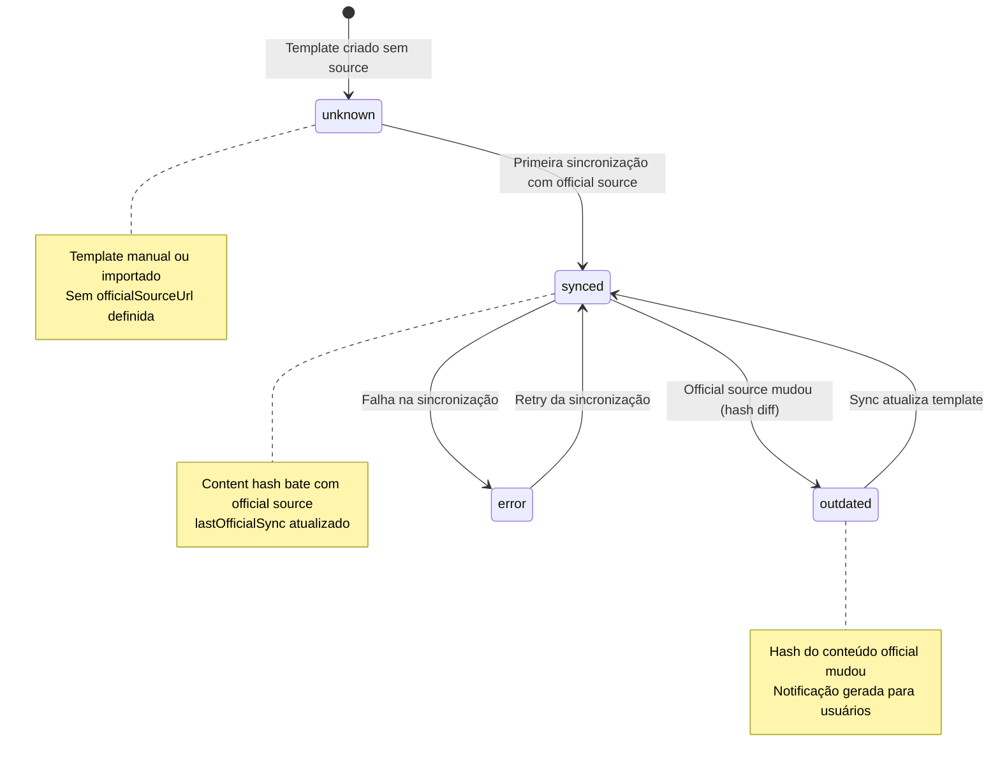
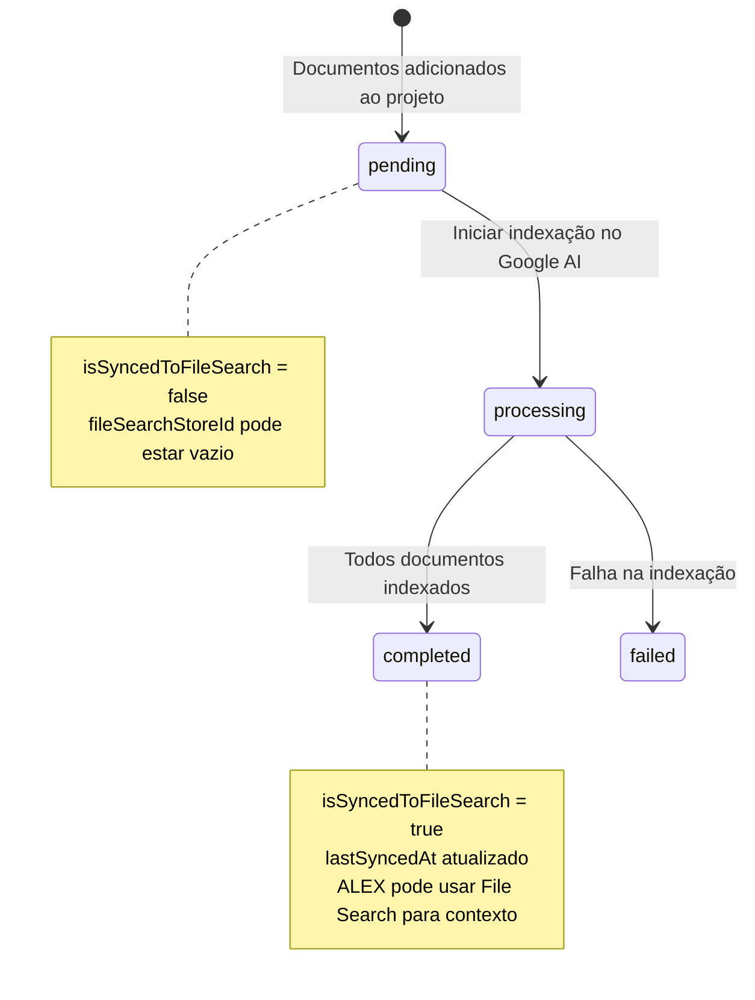
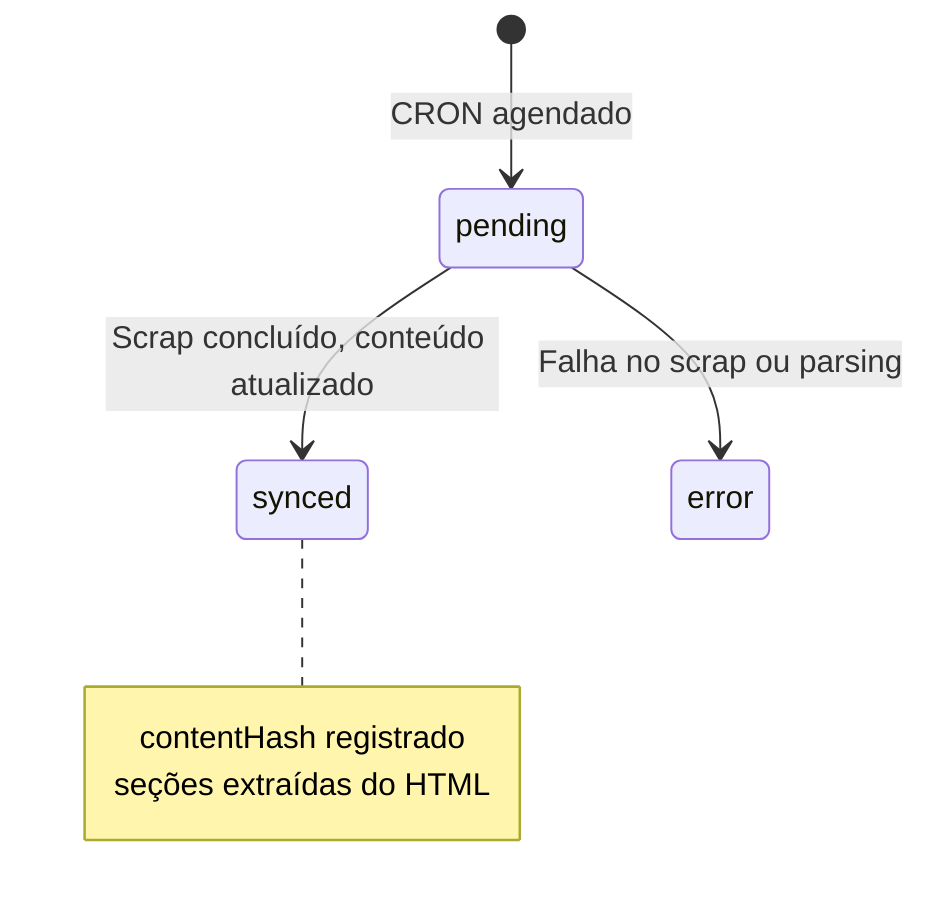

# State Machines — V-Lab Assistant

> Diagramas de estado para todas as entidades com campos de status.
> Gerado pelo Detective em 2026-05-02 | Nível: Completo

---

## 1. Project (`ProjectStatus`)



**Transições e Gatilhos:**

| De | Para | Gatilho | Guard |
|---|---|---|---|
| `[*]` | `active` | Criar projeto via UI | `request.auth != null && createdBy == userId` |
| `active` | `archived` | Editor ou owner arquiva | `hasProjectRole(projectId, 'editor')` |
| `active` | `deleted` | Owner deleta | `hasProjectRole(projectId, 'owner')` |
| `archived` | `active` | Owner ou editor desarquiva | `hasProjectRole(projectId, 'editor')` |
| `archived` | `deleted` | Owner deleta | `hasProjectRole(projectId, 'owner')` |

**Confiança: 🟢 CONFIRMADO** — Extraído de `firestore.rules` e `src/lib/types.ts`.

---

## 2. Project Document (`DocumentStatus`)



**Transições e Gatilhos:**

| De | Para | Gatilho | Guard |
|---|---|---|---|
| `[*]` | `uploaded` | Upload via R2 ou Firebase Storage | `hasProjectRole(projectId, 'editor')` |
| `uploaded` | `processing` | Genkit flow inicia extração | Editor/Owner |
| `processing` | `indexed` | AI completa extração | N/A |
| `processing` | `error` | Falha na extração (timeout, erro API) | N/A |
| `error` | `processing` | Retry manual ou automático | Editor/Owner |

**Confiança: 🟢 CONFIRMADO** — Extraído de `src/lib/types.ts` e `src/lib/actions.ts`.

---

## 3. Project Placeholder (`PlaceholderStatus`)



**Transições e Gatilhos:**

| De | Para | Gatilho | Guard |
|---|---|---|---|
| `[*]` | `extracted` | Genkit flow: matchEntitiesToPlaceholders | N/A |
| `extracted` | `reviewed` | Usuário edita valor | `hasProjectRole(projectId, 'editor')` |
| `extracted` | `confirmed` | Usuário confirma sem editar | Membro do projeto |
| `reviewed` | `confirmed` | Usuário confirma após edição | Membro do projeto |
| `reviewed` | `extracted` | Reverter para valor original | Editor/Owner |

**Confiança: 🟢 CONFIRMADO** — Extraído de `src/lib/types.ts` e `src/app/(main)/projects/[projectId]/placeholders/page.tsx`.

---

## 4. Project Invite (`InviteStatus`)



**Transições e Gatilhos:**

| De | Para | Gatilho | Guard |
|---|---|---|---|
| `[*]` | `pending` | Editor/Owner convida | `hasProjectRole(projectId, 'editor') && isValidEmail(email)` |
| `pending` | `accepted` | Convidado aceita | `resource.data.email == getUserEmail()` |
| `pending` | `expired` | Cron ou verificação no frontend | `new Date() > expiresAt` |
| `pending` | `revoked` | Owner cancela | `hasProjectRole(projectId, 'owner')` |

**Confiança: 🟢 CONFIRMADO** — Extraído de `firestore.rules` e `src/hooks/use-projects.ts`.

---

## 5. Google Docs Sync Event (`SyncEvent`)

```mermaid
stateDiagram-v2
    [*] --> pending : Sync agendado
    pending --> in-progress : Iniciar sync
    in-progress --> success : Sync concluído com sucesso
    in-progress --> error : Falha no sync
    in-progress --> conflict : Conflito detectado

    conflict --> in-progress : Resolver conflito manualmente
    conflict --> success : Usar estratégia de resolução (firestore-wins/docs-wins)
    error --> pending : Retry automático

    note right of pending
        Agendado por mudança no Firestore ou Google Docs
        Direção: firestore-to-docs ou docs-to-firestore
    end note

    note right of conflict
        both sides modified since last sync
        conflictResolution: manual | firestore-wins | docs-wins
    end note
```

**Transições e Gatilhos:**

| De | Para | Gatilho | Guard |
|---|---|---|---|
| `[*]` | `pending` | Mudança detectada (webhook ou polling) | Editor/Owner cria sync config |
| `pending` | `in-progress` | Sync inicia | N/A |
| `in-progress` | `success` | Sync completo | N/A |
| `in-progress` | `error` | Falha na API (rate limit, auth) | N/A |
| `in-progress` | `conflict` | Mudanças simultâneas detectadas | N/A |
| `conflict` | `success` | Resolução aplicada | `conflictResolution != 'manual'` ou user resolve |
| `error` | `pending` | Retry (com backoff) | N/A |

**Confiança: 🟡 INFERIDO** — Estrutura extraída de `src/lib/types.ts`; transições inferidas do padrão de sync.

---

## 6. Template Sync Status (`syncStatus` em Template)



**Transições e Gatilhos:**

| De | Para | Gatilho | Guard |
|---|---|---|---|
| `[*]` | `unknown` | Template criado manualmente | N/A |
| `unknown` | `synced` | officialSourceUrl definida e sync | N/A |
| `synced` | `outdated` | CRON detecta mudança no hash | Hash diff detectado |
| `outdated` | `synced` | CRON atualiza conteúdo | N/A |
| `synced` | `error` | Falha no sync (URL inacessível) | N/A |
| `error` | `synced` | Retry do CRON | N/A |

**Confiança: 🟢 CONFIRMADO** — Extraído de `src/lib/types.ts` e `src/app/api/cron/sync-templates/route.ts`.

---

## 7. File Search Sync Status (`fileSearchSyncStatus` em Project)



**Transições e Gatilhos:**

| De | Para | Gatilho | Guard |
|---|---|---|---|
| `[*]` | `pending` | Projeto criado, documentos pendentes | N/A |
| `pending` | `processing` | syncFileSearchToProject iniciado | Editor/Owner |
| `processing` | `completed` | Todos documentos indexados com sucesso | N/A |
| `processing` | `failed` | Erro na API do Google AI | N/A |

**Confiança: 🟢 CONFIRMADO** — Extraído de `src/lib/types.ts` e `src/lib/actions.ts`.

---

## 8. FAQ Content Sync (`syncStatus` em FaqContent)



**Transições e Gatilhos:**

| De | Para | Gatilho | Guard |
|---|---|---|---|
| `[*]` | `pending` | CRON semanal dispara | `0 3 * * 0` |
| `pending` | `synced` | Cheerio scrap + parse concluído | N/A |
| `pending` | `error` | URL inacessível ou HTML mudou | N/A |

**Confiança: 🟢 CONFIRMADO** — Extraído de `src/lib/types.ts` e `src/app/api/cron/sync-faq-content/route.ts`.

---

## Resumo de Máquinas de Estado

| Entidade | Status Possíveis | Transições | Confiança |
|---|---|---|---|
| Project | active, archived, deleted | 4 | 🟢 |
| ProjectDocument | uploaded, processing, indexed, error | 5 | 🟢 |
| ProjectPlaceholder | extracted, reviewed, confirmed | 5 | 🟢 |
| ProjectInvite | pending, accepted, expired, revoked | 5 | 🟢 |
| SyncEvent | pending, in-progress, success, error, conflict | 7 | 🟡 |
| Template | synced, outdated, unknown, error | 6 | 🟢 |
| Project (File Search) | pending, processing, completed, failed | 4 | 🟢 |
| FaqContent | synced, error, pending | 3 | 🟢 |
